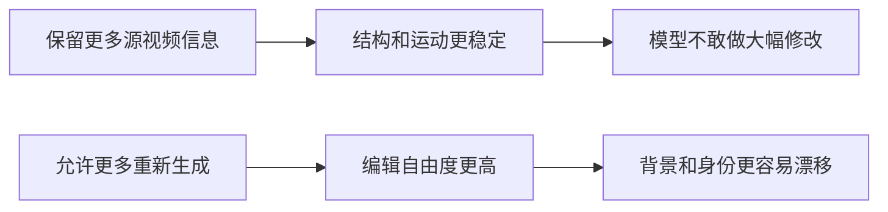
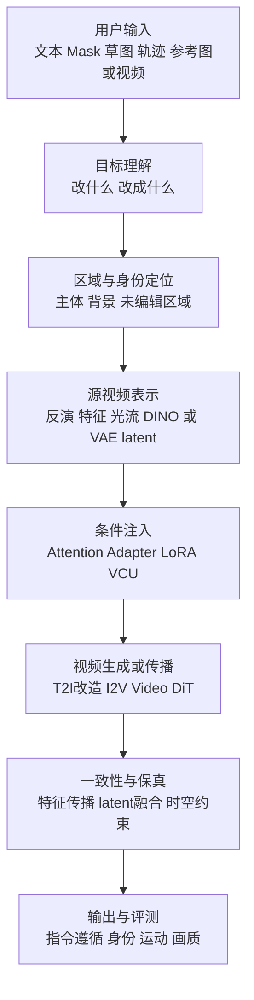

# 视频编辑论文整体总结：先看懂这张技术地图

## 先用一句话理解视频编辑

**视频编辑不是“把每一帧分别修一下”，而是让模型只改变用户指定的内容，同时保留原视频的主体、背景、运动和镜头关系，并让修改后的结果在所有帧中连续成立。**

例如，把视频中的猫替换成狐狸，模型需要同时完成三件事：

1. 理解要把“猫”改成“狐狸”；
2. 保留猫原来的位置、动作、遮挡和背景；
3. 保证每一帧都是同一只狐狸，而不是颜色、脸型和毛发不断变化。

几乎所有视频编辑论文，都是在回答下面三个核心问题：

| 核心问题 | 模型需要知道什么 | 常见技术 |
|---|---|---|
| 改什么 | 目标主体、属性、动作、区域或视角 | 文本、mask、草图、轨迹、参考图或参考视频 |
| 保留什么 | 背景、身份、构图、原运动、未编辑区域 | 反演、特征注入、latent blending、区域掩码 |
| 怎样跨帧稳定 | 同一对象在不同帧中的对应关系 | 光流、注意力、token 匹配、DINO 特征、视频生成先验 |

## 为什么视频编辑比图像编辑难

图像编辑只需要处理一个空间平面。视频多了时间维度，同一个对象会移动、旋转、被遮挡、离开画面再出现。逐帧调用图像编辑模型虽然简单，但每一帧都会独立生成，于是容易出现闪烁、身份漂移、纹理跳变和动作断裂。

视频编辑还有一个根本矛盾：

因此，好的方法不是单纯追求“更像原视频”或“更符合提示词”，而是根据任务决定哪里保留、哪里重新生成。

## 整体发展路线

### 第一阶段：让图像扩散模型暂时学会视频

代表论文是 **Tune-A-Video** 和 **Text2Video-Zero**。

这一阶段没有成熟、开放的视频生成底座，因此研究者主要改造 Stable Diffusion：加入时间注意力、让当前帧参考第一帧，或者针对一段视频做临时微调。它们证明图像扩散模型可以继承原视频运动并完成语义修改，但逐视频训练较慢，时间一致性也比较粗糙。

### 第二阶段：利用反演和注意力控制编辑区域

代表论文是 **Video-P2P** 和 **FateZero**。

这类方法先通过 DDIM inversion 把真实视频映射到扩散噪声，再用新文本重新去噪。Cross-attention 大致表示“文本中的词对应画面哪里”，self-attention 表示“画面中的位置如何关联”。保存并融合原视频注意力后，模型可以重点修改目标对象，同时尽量保持其他内容。

它们的局限是：注意力并不等于准确分割，复杂遮挡和大幅形变时容易定位错误；反演越贴近原视频，也越可能限制新动作和新结构。

### 第三阶段：显式寻找跨帧对应关系

代表论文包括 **TokenFlow、FLATTEN、RAVE、VidToMe 和 CoDeF**。

这些方法不再只说“让帧之间互相看”，而是研究具体应该怎样对应：

- TokenFlow 用扩散特征寻找同一语义部件；
- FLATTEN 用光流寻找像素运动轨迹；
- VidToMe 匹配并合并相似 token；
- RAVE 把不同帧随机拼成网格共同去噪；
- CoDeF 把整段视频映射到统一内容图和时间形变场。

这一阶段显著改善了闪烁，但通常更擅长风格、颜色和材质变化。物体结构发生巨大变化时，源视频对应关系本身就可能不再成立。

### 第四阶段：把编辑变成“修改首帧，再生成后续视频”

代表论文包括 **Videoshop、AnyV2V、GenProp 和 Visual Prompting OCVE**。

随着图生视频模型变强，一个更自然的方案出现了：用户先用成熟的图像工具修改第一帧，再让 I2V 模型把修改传播到后续帧。

- Videoshop 改进视频反演，让编辑后的第一帧能稳定驱动后续帧；
- AnyV2V 把任意图像编辑器与 I2V 模型组合；
- GenProp 专门训练生成式传播能力，并显式保护未编辑区域；
- Visual Prompting 把“编辑前首帧、编辑后首帧”当作视觉示例，直接使用 inpainting 模型，绕开标准 DDIM inversion。

这条路线交互直观，也能继承 Photoshop、生成式填充和参考图编辑能力。主要风险是第一帧错误会传播，长视频中还可能累计身份和纹理漂移。

### 第五阶段：把主体、外观、动作和相机拆开控制

代表论文包括 **MotionDirector、DragAnything、DIVE、VideoMage 和 Reangle-A-Video**。

研究者逐渐认识到，“视频编辑”不是一个单一控制变量：

- MotionDirector 从参考视频学习抽象动作；
- DragAnything 让用户拖动实体轨迹；
- DIVE 用 DINO 特征保留源运动，用参考图或文本注册新身份；
- VideoMage 组合多个主体 LoRA 和动作 LoRA；
- Reangle-A-Video 保留原运动，但重新生成不同相机视角。

这一阶段的关键词是**解耦**：外观不能泄漏到动作，源主体身份不能混进目标主体，多主体之间的位置和交互也要分别建模。

### 第六阶段：视频基础模型原生支持统一编辑

代表论文包括 **VACE、VideoDirector、Align-A-Video 和 SketchVideo**。

早期方法不断给图像模型增加临时模块；新方法则直接在 Video DiT 或 T2V 模型中设计编辑接口。

- VACE 用 Video Condition Unit 统一文本、参考图、源视频和时空 mask；
- VideoDirector 分开约束前景/背景、空间外观和时间运动；
- Align-A-Video 优化一个锚点帧的奖励，再把高质量特征传播到全视频；
- SketchVideo 用少量关键帧草图控制几何布局，并保护未编辑区域。

技术重点从“怎样补救逐帧闪烁”，转为“怎样让一个视频模型自然理解哪些条件要遵循、哪些内容要保留”。

### 第七阶段：从单个算法走向完整编辑系统

代表论文包括 **Wan、OpenVE-3M、Bernini 和 Video-As-Prompt**。

一个可用的视频编辑系统不仅需要生成模型，还需要数据、任务分类、指令理解和控制接口：

- Wan 提供开放的视频生成与编辑底座；
- OpenVE-3M 用大规模编辑对和任务 taxonomy 解决训练与评测问题；
- Bernini 让多模态大模型先理解复杂指令、规划目标语义，再交给 DiT 渲染；
- Video-As-Prompt 允许用户直接用参考视频表达动作、变化过程、风格和运镜。

这意味着未来的视频编辑更像一个分层系统，而不是单个扩散技巧。

## 六类主流方法到底怎么做

| 方法类型 | 大致流程 | 最适合 | 主要问题 |
|---|---|---|---|
| 反演 + 注意力控制 | 视频反演成噪声，再替换文本和注意力 | 文本属性、主体和风格替换 | 反演慢，大形变困难 |
| 光流/特征/token 传播 | 找到跨帧对应，将关键帧编辑特征传播 | 保持原运动的外观编辑 | 遮挡和大运动会错配 |
| 首帧编辑 + I2V | 先改第一帧，再生成后续帧 | 添加、删除、替换和精确局部编辑 | 首帧错误及长视频漂移 |
| LoRA 和控制模块 | 分别学习主体、动作、轨迹或视角 | 个性化主体和运动控制 | 训练成本、因素泄漏和组合冲突 |
| 统一条件 Video DiT | 把文本、视频、mask、草图统一编码 | 多种编辑任务和组合条件 | 模型与数据成本高 |
| 语义规划 + 渲染 | MLLM 理解任务，DiT 执行生成 | 复杂指令、因果变化和多参考输入 | 规划错误会传给渲染器 |

## 一个现代视频编辑系统的大致流程

不同论文通常只重点改进其中一两个模块。读论文时先找到它在这条流水线中的位置，就不会被大量模块名带偏。

## 当前还没有解决好的问题

1. **长视频一致性**：大多数论文主要测试十几帧到几十帧，长视频误差会累积。
2. **大幅运动和复杂遮挡**：对象旋转、离开画面、重新出现时，二维对应关系容易失效。
3. **多主体交互**：身份、属性、动作和空间关系很容易混在一起。
4. **精确保留未编辑区域**：语义上相似不等于像素上不变，小文字和细纹理尤其容易损失。
5. **真实编辑自由度**：很多方法擅长换颜色和风格，却无法可靠改变动作、物理状态和因果过程。
6. **评测不统一**：CLIP、FVD、光流误差和 VLM 打分各自只覆盖一部分质量，不同论文数字不能直接横比。
7. **计算成本**：逐视频优化、反演和大规模 Video DiT 推理仍然昂贵。

## 入门者应该先形成的判断

- 视频编辑的核心不是生成更漂亮的帧，而是管理“变化”和“保留”的边界。
- 时间一致性不是一种技术：光流、特征传播、token 合并和视频生成先验各有适用范围。
- 反演适合保留源视频，但也可能成为大幅编辑的束缚。
- 首帧传播是当前最直观的交互路线，统一 Video DiT 是当前最重要的模型路线。
- 主体、外观、运动、轨迹和相机必须分开理解，不能都笼统地称为“运动控制”。
- 新趋势正在从单一编辑算法，转向“数据 + 多模态理解 + 条件接口 + 视频生成器”的完整系统。

## 接下来怎么读

读完这篇整体总结后：

1. 用 [阅读路线](./00_阅读路线.md) 按阶段学习；
2. 时间有限时先读 Tune-A-Video、FateZero、TokenFlow、FLATTEN、Videoshop、GenProp、DIVE、VACE、OpenVE-3M 和 Bernini；
3. 有具体任务时直接查 [方法选型](./00_方法选型.md)；
4. 遇到 DDIM inversion、LoRA、FVD 等概念时查 [术语速查](./00_术语速查.md)。
