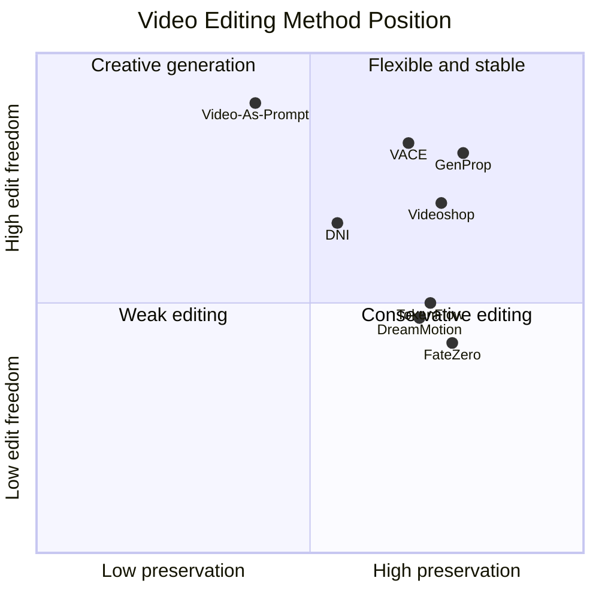

# 视频编辑方法选型速查

## 先按需求选路线

| 需求 | 优先阅读 | 核心条件 | 主要优势 | 主要风险 |
|---|---|---|---|---|
| 整体风格/材质变化 | TokenFlow、FLATTEN、RAVE、VidToMe | 源视频 + 文本 | 无需训练或轻量处理 | 大形变能力有限 |
| 精确替换某个词对应的对象 | Video-P2P、FateZero、VideoDirector | 源/目标文本 | 能保留提示词布局 | 注意力定位可能不准 |
| 用户直接编辑第一帧 | Videoshop、AnyV2V、GenProp、Visual Prompting | 源视频 + 编辑后首帧 | 控制直观、可用任意图像编辑器 | 首帧错误会传播 |
| 局部添加/删除/替换 | Videoshop、GenProp、VACE、SketchVideo | 首帧/Mask/草图 | 编辑区域明确 | 边界、遮挡和补全难 |
| 改变原动作 | DNI、MotionDirector、DragAnything | 文本/参考动作/轨迹 | 可放松原结构或显式控制 | 新动作与身份容易耦合 |
| 替换主体但保持原运动 | DIVE | 源视频 + 文本或参考图 | DINO 特征更少携带源外观 | 需身份注册，长视频未充分验证 |
| 多主体和交互动作 | VideoMage | 多主体图 + 参考动作视频 | 主体/动作 LoRA 可组合 | 训练和采样复杂，外观仍可能泄漏 |
| 重设相机视角 | Reangle-A-Video | 源视频 + 目标视角 | 显式处理视角变化 | 多视角修复和几何一致性成本高 |
| 草图控制几何和运动 | SketchVideo | 1-2 张关键帧草图 | 布局比文本更精确 | 草图不提供完整 3D/遮挡信息 |
| 多任务统一模型 | VACE、Wan | 文本/视频/参考/Mask | 一个模型覆盖多任务组合 | 训练成本高，条件可能冲突 |
| 复杂指令和因果变化 | Bernini | 多模态输入 + 指令 | 先规划再渲染 | Planner 错误会向后传播 |
| 用示例表达动态效果 | Video-As-Prompt | 目标图 + 参考视频 | 适合文字难描述的动态语义 | 不保证源视频像素级保真 |

## 选方法时必须问的六个问题

1. **目标是保留原运动，还是创造新运动？** 这是最先要区分的条件。
2. **编辑范围能否用 mask 或首帧明确表示？** 能明确表示时，局部保真通常更可靠。
3. **需要像素级保留，还是语义上相似即可？** 生成式方法往往只能保证后者。
4. **能否接受逐视频优化？** Tune-A-Video、VideoDirector、DreamMotion 等交互成本较高。
5. **是否有参考图、参考动作或参考视频？** 不同参考条件对应不同模型路线。
6. **视频多长、运动多大、遮挡多强？** 论文常在 14-49 帧短视频上评测，长视频不能直接套用结论。

## 五个常见错误判断

- **CLIP 分高不代表视频编辑成功。** 它可能符合文本但破坏了背景和原运动。
- **单帧很好看不代表时间一致。** 必须检查闪烁、身份漂移、纹理跳变和运动断裂。
- **零样本不代表便宜。** 多步 inversion、扩散采样和跨帧 attention 仍可能很慢。
- **保真度高不一定是优点。** 原视频结构保留太强会阻止非刚性编辑，DNI 正是针对这一问题。
- **统一模型不等于每项都最强。** VACE/Wan 减少模型数量，但可能在某些任务上弱于专用模型。

## 最实用的能力坐标系

图中位置是帮助理解的定性示意，不是论文量化排名。实际效果取决于底座模型、视频长度、提示、参考条件和任务类型。
