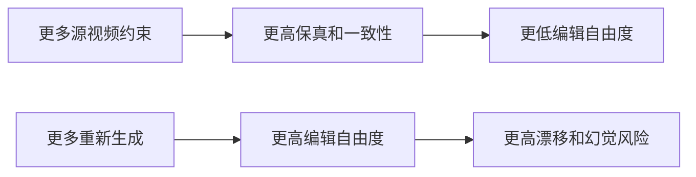

# 视频编辑术语速查

## 扩散与采样

- **Diffusion model**：训练模型从噪声逐步恢复图像或视频。
- **DDIM inversion**：把真实图像/视频沿扩散轨迹映射回噪声，使模型能够从这个噪声近似重建原内容。视频编辑常用它建立“可重建的编辑起点”。
- **Denoising**：从高噪声状态逐步预测干净 latent 的过程。
- **Latent**：图像或视频经 VAE 压缩后的内部表示，比像素更小，扩散通常在这里运行。
- **VAE**：负责像素视频与 latent 视频之间的编码和解码；它也可能损失小文字和细纹理。
- **Consistency model**：学习把不同噪声程度的样本映射到一致结果，可用更少步数生成或编辑。
- **Flow Matching**：学习连续概率流的速度场，是许多新视频 DiT 的训练方式。
- **Score Distillation**：利用预训练扩散模型的梯度直接优化一个图像、视频或 3D 表示，而不是完整执行标准采样。

## 注意力与特征

- **Self-attention**：画面/视频 token 之间互相读取信息；视频中可用于建立跨帧关系。
- **Cross-attention**：视觉 token 读取文本 token，常被解释为“某个词关注画面的哪些区域”。
- **Cross-frame attention**：让当前帧参考第一帧、关键帧或其他帧，减少身份和外观漂移。
- **Feature propagation**：先编辑少量关键帧，再把中间特征传播到其他帧。
- **Token merging**：把跨帧相似 token 临时合并，共享信息并降低注意力成本。
- **Optical flow**：估计像素从一帧移动到下一帧的位置；适合小到中等运动，但会受遮挡、大形变和估计误差影响。
- **DINOv2 feature**：自监督视觉模型提取的语义特征，通常比 RGB/光流更能稳定表示主体和部件，但不是完美运动表示。

## 视频编辑任务

- **Text-guided video editing**：用文本说明要修改什么。
- **Video-to-video (V2V)**：输入源视频并生成一个变换后视频。
- **Masked V2V**：只允许 mask 指定的时空区域被修改。
- **One-shot editing**：只依赖一个示例或一个源视频进行编辑/适配。
- **Zero-shot editing**：不针对当前视频额外训练模型；仍可能需要反演或优化 latent。
- **First-frame propagation**：用户只修改第一帧，模型把修改传播到后续帧。
- **Subject-driven editing**：用文本或参考图片指定目标主体身份，同时保留源视频动作或背景。
- **Motion customization**：从参考视频学习一个动作模式，再迁移给其他主体。
- **Trajectory control**：用户画轨迹，模型让指定对象沿轨迹运动。
- **Camera reangling**：改变观看源视频的相机视角，同时保持动作同步。
- **Inpainting / Outpainting**：补全 mask 内部区域 / 扩展原画面边界。

## 参数高效训练

- **LoRA**：在冻结大模型的基础上，只训练低秩增量矩阵。主体 LoRA 常学习外观，运动 LoRA 常插入时间模块学习动作。
- **Adapter**：在冻结主模型时添加可训练分支，通过残差向主干注入条件。
- **Pivotal tuning**：针对一个输入样本优化模型或条件，使其能更准确重建该样本。
- **Null-text optimization**：优化无条件文本 embedding，补偿扩散反演和重建误差。

## 保真与评测

- **Temporal consistency**：同一主体、纹理、颜色和背景在连续帧中是否稳定。
- **Motion fidelity**：编辑后视频是否保留或正确遵循目标运动。
- **Text alignment**：结果是否符合目标文本；不能代表未编辑区域保真。
- **CLIP / ViCLIP**：图文或视频文本相似度指标。
- **LPIPS / PSNR / SSIM**：衡量感知差异、像素重建和结构相似性。
- **FVD**：比较视频分布的生成质量与动态合理性，受数据规模和实现影响较大。
- **Warp error**：借助光流检查相邻帧经过运动对齐后是否仍有不一致。
- **VLM-as-judge**：用多模态大模型评价指令遵循、画质和一致性；更灵活，但存在评委模型偏差。

## 一个最重要的关系

视频编辑论文的大部分创新，都在重新调整这组权衡。
