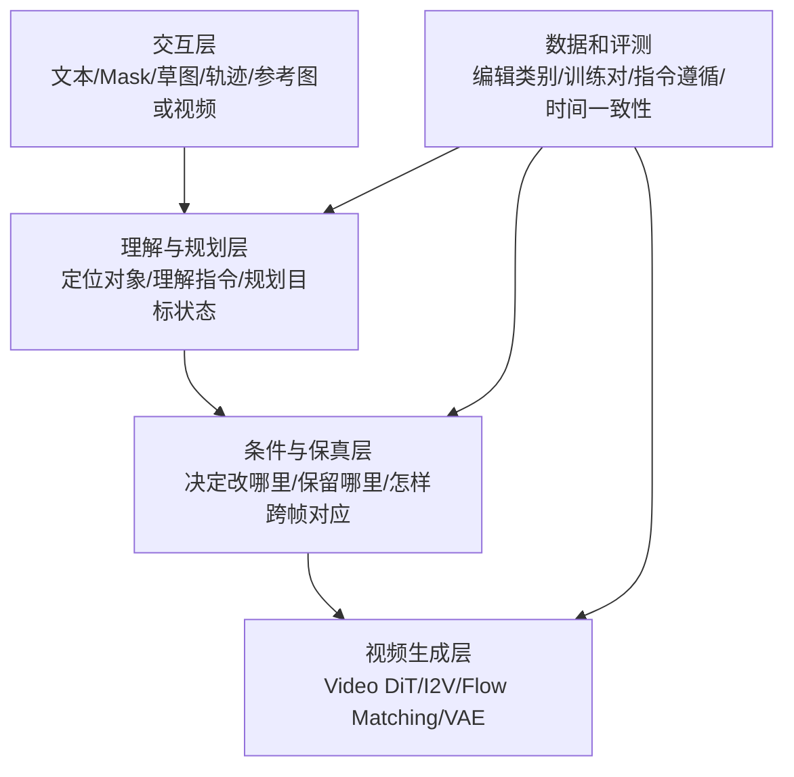

# 视频编辑论文入门阅读路线

这套资料覆盖 30 篇论文。不要按年份从头硬读，也不要一开始就钻公式。最有效的方式是先建立三个问题：

1. 模型怎样知道“要改什么”？
2. 模型怎样知道“哪些内容不能改”？
3. 模型怎样让同一个改动跨帧保持一致？

每读一篇，只要能回答这三个问题，就已经抓住主干。

## 第一阶段：理解视频编辑的基本矛盾

建议用 1-2 天完成。

1. [Tune-A-Video](./01_基础范式/01_Tune-A-Video.md)：为什么“只会画图”的模型也能临时学会视频。
2. [Text2Video-Zero](./01_基础范式/02_Text2Video-Zero.md)：怎样不训练模型，靠跨帧注意力得到基础时间一致性。
3. [Video-P2P](./01_基础范式/03_Video-P2P.md)：文本中的词怎样对应到视频区域。
4. [FateZero](./01_基础范式/04_FateZero.md)：为什么保存源视频的注意力能帮助编辑。
5. [TokenFlow](./01_基础范式/06_TokenFlow.md)：怎样把关键帧编辑后的特征传播到其他帧。

这一阶段读完应理解：早期方法大多借用图像扩散模型，并在“可编辑性”和“原视频保真”之间权衡。保留源特征越多，视频越稳定，但改动越不明显；重新生成越自由，越容易闪烁和漂移。

## 第二阶段：比较五种时间一致性机制

建议用 2 天完成。

1. [FLATTEN](./02_一致性机制/01_FLATTEN.md)：用光流找到跨帧对应位置。
2. [RAVE](./02_一致性机制/02_RAVE.md)：随机重组帧，让不同帧共同去噪。
3. [VidToMe](./02_一致性机制/03_VidToMe.md)：合并相似 token，同时降低注意力开销。
4. [CoDeF](./02_一致性机制/04_CoDeF.md)：把视频表示成标准内容和时间形变场。
5. [AnyV2V](./02_一致性机制/05_AnyV2V.md)：编辑第一帧，再让 I2V 模型继承变化。

把五种方法记成一句话：

- 光流回答“同一个像素去了哪里”。
- 特征传播回答“同一个语义部件对应哪个特征”。
- token 合并回答“哪些信息可以共享”。
- 形变场回答“整段视频怎样映射到统一底图”。
- I2V 先验回答“第一帧变化之后，后面合理地怎样动”。

## 第三阶段：理解反演、局部编辑和传播

建议用 2 天完成。

1. [Videoshop](./03_反演与传播/01_Videoshop.md)：为什么编辑第一帧需要更可靠的视频反演。
2. [DNI](./03_反演与传播/02_DNI.md)：为什么反演噪声保留太多原结构会限制动作改变。
3. [DreamMotion](./03_反演与传播/03_DreamMotion.md)：不用标准反演，直接优化视频变量是否可行。
4. [FastVideoEdit](./03_反演与传播/04_FastVideoEdit.md)：一致性模型如何减少采样和反演成本。
5. [GenProp](./03_反演与传播/05_GenProp.md)：如何把首帧修改传播训练成通用能力。
6. [Visual Prompting OCVE](./05_统一编辑框架/05_Visual-Prompting-OCVE.md)：把“编辑前后第一帧”当作视觉示例，彻底绕开 DDIM inversion。

这一阶段的核心不是记住所有采样公式，而是理解反演的作用：它为编辑提供一个能够重建源视频的起点。起点越贴近源视频，越容易保真；但也越容易被原结构锁死。

## 第四阶段：把“编辑什么”拆成可控维度

建议用 2-3 天完成。

1. [MotionDirector](./04_主体运动视角/01_MotionDirector.md)：从参考视频学习抽象动作。
2. [DragAnything](./04_主体运动视角/02_DragAnything.md)：通过实体表示和轨迹拖动物体。
3. [DIVE](./04_主体运动视角/03_DIVE.md)：用 DINO 特征保留源运动，同时替换主体身份。
4. [VideoMage](./04_主体运动视角/04_VideoMage.md)：组合多个主体 LoRA 和动作 LoRA。
5. [Reangle-A-Video](./04_主体运动视角/05_Reangle-A-Video.md)：重新设置相机视角，并保持原运动。
6. [SketchVideo](./05_统一编辑框架/04_SketchVideo.md)：用少量关键帧草图控制几何和运动。

读完后要能区分：主体身份、外观、动作模式、显式轨迹、相机视角和局部几何不是同一种控制。很多方法失败，原因正是这些因素没有解耦。

## 第五阶段：理解 2025 统一框架

建议用 2 天完成。

1. [Align-A-Video](./05_统一编辑框架/01_Align-A-Video.md)：奖励模型负责把结果推向更符合文本、更好看的方向。
2. [VACE](./05_统一编辑框架/02_VACE.md)：用 Video Condition Unit 统一文本、视频、参考图和掩码。
3. [VideoDirector](./05_统一编辑框架/03_VideoDirector.md)：直接在 T2V 模型中分开约束空间和时间。
4. [SketchVideo](./05_统一编辑框架/04_SketchVideo.md)：让关键帧草图成为稀疏控制接口。
5. [Visual Prompting OCVE](./05_统一编辑框架/05_Visual-Prompting-OCVE.md)：让图像 inpainting 模型从编辑示例中推断后续帧。

这一阶段要看到范式变化：研究重点从“怎样给图像模型补时间一致性”，转向“怎样给视频基础模型设计统一、可组合的编辑条件”。

## 第六阶段：从单篇方法上升到完整系统

建议最后用 1-2 天完成。

1. [Wan](./06_数据底座规划/01_Wan.md)：视频生成底座为什么决定编辑上限。
2. [OpenVE-3M](./06_数据底座规划/02_OpenVE-3M.md)：数据 taxonomy、指令遵循和 benchmark 为什么重要。
3. [Bernini](./06_数据底座规划/03_Bernini.md)：为什么复杂编辑需要先做语义规划，再做视频渲染。
4. [Video-As-Prompt](./06_数据底座规划/04_Video-As-Prompt.md)：当文字说不清动态效果时，参考视频本身可以成为提示词。

最终可以把视频编辑系统理解为四层：

## 推荐的最短路线

时间有限时，只读以下 10 篇：

1. Tune-A-Video
2. FateZero
3. TokenFlow
4. FLATTEN
5. Videoshop
6. GenProp
7. DIVE
8. VACE
9. OpenVE-3M
10. Bernini

这 10 篇足以建立从早期图像扩散改造，到跨帧一致性，再到首帧传播、主体替换、统一框架和语义规划的完整认知。
