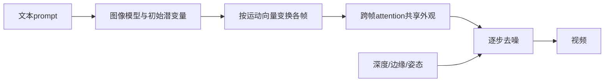

# 02 Text2Video-Zero：不训练也能把图像模型用于视频

## 元信息
- **论文**：*Text2Video-Zero: Text-to-Image Diffusion Models are Zero-Shot Video Generators*
- **作者**：Levon Khachatryan 等；**年份/venue**：2023，ICCV 2023
- **arXiv**：[2303.13439](https://arxiv.org/abs/2303.13439)；**定位**：零样本文生视频、运动潜变量、跨帧注意力

## 先记住一句话
它不训练视频模型，而是让不同帧的潜变量按运动规则变化，再让各帧参考彼此外观。类比是：只会画单张漫画的画师画连续漫画，每格改变位置，但都拿第一格作人物参照。

## 它要解决什么
Stable Diffusion 有强图像和文本先验，却不能直接输出稳定视频；逐帧生成会让脸、衣服、颜色和纹理变化。本文证明只改造推理过程也能生成短视频，并可结合深度、边缘、姿态等条件用于编辑。

## 输入输出
输入是文本 prompt，可选运动方向、相机运动、深度图、边缘图和姿态序列；输出是一段视频。它不是专门的编辑器，但其跨帧机制影响了 FateZero、TokenFlow 等工作。

## 方法流程（Mermaid）

1. 用文本获得初始潜变量；2. 为后续帧施加平移等运动；3. 将 self-attention 改为 cross-frame attention；4. 各帧联合完成去噪；5. 可加入结构条件。见 **Section 3–4、Figure 2、Figure 4、Figure 10**。

## 核心机制人话解释
它把“运动”和“外观”分开：潜变量平移告诉模型往哪里动，cross-frame attention 告诉模型仍是同一个主体。当前帧可以读取第一帧或参考帧的视觉特征，所以能抑制闪烁；但这不是精确跟踪器，只提供粗粒度外观锚点。

## 保留/编辑权衡
零训练带来低准备成本；深度、边缘和姿态能保留结构。代价是没有针对输入视频适配，细节保持较弱；编辑时背景仍可能被重绘，未编辑区域不保证像素级不变。

## 关键实验
论文展示纯文本、深度、边缘和姿态控制。**Figure 4** 说明跨帧机制优于逐帧生成；消融表明去掉运动潜变量或 cross-frame attention 后会明显闪烁。后续比较指出其长视频、大运动和细粒度身份保持能力不足。

## 成本
不需要训练或逐视频微调，直接用预训练图像模型；但每帧仍需扩散采样和跨帧特征计算。增加分辨率、帧数和控制条件会增加显存与时间，因此 zero-shot 是零训练，不是零计算。

## 局限
1. 运动常由规则或手工向量指定；2. 长视频误差累积；3. 大运动时身份和纹理漂移；4. 难处理复杂多主体和物理过程；5. 编辑时背景不能严格锁定。

## 读完后应建立的认识
视频能力可以通过组织图像模型的潜变量和注意力获得，不一定先训练视频模型；但隐式跨帧注意力只知道“应该相似”，不一定知道具体物体如何对应。

## 下一篇
[03_Video-P2P.md](./03_Video-P2P.md)：把 Prompt-to-Prompt 的词语—区域控制引入视频。
