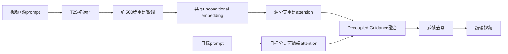

# 03 Video-P2P：用 cross-attention 控制视频里改哪里

## 元信息
- **论文**：*Video-P2P: Video Editing with Cross-Attention Control*
- **作者**：Shaoteng Liu、Yuechen Zhang、Wenbo Li、Zhe Lin、Jiaya Jia
- **年份/venue**：2024，CVPR 2024；**arXiv**：[2303.04761](https://arxiv.org/abs/2303.04761)
- **定位**：视频版 Prompt-to-Prompt、局部文本编辑、共享 unconditional embedding

## 先记住一句话
它让被替换的词主要改变对应区域，其他区域尽量不动。像把“孩子骑自行车”中的“孩子”改成“乐高孩子”，不重新画道路、自行车和姿势。

## 它要解决什么
图像 Prompt-to-Prompt 可控制词语对应区域，但视频还存在逐帧 inversion 不稳定、换 prompt 后整幅图重绘的问题。Video-P2P 把图像模型扩展为 Text-to-Set（T2S）模型，兼顾局部编辑和跨帧一致性。

## 输入输出
输入是真实视频、source prompt 和 target prompt；输出是编辑视频。支持 word swap、prompt refinement 和 attention re-weighting，例如换人物、材质或属性，同时保留姿势和环境。

## 方法流程（Mermaid）

1. 扩展多帧 T2S 模型；2. 约 500 步近似重建微调；3. 优化跨帧共享 unconditional embedding；4. 源分支追求重建、目标分支保留可编辑性；5. 融合 cross-attention。见 **Section 3、Figure 2–3、Table 1–3**。

## 核心机制人话解释
它把“还原原视频”和“接受新文字”拆成两分支。源分支使用优化后的 embedding，目标分支使用初始化 embedding；然后融合两边 attention。cross-attention 可以看作“某个文字正在看画面的哪一块”：改“孩子”时重点改人物，尽量继承道路和自行车的注意力。

## 保留/编辑权衡
它比全局重绘更擅长局部编辑，未修改词语和区域有保护；但文字与物体不总是一一对应，attention 可能扩散。编辑越激进，保持源结构与服从目标 prompt 的冲突越明显。

## 关键实验
**Table 1** 中完整方法 CLIP **0.3361**、Masked PSNR **20.54**、LPIPS **0.3297**、OSV **47.57**；Tune-A-Video+DDIM 的 OSV 为 55.12。**Table 2** 显示共享 embedding 约 **2.94M** 参数，却取得更好重建。8 帧、512×512、单 V100 示例约需初始化 5 分钟、inversion 6 分钟、推理 1 分钟。

## 成本
无需大规模视频训练，但每个视频仍需微调和 embedding 优化；比纯零样本慢，却比逐帧优化省内存，长视频会加重 T2S attention 与 inversion 成本。

## 局限
1. 每个视频都要预处理；2. 依赖准确 source prompt；3. 复杂场景 attention 易错位；4. 不擅长创造全新运动；5. 长视频受显存和 inversion 时间限制。

## 读完后应建立的认识
Video-P2P 的重点不是让模型知道视频怎么动，而是让它知道**文本中的哪一个变化应该影响画面的哪一块**。它代表“可编辑性优先”的路线。

## 下一篇
[04_FateZero.md](./04_FateZero.md)：直接融合 inversion 阶段注意力，减少目标 prompt 的逐视频训练。
