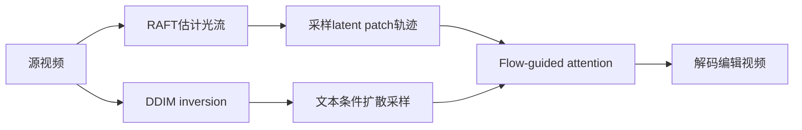

# 01 FLATTEN：用光流约束扩散注意力

## 元信息
- **题目**：FLATTEN: Optical Flow-guided Attention for Consistent Text-to-Video Editing
- **作者**：Yuren Cong 等
- **论文信息**：arXiv:2310.05922；ICLR 2024；本地原文：`FLATTEN_arXiv2310.05922.pdf`
- **任务类型**：免训练、文本引导的 T2V 视频编辑

## 一句话
普通方法让每一帧独立“化妆”，FLATTEN 先用光流确认“这是同一只眼睛、同一件衣服”，再让对应区域共享编辑信息。

## 问题
图像扩散模型擅长单图编辑，但逐帧处理视频时，各帧会独立生成颜色、纹理和局部细节，造成闪烁、纹理跳变和结构漂移。把所有帧直接放进密集时空注意力，又会让某个 patch 关注其他帧中的错误区域。论文希望在保留源视频运动的同时，让文本编辑在整段视频中稳定。

## 输入输出
输入是源视频和文本提示，例如“把猫变成老虎”“改成梵高画风”。输出是外观符合文本、运动和主体结构基本沿用源视频的编辑视频。它不是从文本完全生成新视频，而是以输入视频为运动与结构参考。

## 流程

1. 用 RAFT 估计相邻帧光流。
2. 将光流下采样到 U-Net latent feature 分辨率并采样 patch trajectory。
3. 对视频做 DDIM inversion，取得结构特征。
4. 让 query 只从同一光流轨迹上的 patch 收集 key/value。
5. 在 inversion 和 sampling 阶段使用该注意力并解码视频。

## 核心机制
关键是把跨帧通信从无差别的 dense spatio-temporal attention 改成“按运动对应通信”。Fig. 4 中，每个 query 沿光流轨迹寻找其他帧的对应 patch，再执行多头注意力。同一物体的颜色和材质得以共享，也减少背景或其他物体的无关信息混入。

## 时间一致性来源
一致性主要来自**显式光流对应关系**。模型不是笼统地要求各帧相似，而是让同一运动轨迹上的局部区域交换信息，因此对衣服纹理、脸部颜色、物体材质特别有效。

## 保留/可编辑权衡
光流对源运动和局部结构约束较强，因此颜色、纹理、风格编辑时保真度好；但若提示要求大幅改变物体形状，原轨迹未必仍有意义。它更偏向“沿原运动改外观”，而不是创造全新运动。光流估计错误、快速运动、遮挡和场景切换也可能把错误区域绑定在一起。

## 关键实验
Sec. 4 使用 LOVEU-TGVE 的 53 个视频：16 个 DAVIS 视频组成 TGVE-D，37 个 Videvo 视频组成 TGVE-V；统一为 512×512、32 帧。Table 1 中 TGVE-D 的 CLIP-F、PickScore、CLIP-T、ErrorWarp、Sedit 分别为 92.49、20.95、28.05、4.92、57.01；TGVE-V 的 Sedit 为 84.49。Table 2 中基础模型 ErrorWarp 为 13.40，加入 DSTA 后为 6.65，加入 FLATTEN 后为 6.27，最终组合为 4.92、Sedit 57.01。

## 成本
Table 5 在单张 A100、32 帧视频上报告 DDIM inversion 约 3 分 52 秒、sampling 约 3 分 45 秒，无额外训练。额外开销来自光流预处理、轨迹采样和注意力计算。

## 局限
1. 光流不准或存在大遮挡时，会出现错误传播、拖影或闪烁。
2. 对剧烈非刚体运动和大幅形状变化不够灵活。
3. 依赖底层图像扩散模型和 DDIM inversion 的重建质量。
4. 仍需逐视频估计光流，长视频和高分辨率下成本上升。

## 与上一/下一篇关系
本篇是该组首篇，代表“显式运动对应”路线。下一篇 RAVE 不估计每个 patch 的运动，而让多帧 latent 随机组成网格并共享去噪：RAVE 更轻量、更偏统计一致性，FLATTEN 的对应则更明确。
