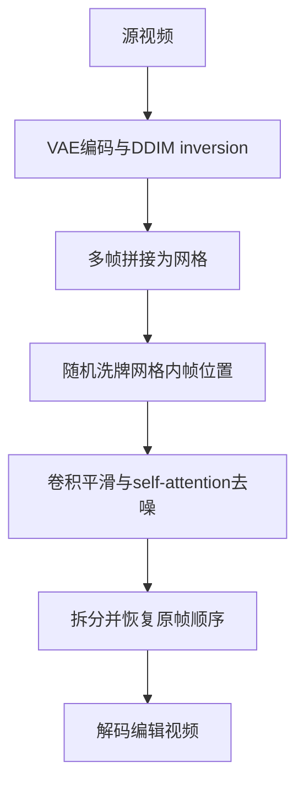

# 02 RAVE：通过随机噪声洗牌实现快速一致的视频编辑

## 元信息
- **题目**：RAVE: Randomized Noise Shuffling for Fast and Consistent Video Editing with Diffusion Models
- **作者**：Özgür Kara、Barışcan Kurtkaya、Hidir Yesiltepe、James M. Rehg、Pınar Yanardağ
- **论文信息**：arXiv:2312.04524，v1 提交于 2023-12-07；本地原文：`RAVE_arXiv2312.04524.pdf`
- **任务类型**：免训练、文本引导、基于 T2I 扩散模型的视频编辑

## 一句话
如果逐帧编辑像 90 个人各画一幅画，RAVE 就把多帧随机拼成大网格，让同一个扩散网络一次看到它们，从而共享风格、颜色和纹理。

## 问题
T2I 扩散模型单图质量高，但逐帧生成会闪烁；把长视频直接作为完整时空序列又显存昂贵。RAVE 希望不训练视频模型，也能处理较长视频、复杂形状编辑和多种文本控制。

## 输入输出
输入为视频、文本提示，以及可选的 depth、lineart 或 soft-edge 控制；输出为保留大体动作和结构、但外观或类别符合文本的视频。它支持风格、局部属性和形状变化，例如改变衣服或把狼改成恐龙。

## 流程

1. 编码视频帧并执行 DDIM inversion。
2. 按 2×2 或 3×3 网格把多个 latent 帧拼成大图。
3. 在扩散过程中随机打乱各帧在网格中的位置。
4. 让卷积层平滑 latent，self-attention 负责跨帧信息交换。
5. 按原索引拆帧、拼接并解码。

## 核心机制
RAVE 的关键是 **randomized noise shuffling**。随机重排使不同帧在多个网格中不断更换邻居，避免固定网格边界长期绑定。卷积减少局部 latent 跳变，self-attention 促使各帧采用统一风格。Fig. 4 对比独立网格、稀疏因果注意力和 RAVE，后者在跨网格颜色稳定性上更好。

## 时间一致性来源
一致性来自共享 latent 网格、共同去噪、卷积平滑和跨帧注意力。它没有显式光流，不知道两个 patch 是否属于同一物体，而是在生成统计上让所有帧互相影响。

## 保留/可编辑权衡
RAVE 对风格、属性和大幅形状编辑较灵活；DDIM inversion 和 ControlNet 则帮助保留源结构。但没有明确运动对应，快速运动、遮挡和细粒度纹理的稳定性不如光流方法。共享越强，一致性越好，但局部真实变化可能被抹平。

## 关键实验
论文使用覆盖物体、人物打字、跳舞、鱼和船等场景的视频集，并比较 8、36、90 帧。Table 1 中 90 帧时 RAVE 的 CLIP-F 为 95.99、WarpSSIM 为 80.51、CLIP-T 为 29.76、Qedit 为 23.95；用户研究的 General Editing、Temporal Consistency、Textual Alignment 分别为 90.51%、82.82%、86.67%。去掉 shuffling 后，90 帧 WarpSSIM 从 80.51 降至 76.58，Qedit 从 23.95 降至 22.76。

## 成本
无需训练新网络，分网格有利于控制显存，但仍要执行 DDIM inversion 和多步采样。90 帧完整运行约 4 分 28 秒，去掉预处理后约 3 分 13 秒；论文称平均比 TokenFlow 快约 1 分钟。

## 局限
1. 极端形状编辑在长视频中会退化，某些案例约 27 帧后开始明显降质。
2. 长毛发等高频细节仍可能闪烁。
3. latent 编解码和 DDIM inversion 会损失细节。
4. 随机交互没有显式运动对应，无法保证像素级轨迹正确。

## 与上一/下一篇关系
上一份 FLATTEN 用光流明确连接对应 patch；RAVE 把它换成随机网格中的共享去噪，更简单但对应关系更弱。下一篇 VidToMe 会把控制推进到 U-Net token 层，显式匹配、合并和还原跨帧 token。
