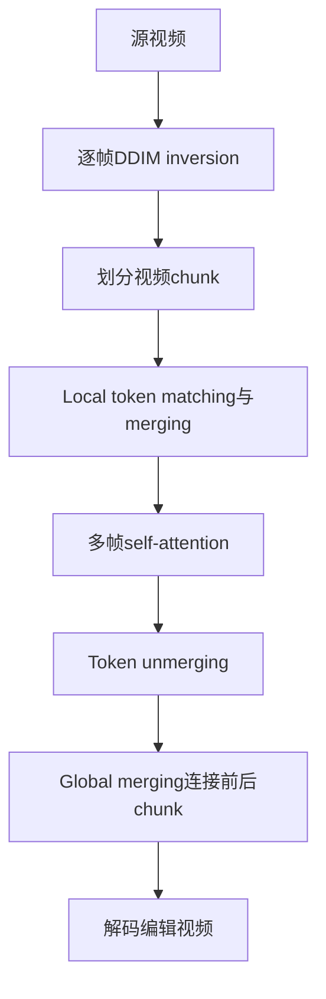

# 03 VidToMe：用跨帧 token 合并保持短期和长期一致

## 元信息
- **题目**：VidToMe: Video Token Merging for Zero-Shot Video Editing
- **作者**：Xirui Li、Chao Ma、Xiaokang Yang、Ming-Hsuan Yang
- **论文信息**：arXiv:2312.10656 v2，2023-12-19；本地原文：`VidToMe_arXiv2312.10656.pdf`
- **任务类型**：免训练、零样本、基于图像扩散模型的视频编辑

## 一句话
连续帧有大量重复信息，VidToMe 像把“同一个人的衣服和背景”的多份复印件暂时合成一份统一参考，处理完再还原到各帧。

## 问题
逐帧使用 T2I 模型会让每帧独立改变颜色和纹理；直接做多帧 self-attention 时，token 增多又会使显存按平方增长。论文要同时解决时间闪烁、长视频外观漂移和多帧注意力昂贵的问题。

## 输入输出
输入是源视频、提示和可选控制器；输出是保持结构和动作的编辑视频。

## 流程

1. 对各帧做 DDIM inversion。
2. 将视频分成若干 chunk，在 chunk 内用 bipartite soft matching 匹配相似 token。
3. 把其他帧 token 合并到目标帧，减少冗余并共享特征。
4. 完成 self-attention 后 unmerge，恢复各帧布局。
5. 用 global token 连接前后 chunk，防止长期漂移。

## 核心机制
VidToMe 在 self-attention 前后增加轻量 merge/unmerge 模块，不修改注意力本身。Local merging 负责相邻帧连续性；global merging 让前面建立的颜色、身份和风格影响后续 chunk。论文发现简单平均 token 会降低多样性，因此倾向 token replacement。Fig. 7 中，无 global merging 时彩虹羽毛颜色会漂移，平均合并则可能使特征变得单一。

## 时间一致性来源
一致性来自**跨帧 token 相似性匹配和特征共享**。它按扩散特征匹配对应关系，不需额外运动模型；合并还可压缩注意力输入。

## 保留/可编辑权衡
合并比例高时，一致性和显存节省更好，但可能抹平真实运动和局部差异；比例低时更保留逐帧自由，却可能重新闪烁。“特征相似”不等于“同一物体”，复杂遮挡和快速运动会造成误配。

## 关键实验
论文构造 60 个 512×512、每个 32 帧的编辑视频。Table 1 中结合 SD2-Depth 时，Interpolation Error 为 0.105、CLIP Score 为 25.6、Directional CLIP Score 为 0.012、Per-frame Semantic Alignment 为 0.971。Table 2 比较多帧注意力：逐帧 attention 的 Interpolation Error 为 0.253，扩展 attention 为 0.140，VidToMe 为 0.105。Fig. 6 表明显存可低于 7 GB。

## 成本
不需要视频训练，但每个扩散时间步都要做 token 匹配，并缓存 global token。合并减少显存，但不能消除 inversion 和采样成本。

## 局限
1. 底层图像编辑器若单帧失败，错误会传播到整段视频。
2. 相似但语义不同的对象可能被错误合并和混合。
3. 强合并牺牲细节与运动，弱合并削弱一致性。
4. token 相似度不是显式运动模型，对遮挡和大视角变化不够稳。

## 与上一/下一篇关系
上一份 RAVE 在 latent 网格层面让帧共同去噪；VidToMe 则直接控制 U-Net 内部 token，匹配更有针对性。下一篇 CoDeF 离开逐步扩散路线，先把视频拟合成 canonical content field 和 deformation field，再在统一内容图上执行编辑。
