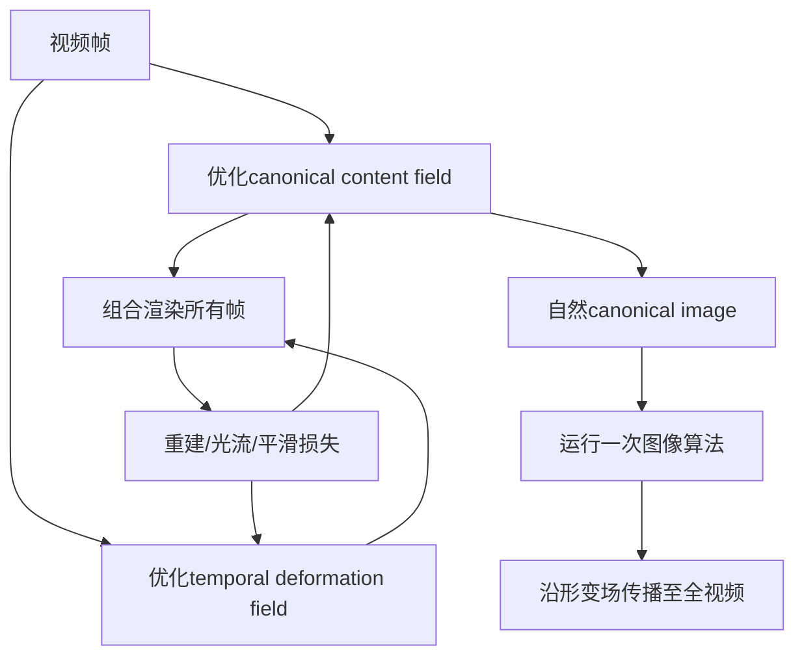

# 04 CoDeF：用内容场和形变场构建连续视频表示

## 元信息
- **题目**：CoDeF: Content Deformation Fields for Temporally Consistent Video Processing
- **作者**：Hao Ouyang、Qiuyu Wang、Yuxi Xiao 等
- **论文信息**：arXiv:2308.07926 v2；本地原文：`CoDeF_arXiv2308.07926.pdf`
- **任务类型**：视频表示、视频处理与时间一致编辑

## 一句话
CoDeF 先整理出一张“整个视频的标准内容底图”，再为每一帧记录底图内容如何移动；在底图上改一次，就能传播到全视频。

## 问题
图像处理工具比视频工具成熟，但逐帧运行会闪烁。传统视频 atlas 又常常扭曲并丢失眨眼、微笑等细节，导致图像算法在 atlas 上表现不佳。CoDeF 想建立既能精确重建视频、又足够自然可编辑的统一表示。

## 输入输出
输入是一个视频；直接输出是 canonical content field 和 temporal deformation field，二者能重建所有帧。随后可在 canonical image 上执行文本翻译、超分辨率、分割和关键点检测，再将结果恢复成视频。

## 流程

1. 建立 canonical field 与 deformation field 两个坐标 MLP。
2. 前者聚合静态内容，后者表示各时刻到 canonical 坐标的变形。
3. 用多分辨率 hash encoding 和渲染管线重建视频。
4. 用重建、光流一致性和形变平滑损失优化。
5. 采用 coarse-to-fine annealing，先学粗形变再加入高频细节。
6. 在 canonical image 上编辑一次，再传播到所有帧。

## 核心机制
所有帧共享一个 canonical content field，时间变化只由 deformation field 表达。光流损失约束对应点形变合理，平滑正则避免形变随时间抖动；canonical 语义约束则尽量让底图自然，避免成为严重扭曲的 atlas。复杂多物体和遮挡场景还可扩展为 grouped content deformation fields。

## 时间一致性来源
一致性来自**同一内容场加连续形变场**。编辑不在每一帧重新随机生成，而是在统一坐标中的一张内容图上发生，因此天然共享颜色、纹理和语义，再由时间形变恢复动作。

## 保留/可编辑权衡
统一编辑的时间一致性很强，图像算法只运行一次。但单一 canonical image 难以覆盖复杂遮挡、极端视角和大型非刚体形变。强调底图自然可能牺牲动态细节，追求完整重建又可能让底图变形、不利于图像算法。

## 关键实验
Sec. 4 评估刚体、非刚体、水和烟雾等场景，并与 Neural Image Atlas 等比较。论文报告重建 PSNR 约提升 4.4。Fig. 3 展示细节重建；Fig. 5—7 展示文本翻译、跟踪和超分辨率。关键结论是：只在 canonical image 上运行图像算法，也可得到时间稳定的视频结果。

## 成本
默认约 10,000 次迭代。单张 NVIDIA A6000 处理 100 帧平均约 5 分钟，按设置约 1—10 分钟。主要成本是每视频优化；建立表示后只需运行一次图像算法。

## 局限
1. 必须对每个视频单独优化，缺少 feed-forward 泛化。
2. 极端视角会出现 canonical image 未包含的新可见区域。
3. 大型非刚体形变可能需要多个 canonical image。
4. 内容场与形变场的分工不唯一，复杂多物体场景可能不稳。

## 与上一/下一篇关系
上一份 VidToMe 共享扩散 token，CoDeF 则共享整个视频的 canonical 坐标。下一篇 AnyV2V 也先得到可编辑中间结果再传播，但不优化形变场：它编辑第一帧后，依靠 I2V 模型、inverted latent 和时空特征完成传播。
