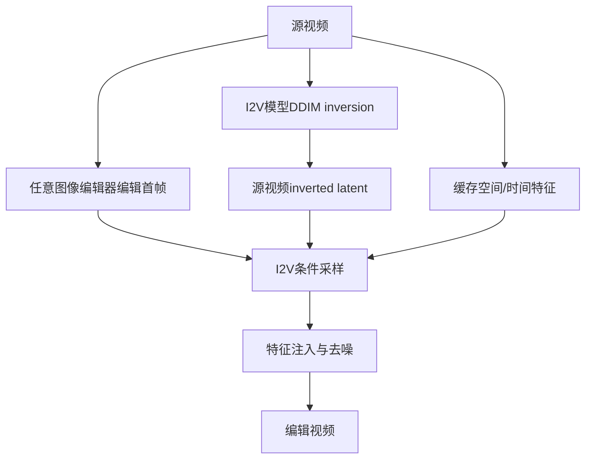

# 05 AnyV2V：先编辑首帧，再用 I2V 传播到整段视频

## 元信息
- **题目**：AnyV2V: A Tuning-Free Framework For Any Video-to-Video Editing Tasks
- **作者**：Max Ku、Cong Wei、Weiming Ren、Harry Yang、Wenhu Chen
- **论文信息**：arXiv:2403.14468 v4；TMLR 2024 年 11 月；本地原文：`AnyV2V_arXiv2403.14468.pdf`
- **任务类型**：免调参、统一的多类型 video-to-video editing

## 一句话
AnyV2V 像先把视频的第一张海报改好，再请一个懂“如何让海报动起来”的动画师，结合原视频动作把改动延续到整段视频。

## 问题
早期方法多依赖文本提示，或需要任务专门训练。AnyV2V 将编辑拆成单图编辑和图生视频，希望复用现成模型。

## 输入输出
输入是源视频和文本、风格图、主体图、身份图或修改后的首帧；输出是遵守首帧结果并保留动作的视频。

## 流程

1. 用 InstructPix2Pix、NST、AnyDoor、InstantID 或人工工具编辑首帧。
2. 用 I2V 模型对源视频执行 DDIM inversion。
3. 以编辑首帧作为 I2V 条件，inverted latent 作为生成起点。
4. 在卷积层和空间 attention 注入源视频特征，保留背景与结构。
5. 在时间 attention 注入 temporal feature，帮助动作跟随。
6. 去噪并解码；更长 inverted latent 可用于超过训练帧数的视频。

## 核心机制
AnyV2V 组合三类信号：编辑首帧决定“改成什么”；DDIM inverted noise 提供结构初始化；spatial/temporal feature injection 保留外观和动作。Sec. 4.3、4.4 分别介绍空间与时间注入。

## 时间一致性来源
一致性主要来自**I2V 模型自身的时空生成能力，加源视频 inverted latent 和 temporal feature**。它不逐帧独立编辑，也不需要显式光流或 token matching，而让已经学会“从首帧生成连续视频”的模型承担传播。

## 保留/可编辑权衡
首帧可由不同模型或人修改，支持文本、风格、主体和身份，也容易控制编辑区域。但首帧失败会传播错误，I2V 动作能力不足时后续帧会偏离源运动。特征注入越强，源视频保留越好，但大幅编辑可能受抑制。

## 关键实验
Table 2 中 AnyV2V 使用 I2VGen-XL 时 CLIP-Text 为 0.2932、CLIP-Image 为 0.9652；人工评价 prompt alignment 为 69.7%，overall preference 为 46.2%，高于 Tune-A-Video、TokenFlow 和 FLATTEN。Table 3 消融：完整模型 CLIP-Image 为 0.9648；去 temporal injection 后为 0.9652，但动作跟随变差；再去 spatial injection 后为 0.9637；再去 DDIM inverted noise 后为 0.9607。Table 4 共 89 个样本，覆盖四类任务。

## 成本
无需训练，但需要图像编辑模型、I2V、inversion、特征缓存和多步采样。单张 A6000 编辑 16 帧约需 15 GB 显存和 100 秒。

## 局限
1. 首帧编辑器不总能准确工作，主体替换可能需多次尝试与人工筛选。
2. I2V 难以跟随高速碰撞、复杂人物动作和严重遮挡。
3. I2V 常在约 16 帧数据上训练，长视频可能语义漂移。
4. 效果高度依赖所选 I2V backbone。
5. 特征注入强度需在源保真与编辑幅度之间折中。

## 与上一/下一篇关系
上一份 CoDeF 通过内容与形变场传播编辑；AnyV2V 改为编辑首帧，再由 I2V 传播。它接口最开放，但对外部模型依赖也最强。
