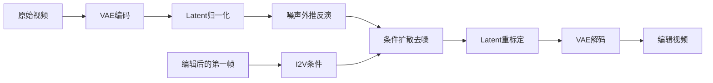

# 01 Videoshop：Localized Semantic Video Editing with Noise-Extrapolated Diffusion Inversion

## 元信息
- 作者：Xiang Fan、Anand Bhattad、Ranjay Krishna
- 年份 / Venue：2024，ECCV 2024
- arXiv：[2403.14617](https://arxiv.org/abs/2403.14617)
- 基础模型：Stable Video Diffusion（SVD）

## 一句话理解
Videoshop 像是“先在 Photoshop 里改好视频第一帧，再让图生视频模型把这张改好的图拍成连续镜头”。

## 问题、输入与输出
文本视频编辑通常只能粗略地改变类别、颜色或风格，逐帧编辑又容易闪烁。Videoshop 解决局部语义视频编辑：用户在第一帧添加、删除、替换或修改物体，系统把修改传播到整段视频，同时保持原运动和未编辑区域。

输入是原始视频 V 和编辑后的第一帧 I；第一帧可以由文本修复模型、普通图像编辑器或 Photoshop 制作。输出是编辑视频 J。

## Mermaid 流程

## 核心机制
论文 Figure 3 发现视频 latent 在去噪过程中近似沿直线运动：100 个视频的任意步骤方向平均余弦相似度为 0.9282，相邻步骤为 0.9919。因此 Videoshop 不把当前 latent 简单当作下一步输入，而是按噪声尺度比例外推下一步噪声，即 noise extrapolation。Section 3.5 还设置低噪声阈值，避免除以很小的噪声尺度造成不稳定。

第二个贡献是 latent normalization 和 rescaling。SVD 的 VAE 编码幅值方差较大，反演前将 latent 标准化，去噪后按照目标第一帧 latent 的均值和方差重标定。Figure 6 显示，去掉外推会造成视频不连贯，去掉归一化会使背景运动错误，去掉重标定会出现颜色偏移。

## 反演、局部编辑与传播
Videoshop 仍使用反演，但针对 SVD 的 EDM 形式修正累积近似误差。它不要求每帧 mask，局部性由编辑后的第一帧条件体现；时间传播交给 I2V 模型的时空先验，因此新增对象也可能获得独立运动。整体思路是“图像编辑 + 视频传播”，控制精细但受第一帧质量和 I2V 先验约束。

## 关键实验
实验使用 MagicBrush 生成的视频数据，以及从 HD-VILA-100M 抽取并由专家编辑的 45 个视频，统一为 14 帧、16:9。对比 Pix2Video、Fate/Zero、Spacetime Diffusion、RAVE 和 BDIA，评估 CLIP/TIFA、光流 EPE、FVD、SSIM 和连续帧 CLIP。MagicBrush 上 Table 2 的目标 CLIP 为 88.80，编辑区域目标 CLIP 为 85.58，未编辑区域 Flow+ 为 0.78，FVD 为 1478.76。Table 4 的人工偏好中，Videoshop 的编辑质量和视频质量偏好分别为 96.93% 和 84.62%，平均速度约为基线的 2.23 倍。

## 成本
无需训练或逐视频微调，但要做一次完整视频反演和一次完整扩散生成。论文报告 14 帧视频平均约 2 分钟，成本来自 VAE 编解码、多步噪声外推反演和多步去噪。

## 局限
1. VAE 可能损失小文字等细节。
2. 大幅运动或闪烁会降低时间一致性。
3. 训练免费意味着不能主动学习全新的运动，主要依赖基础 I2V 先验。
4. 长视频递归分块生成时误差可能累积。

## 路线关系
Videoshop 延续 DDIM/EDM 反演和 SVD，但把文本控制改成第一帧图像控制，并修正视频反演误差。前序方法多依赖文本、attention 或逐视频微调；下一篇 DNI 仍使用反演，但通过局部噪声稀释放松原视频结构。

## 下一篇
[02_DNI.md](02_DNI.md)
