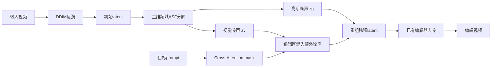

# 02 DNI：Dilutional Noise Initialization for Diffusion Video Editing

## 元信息
- 作者：Sunjae Yoon、Gwanhyeong Koo、Ji Woo Hong、Chang D. Yoo
- 年份 / Venue：2024，ECCV 2024
- arXiv：[2409.13037](https://arxiv.org/abs/2409.13037)
- 定位：可插入已有扩散视频编辑器的模型无关框架

## 一句话理解
DNI 像是在“需要改动作的地方把原视频的记忆调低音量，再混入更多随机性”，让模型不再被原姿势锁住。

## 问题、输入与输出
DDIM inversion 得到的初始 latent 虽然被称为噪声，却仍保留输入视频的布局和动作。这有利于风格、颜色和对象覆盖等刚性编辑，却阻碍“走路改跑步”“手掌改竖拇指”等非刚性编辑。DNI 输入原视频反演后的 latent、源/目标 prompt 和已有编辑模型，输出稀释后的 latent 及最终编辑视频。

## Mermaid 流程

## 核心机制
Noise Disentanglement 使用三维 DFT 和自适应频谱过滤器 ASF，把初始 latent 分成包含输入结构的 visual noise `zv` 和 Gaussian-like noise `zg`。不同于固定低通滤波器，ASF 从输入自身频谱生成权重。Figure 5 展示了初始 latent 中确实存在视频结构；Table 2 中 ASF 的 PSNR 为 18.4，高于不同尺度的 Gaussian low-pass filter。

Noise Dilution 在目标区域 mask `medit` 内加入额外高斯噪声：`z* = zg + medit·ε + (1−medit)·zv`。未编辑区保留输入结构，编辑区降低原结构影响，让目标 prompt 可以重新生成姿态。

## 反演、局部编辑与传播
DNI 不修改 DDIM inversion，而是在反演后处理 latent。局部区域由目标词的 cross-attention 得到：名词/形容词通常用 down-block attention，谓词或动作词用 mid-block attention，后者区域更宽，适合非刚性编辑，见 Section 4.2 和 Figure 6。DNI 没有独立时间传播网络，时间一致性仍依赖底层编辑器的 temporal attention、特征注入或 TokenFlow；稀释作用于整个视频的对应区域。

## 关键实验
实验使用 DAVIS 和 LOVEU-TGVE，基线为 Tune-A-Video、Video-P2P、FateZero 和 TokenFlow，指标包括 CLIP、PickScore、LPIPS、SSIM、Image-CLIP、FVD 和人工偏好。Table 1 显示 DNI 叠加所有基线都提升文本对齐。例如 TokenFlow 的非刚性/刚性 CLIP 从 21.7/27.4 提升到 25.9/29.6，LPIPS 从 0.160/0.157 降至 0.143/0.151，FVD 从 3152/3043 降至 3103/2912。人工偏好从 0.41 提升到 0.59。Figure 8 显示，视觉分支保真高但难改动作，噪声分支自由度高但身份易损失，两者结合最好。

## 成本
不需要重新训练、光流或深度估计。额外成本是一次三维 DFT/IDFT、attention mask 提取和噪声重组；主要成本仍是 DDIM inversion 与原有扩散去噪，因此它不能消除反演时间。

## 局限
1. 不能生成与原视频差异极大的自然运动。
2. 对空间上远离编辑目标但物理相关的区域处理不足。
3. attention mask 不准会导致稀释区域过小或过大。
4. 稀释强度需按任务调整，过强会损害保真度。
5. 它只改变初始化噪声，没有新增运动知识。

## 路线关系
DNI 接续 Tune-A-Video、Video-P2P、FateZero 和 TokenFlow 的保真路线，但指出结构保持也会导致编辑僵化。与上一篇 Videoshop 相比，Videoshop修正反演轨迹，DNI则选择性削弱反演 latent 的结构。下一篇 DreamMotion 将绕过传统反演，直接从原视频做 score distillation。

## 下一篇
[03_DreamMotion.md](03_DreamMotion.md)
