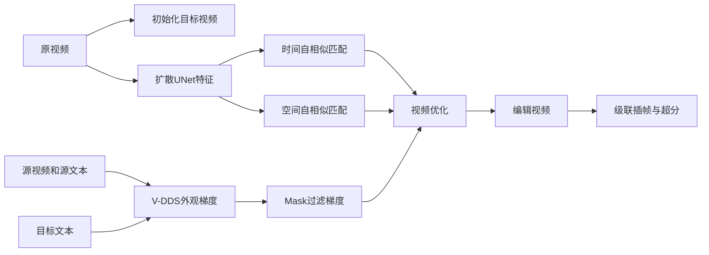

# 03 DreamMotion：Space-Time Self-Similar Score Distillation for Zero-Shot Video Editing

## 元信息
- 作者：Hyeonho Jeong、Jinho Chang、Geon Yeong Park、Jong Chul Ye
- 年份 / Venue：2024，ECCV 2024
- arXiv：[2403.12002](https://arxiv.org/abs/2403.12002)
- 基础模型：Zeroscope、Show-1

## 一句话理解
DreamMotion 像是在已拍好的原视频上“逐渐刷入新的外观”，同时用空间关系和时间关系做护栏，避免人物和动作变形。

## 问题、输入与输出
从噪声开始的生成容易得到新内容，却难保留真实视频的复杂运动；DDIM inversion 又会带来误差、闪烁和运动偏移。DreamMotion 直接以原视频为优化变量。输入原视频、源文本、目标文本和编辑区域 mask，输出外观符合目标文本、结构和运动尽量不变的编辑视频。

## Mermaid 流程

## 核心机制
V-DDS 用目标分支与源分支的噪声预测差异注入目标外观：`L_V-DDS = ||εφw(xt(θ),t,y)−εφw(x̂t,t,ŷ)||²`。它比普通 SDS 更适合编辑，但仍可能模糊和过饱和。

Spatial Self-Similarity Matching 从视频扩散 UNet 的 attention key feature 计算每帧空间位置之间的余弦相似度，保持物体相对结构。Temporal Self-Similarity Matching 先对每帧特征做空间平均，再匹配帧间相似度，抑制 flicker。Section 3.3–3.4 和 Figure 5 给出两个正则。三个损失共享噪声和时间步，一次扩散前后向即可共同计算。

## 反演、局部编辑与传播
DreamMotion 不使用标准 DDIM inversion，而是从原视频直接优化。局部编辑通过检测框或二值 mask 过滤 V-DDS 梯度，见 Figure 6；不使用 mask 会使非目标区域模糊和过饱和。时间传播不依赖光流，而由 temporal self-similarity 保持帧间关系。级联模型只在低分辨率 keyframe generation 阶段优化，再交给原有插帧和超分模块。

## 关键实验
非级联实验使用 DAVIS、WebVid 的 26 个 text-video pair，在 Zeroscope 上测试 8–16 帧视频，SGD 200 步、学习率 0.4。单张 A100 上 8 帧约 2 分钟，16 帧约 4 分钟。Table 1 中 Text-Align 为 0.8209，Frame-Con 为 0.9726，Motion-Fidelity 为 0.9259，Frame-LPIPS 为 0.3042；人工编辑准确性、帧一致性、结构运动保持分别为 4.14、4.21、4.33，优于多种基线。

级联实验使用 Show-1，只在 keyframe 阶段优化，约 3 分钟/A100。Table 2 优于 VMC 和 DDIM inversion + Word Swap。Table 3 消融说明去掉空间或时间自相似损失都会降低结构和运动质量。

## 成本
不做传统反演，也不逐视频微调，但需要约 200 步视频梯度优化。计算来自每一步扩散模型前向和反向，以及空间/时间自相似特征计算，因此 8 帧约 2 分钟，16 帧约 4 分钟，仍不适合实时。

## 局限
1. 不适合大幅结构、姿态或场景布局改变，Figure 10 明确展示此限制。
2. 多步梯度优化速度慢。
3. 需要外部检测框或 mask，区域错误会造成编辑泄漏。
4. V-DDS 仍可能模糊或过饱和。
5. 特征和相似度计算随帧数及分辨率增长很快。

## 路线关系
DreamMotion 接续 SDS、DDS 和视频特征一致性路线，但放弃“反演后去噪”。上一篇 DNI 仍在反演 latent 上做噪声处理；DreamMotion直接从真实视频优化。下一篇 FastVideoEdit 也取消 inversion，但改用 Consistency Model 少步直接映射，而不是数百步 score distillation。

## 下一篇
[04_FastVideoEdit.md](04_FastVideoEdit.md)
