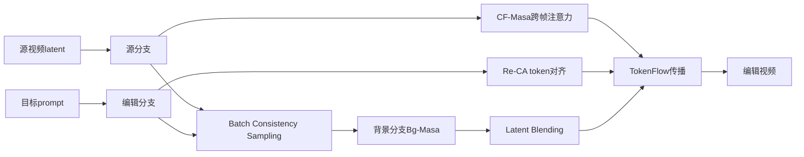

# 04 FastVideoEdit：Leveraging Consistency Models for Efficient Text-to-Video Editing

## 元信息
- 作者：Youyuan Zhang、Xuan Ju、James J. Clark
- 年份 / Venue：2025，WACV 2025
- arXiv：[2403.06269](https://arxiv.org/abs/2403.06269)
- 核心模型：Latent Consistency Model，CF-Masa、Re-CA、Bg-Masa、TokenFlow

## 一句话理解
FastVideoEdit 把“先把视频倒放到噪声、再从噪声重建”的长流程换成一个快速导航器，直接把源视频推向目标视频。

## 问题、输入与输出
传统扩散视频编辑经常需要 DDIM inversion、逐视频微调或光流/深度/边缘条件，速度很慢；仅做 latent blending 又会让前景编辑不足或背景被改动。FastVideoEdit 输入源视频、源 prompt 和目标 prompt，输出目标文本对齐且保留主体、背景和时间结构的编辑视频。

## Mermaid 流程

## 核心机制
Consistency Model 的自一致性允许同一生成轨迹上的不同噪声状态直接映射到相同干净样本。FastVideoEdit 因此从源 latent 计算 reconstruction noise，并通过噪声校准估计编辑分支 noise，避免 DDIM inversion，见 Section 4.1、Equation 8–9。

CF-Masa 在早期步骤借用源分支 query/key，并在跨帧维度拼接 key/value，保持内容和时间结构。Re-weighted Cross-Attention 根据源/目标 prompt token 对齐来限制修改范围。背景 branch 同时借用源内容和编辑结构，每一步根据编辑 token attention 得到 blending mask，把背景区域替换回来，见 Equation 14–15。

## 反演、局部编辑与传播
FastVideoEdit 完全取消 DDIM inversion，借助 consistency sampling 直接完成 source-to-target 映射。局部区域来自目标 token 的 cross-attention：高 attention 区域保留编辑，低 attention 区域使用背景 branch。时间传播由 CF-Masa 和 TokenFlow完成：先处理关键帧，再用相邻关键帧中最相似的空间特征替换非关键帧特征。

## 关键实验
实验使用 TGVE 2023 的 76 个视频，每个 32 帧、480×480。对比 Rerender、Text2Video-Zero、FateZero、Pix2Video、TokenFlow、RAVE 和 DMT。Table 1 中 Tem-Con 为 96.5，Txt-Sim 为 27.7，Clip-Acc 为 71.1，人工 P/Q/C/T 为 2.9/3.8/3.6/3.9。编辑时间只有 61.7 秒，TokenFlow 为 292.4 秒，FateZero 为 581.7 秒。Table 2 消融显示，去掉 CF-Masa、Re-CA、Bg-Masa 或 TokenFlow 会分别损害编辑准确性、背景保持或时间一致性。

## 成本
它省去 DDIM inversion、额外条件提取和大量采样步，32 帧约 61.7 秒。代价是每步并行处理 source、edit、background 三个 branch，并执行注意力控制、latent blending 和 TokenFlow，因此不是单次 UNet 前向，长视频仍有显存压力。

## 局限
1. 不同视频需调整噪声调度、attention 阈值和 blending 参数。
2. 对大幅运动和几何变化没有保证。
3. 依赖 LCM 的重建和编辑能力。
4. attention map 不准会混淆编辑区与背景区。
5. 多 branch 和特征传播增加显存占用。

## 路线关系
FastVideoEdit 接续 MasaCtrl、FateZero、TokenFlow 和 Rerender-A-Video，但把速度放在核心。上一篇 DreamMotion也绕过 inversion，却用多步梯度优化；本方法使用 consistency model 少步采样。下一篇 GenProp 将进一步从扩散轨迹控制转向训练式 I2V 生成传播。

## 下一篇
[05_GenProp.md](05_GenProp.md)
