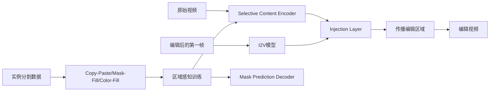

# 05 GenProp：Generative Video Propagation

## 元信息
- 作者：Shaoteng Liu、Tianyu Wang、Jui-Hsien Wang 等
- 年份 / Venue：2025，CVPR 2025
- arXiv：[2412.19761](https://arxiv.org/abs/2412.19761)
- 核心模型：Selective Content Encoder（SCE）+ Image-to-Video（I2V）

## 一句话理解
GenProp 像是训练了一个“视频接力员”：先记住原视频中不该改变的内容，再让 I2V 把第一帧中的新增、删除或替换内容接力到后续帧。

## 问题、输入与输出
GenProp 将对象替换、插入、删除、背景替换、outpainting 和 tracking 统一为“第一帧修改传播”。传统方法依赖 optical flow、depth、deformation field、atlas 或逐帧 mask，容易误差累积；扩散编辑又常只擅长外观变化，难以完成大形状替换、独立运动插入及阴影/反射同步处理。

输入是原始视频和编辑后的第一帧；输出是修改已传播到全视频、其他区域尽量保持一致的结果。训练时还使用任务 embedding 和实例分割生成的合成数据。

## Mermaid 流程

## 核心机制
SCE 类似 ControlNet，复制 I2V 的前若干 block，把原视频信息注入生成网络，但只应保留未编辑区域。I2V feature 反馈给 SCE，使其感知修改区域。Mask Prediction Decoder 从后部 feature 预测编辑区域，作为训练辅助头。

Region-Aware Loss 将监督拆为非 mask 区域、mask 区域和 SCE gradient loss，并加入 MPD 损失：`L=L_non-mask+λL_mask+βL_grad+γL_MPD`。非 mask 项保持原内容，mask 项允许正确传播，gradient 项抑制 SCE 读取编辑区域。训练数据来自 Youtube-VOS、SAM-V2 等实例分割数据：Copy-and-Paste 模拟插入，Mask-and-Fill 模拟删除/修复，Color Fill 模拟跟踪。

## 反演、局部编辑与传播
GenProp 基本不依赖 DDIM inversion，不在每个扩散时间步修改反演 latent，而是把原视频送入 SCE，把编辑后的第一帧送入 I2V。推理时不要求用户提供全视频 dense mask，训练 mask 只用于监督。时间传播由 I2V 模型完成，因此能推断新增物体的独立运动，也能把阴影和反射一起删除或跟踪。Figure 1 展示背景替换、对象插入、对象及效果删除、跟踪和多重编辑。

## 关键实验
GenProp 使用类似 Sora 的 DiT I2V 与 SVD U-Net 变体，主实验支持 32、64、128 帧、360p 输入，并可超分到 720p；基础 I2V 冻结，SCE/MPD 在 32 或 64 张 A100 上训练。Table 1 中 Classic Test Set 的 PSNRm 为 33.837，Challenging Set 为 32.163，困难集 CLIP-T 为 0.3336，优于 InsV2V、AnyV2V、Pika 和 ReVideo。121 人用户研究中，GenProp 在指令对齐和视频质量上明显胜出。对象删除 Table 2 的 CLIP-I 为 0.9879，优于 SAM+ProPainter 与 ReVideo；Table 3 表明去掉 MPD 或 RA Loss 会降低结果质量。

## 成本
训练成本高，需要构造实例分割合成数据，并使用 32/64 张 A100 训练 SCE 与 MPD。但推理不需要逐视频微调、DDIM inversion、光流、深度或 dense mask。它把每个视频的优化成本转移为一次性模型训练成本；推理仍受大型 I2V 模型速度限制。

## 局限
1. 训练资源需求高，不能直接即插即用。
2. 比 SAM-V2 等传统跟踪器慢，不能实时 tracking。
3. 长视频、复杂遮挡和生成式补全仍可能漂移或产生幻觉。
4. 第一帧编辑若与后续物理运动不匹配，传播可能不稳定。
5. 生成式保持强调语义一致，不保证像传统修复那样像素级复制。

## 路线关系
GenProp 延续 Videoshop 的“第一帧编辑传播”，但把无训练 I2V 传播升级为训练式统一框架。它不同于 DNI 的噪声稀释、DreamMotion 的 score distillation 和 FastVideoEdit 的 consistency sampling，而是在架构层面分离“内容保持”和“内容生成”。这代表从扩散过程控制转向生成式视频传播。

## 下一篇
本组论文到此结束，可继续阅读统一视频编辑框架、主体运动控制或视频编辑数据集方向。
