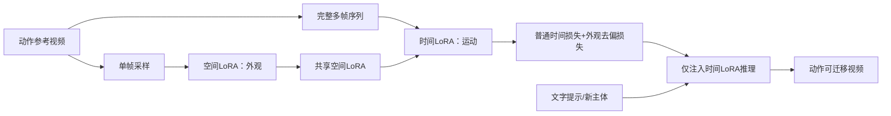

# 01 MotionDirector：动作定制

## 元信息
- **题目**：MotionDirector: Motion Customization of Text-to-Video Diffusion Models
- **作者**：Rui Zhao、Yuchao Gu、Jay Zhangjie Wu、David Junhao Zhang、Jia-Wei Liu、Weijia Wu、Jussi Keppo、Mike Zheng Shou。
- **版本与发表**：arXiv:2310.08465v1，2023-10-12；正式版本为 ECCV 2024。双路径见图3，潜空间分析见图4，实验见第4节，成本见4.3节，局限见第5节。

## 一句话
把“演员长什么样”和“演员怎么运动”录进两个可插拔滤镜：换演员时只换外观，仍可复用原来的动作。

## 控制对象、输入与输出
主要控制**运动概念**，如打高尔夫、举重、骑行、先直行再左转，也可能包含主体和镜头运动。输入是一段或多段动作参考视频，以及描述新主体和场景的文字提示；输出是不同主体执行相同动作的视频。它还支持混合视频A的外观与视频B的动作，或用静态图像承载动作。

## Mermaid流程

## 核心机制
基础视频扩散模型冻结。空间路径在 spatial Transformer 的 self-attention 和 FFN 中插入空间LoRA，每步只随机取一帧，主要学习外观。时间路径复制基础模型，共享空间LoRA，并在 temporal Transformer 中插入时间LoRA，用完整序列学习帧间依赖。普通视频LoRA微调会把人物、衣服和背景带入动作模块，因此第3.2节提出 appearance-debiased temporal loss：以同一视频一帧噪声为anchor，对各帧噪声和预测噪声做中心化，再计算时间损失。图4显示，同一视频潜变量的连接结构更受运动影响，不同视频集合间距离更多由外观影响。

## 运动与外观如何解耦
这是“层位置+训练采样+损失”的近似解耦：空间LoRA用单帧训练，时间LoRA用多帧训练；时间路径共享空间LoRA，避免时间LoRA重建外观；去偏损失进一步压低外观对时间预测的影响。推理只加载时间LoRA即可让新主体执行相同动作，同时加载空间LoRA则可控制参考外观。

## 关键实验
UCF Sports Action含95段视频、12类动作和72个提示；LOVEU-TGVE-2023含76段参考视频和532个提示。第4.1节表1中，ZeroScope上的外观多样性为28.94、时间一致性92.67、Pick Score 20.80，动作保真度人类偏好76.47%。第4.2节表2显示其整体优于VideoComposer、Control-A-Video、VideoCrafter和Tune-A-Video。图5、6显示耦合微调会把“人类”外观带入“猴子打高尔夫”，双路径方法能保留新主体。

## 训练与推理成本
ZeroScope约18亿参数；空间LoRA增加约900万参数，时间LoRA约1200万参数。约14GB显存下，多参考视频约20分钟收敛，单参考视频约8分钟。推理只加载LoRA，远低于全量微调。

## 局限
1. 第5节指出，多主体复杂动作（如多人踢足球）仍难学习，主体动作没有进一步拆分。
2. 去偏是潜空间近似，时间LoRA仍可能残留主体或场景偏差。
3. 用户不能直接修改某一对象某一帧的轨迹，动作由参考视频隐式决定。
4. 结果受基础T2V模型的主体生成、视频长度和分辨率限制。

## 前后关系
它把Tune-A-Video、AnimateDiff的主体/风格个性化推进到动作概念定制。VideoMage继承双LoRA并增加多主体融合和协同采样；DragAnything把隐式动作改为显式拖拽轨迹；DIVE保持已有动作并替换主体；Reangle-A-Video把解耦对象转向视角外观与视角无关运动。
