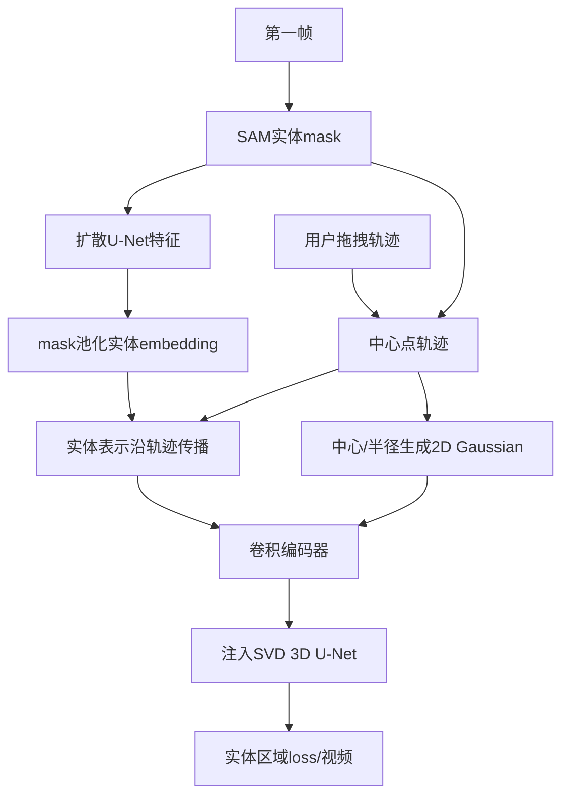

# 02 DragAnything：拖拽轨迹

## 元信息
- **题目**：DragAnything: Motion Control for Anything using Entity Representation
- **作者**：Weijia Wu、Zhuang Li、Yuchao Gu、Rui Zhao、Yefei He、David Junhao Zhang、Mike Zheng Shou、Yan Li、Tingting Gao、Di Zhang。
- **版本与发表**：arXiv:2403.07420v3，2024-03-15；正式收录ECCV 2024。动机见图3，框架见图4，训练标签见图5，实验见第4节，局限见6.2节。

## 一句话
普通拖拽像拽动一根头发，结果整张照片变形；DragAnything先认出“这是整只鸟”，再拖动鸟这个实体。

## 控制对象、输入与输出
主要控制**实体的二维轨迹**，同时回答“拖的是什么主体”。输入为第一帧、SAM选出的实体mask、一个或多个用户轨迹和可选文字条件；输出为对象按轨迹运动的SVD视频。它可同时控制多个前景、云层等背景实体，也可选中整图实现基础相机平移和缩放。

## Mermaid流程

## 核心机制
DragNUWA、MotionCtrl把点或轨迹图直接编码为条件，实际拖动的是像素，容易出现局部变形、错误相机运动或对象不能整体移动。DragAnything先对第一帧执行扩散前向过程，用U-Net得到latent特征，再从mask覆盖区域取特征并平均池化，得到表示“这个实体是什么”的embedding，之后将它放到随时间移动的实体中心位置。

它还引入2D Gaussian表示，使中心附近像素权重更高、边缘权重更低，减少拖点附近过度运动。实体表示和Gaussian经过四个卷积块下采样到latent空间，再像ControlNet一样注入SVD 3D U-Net。训练用实体区域loss mask，只对目标区域反向传播。

## 运动与外观如何解耦
它不是空间/时间LoRA分离，而是把条件拆成三项：扩散特征表达实体身份，Gaussian表达中心和影响范围，轨迹表达实体如何运动。外观由实体语义特征提供，运动由轨迹和逐帧实体表示提供，loss mask保护无关区域，因此属于“实体级条件控制”。

## 关键实验
基础模型为SVD，VIPSeg训练/验证集统一为256×256、14帧。第4.1节使用AdamW、学习率1e-5、100k steps，以FID、FVD、ObjMC和用户投票评估。表1中ObjMC为305.7，优于DragNUWA的324.6；FVD为494.8，优于519.3；FID为33.5，优于39.8。论文报告运动控制人类投票高26%，视频质量高12%。表2显示仅实体表示的ObjMC为318.4，仅Gaussian为339.3，二者结合达到305.7；表3说明loss mask还能改善约5.4。

## 训练与推理成本
训练在Tesla A100上进行，100k steps，论文未给出完整时长和显存峰值。推理需要SAM交互分割、一次扩散特征提取和视频采样。统一模型可响应不同轨迹，但SAM、实体特征构造和视频扩散仍构成交互成本。

## 局限
1. 第6.2节指出，轨迹控制局限于二维，难处理转身、身体旋转和真实三维运动。
2. 结果受SVD基础模型限制，基础模型无法生成的对象不能靠轨迹补救。
3. 大幅拖拽会导致对象变形、失真或跟不上目标，图10展示坏例。
4. 严重遮挡、实体分裂/合并或大幅形变时，单一第一帧embedding可能不够。

## 前后关系
它直接回应DragNUWA、MotionCtrl的像素级轨迹控制，把单位从pixel提升到entity。与DIVE一样使用语义视觉特征，但DragAnything用扩散特征构造可拖实体，DIVE用DINOv2做跨帧对应和身份注册。与MotionDirector相比，它让用户显式画轨迹；与VideoMage相比，它控制位置，VideoMage通过LoRA和注意力组合交互动作。
