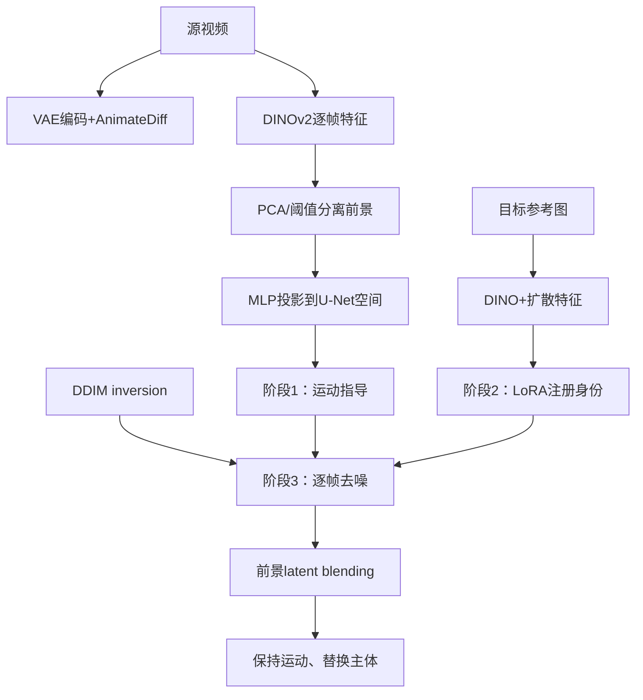

# 03 DIVE：DINO对应

## 元信息
- **题目**：DIVE: Taming DINO for Subject-Driven Video Editing
- **作者**：Yi Huang、Wei Xiong、He Zhang、Chaoqi Chen、Jianzhuang Liu、Mingfu Yan、Shifeng Chen。
- **版本与发表**：arXiv:2412.03347v2，2025-07-29；项目页和arXiv信息显示接收ICCV 2025。DINO分析见图2，总体管线见图3，方法见3.2节，实验见第4节和表1–2。

## 一句话
它给源视频中的猫安装一套只认轮廓和部位、不太在意毛色纹理的追踪器，再让目标主体沿同一条动作轨迹运动。

## 控制对象、输入与输出
主要控制**主体身份**，同时保留源视频的运动、背景和时序。输入是一段源视频，以及目标主体的文字描述或通常3–5张参考图；输出是把源主体替换为目标身份的视频，例如将小猫换成白狐、将银色吉普换成红色轿车。

## Mermaid流程

## 核心机制
第3.1节和图2指出，DINOv2特征跨帧具有语义一致性，可以跟随主体位置和部位，同时比RGB或普通扩散特征少携带纹理、颜色。第一阶段将源视频编码为latent，用DINOv2提取特征，PCA加阈值自适应生成前景mask；四组MLP将DINO前景特征投影到Stable Diffusion U-Net各下采样层，以masked diffusion loss只在主体区域优化，并偏向高噪声时间步，减少低层细节过拟合。

第二阶段对目标参考图提取DINO和扩散特征，将高层语义与低层细节融合，用LoRA注册目标身份。第三阶段先对源视频做DDIM inversion，去噪时注入源DINO运动特征、加载目标LoRA，并把源文本主体词替换为目标词；前景mask通过latent blending保护背景。

## 运动与外观如何解耦
运动来自源视频DINO跨帧语义对应，身份来自目标参考图DINO和LoRA，背景来自源视频inversion。这样源主体“怎么动”和目标主体“长什么样”分开学习。它不是绝对无泄漏：DINO仍是视觉特征，LoRA也可能学习背景偏差，但比直接注入源扩散特征更干净。

## 关键实验
数据为30段DAVIS和互联网视频，每段16帧、stride 4；目标身份8类，每类3–5张参考图。阶段1用Adam、5e-4、50–100 iterations；阶段2用1e-4、800–1000 iterations；推理为50步inversion加50步去噪，单张RTX 3090即可。表1参考图设置中，DIVE的Text Alignment为29.43、Image Alignment为84.27、Temporal Consistency为92.33、Overall Video Quality为0.775，用户偏好率65.6%，高于Slicedit、AnyV2V、FLATTEN和RAVE。文字设置的时间一致性为95.89，偏好率52.8%。图6、7和表2表明去掉DINO指导会降低主体和运动对齐。

## 训练与推理成本
无需全量训练视频模型，但每个目标身份通常需单独训练LoRA。阶段2是主要训练成本；每次编辑还要逐帧inversion和50步去噪，故不是完全零样本即时编辑。

## 局限
1. DINOv2来自图像预训练，对快速三维运动、严重遮挡、透明物体和强形变的对应可能不可靠。
2. 身份注册依赖参考图和数百至上千次迭代，换主体需重新适配。
3. PCA、阈值和前景mask在主体与背景相近时可能误分。
4. 实验以16帧和Stable Diffusion/AnimateDiff为主，长视频、多主体和高分辨率泛化仍有限。

## 前后关系
DIVE继承Tune-A-Video、FateZero、TokenFlow的跨帧保持思路，但针对内部特征夹带源外观的问题。它区别于RAVE、FLATTEN的密集深度/光流对应，使用语义稳定的DINO；与VideoSwap的手工语义点相近但无需手工标注。与DragAnything相比，前者用扩散特征表示可拖实体，DIVE用DINO表示源运动和目标身份；与MotionDirector相比，DIVE编辑已有视频而不是训练可复用动作LoRA。
