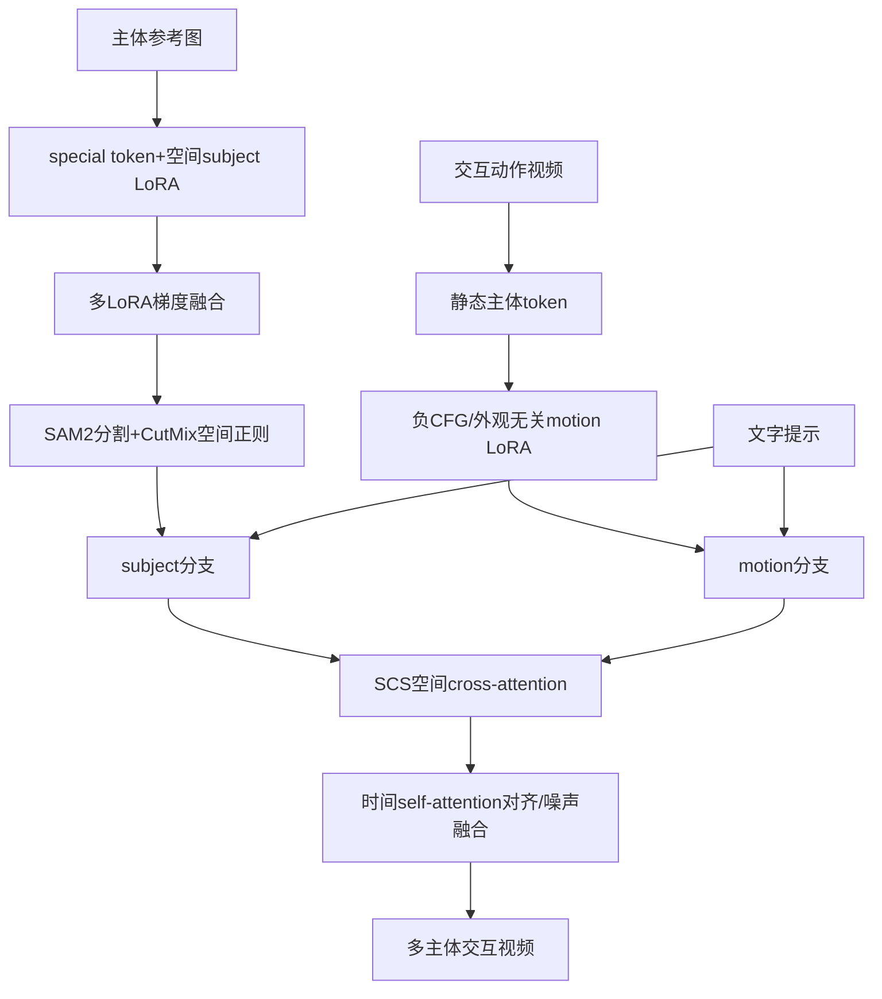

# 04 VideoMage：双LoRA

## 元信息
- **题目**：VideoMage: Multi-Subject and Motion Customization of Text-to-Video Diffusion Models
- **作者**：Chi-Pin Huang、Yen-Siang Wu、Hung-Kai Chung、Kai-Po Chang、Fu-En Yang、Yu-Chiang Frank Wang。
- **发表**：CVPR 2025，CVF页码17603–17612，基础模型主要为ZeroScope。总体见图2，外观无关动作见图3，协同采样见图4，结果见表1，消融见表2和图7。

## 一句话
它像导演拥有多张演员身份滤镜、一条动作排练录像，再用空间和时间两种对讲机让演员正确互动。

## 控制对象、输入与输出
同时控制**多个主体、身份、交互动作和空间排列**。输入是多个主体各自约3–5张参考图、一段交互动作视频和文字提示；输出是指定主体按照参考动作互动的视频，例如玩具骑狗，同时可更换背景和主体类别。

## Mermaid流程

## 核心机制
subject LoRA只插入空间层，motion LoRA只插入时间层。主体图通过special token和空间LoRA学习身份，并用辅助视频数据正则化以保留基础运动。训练动作LoRA时，先从参考视频单帧学习“人”“马”等静态token，再构造动态动作提示与静态主体提示，用负classifier-free guidance从动态预测中减去静态外观，减少motion LoRA复制人物、衣服或动物外观。

多主体融合不是简单平均，而是用gradient-based fusion将多个身份蒸馏到一个fused LoRA；Grounded-SAM2分割主体并生成CutMix视频，用空间cross-attention与mask差异做正则，减少属性串位。推理时复制噪声latent，建立subject和motion两个分支。Spatial-Temporal Collaborative Sampling（SCS）让subject分支提供位置、motion分支提供时间动作，并在前期去噪中互相对齐注意力图后融合噪声。

## 运动与外观如何解耦
这是“空间/时间双LoRA+负指导+注意力协同”的三层解耦。空间LoRA学身份，时间LoRA学动作；负CFG抑制参考动作中的外观泄漏；SCS解决两个LoRA直接叠加时的空间错位和动作错配。因此训练与采样阶段都进行身份—动作分离。

## 关键实验
作者收集6段WebVid交互动作视频，每种动作3对主体、4个背景提示，共72种组合，每种生成10个视频；视频为24帧、8fps、320×576。表1中VideoMage的CLIP-T为0.662、CLIP-I为0.670、DINO-I为0.407、时间一致性为0.983；相较MotionDirector，CLIP-I提升约5.7%，DINO-I约10%。表2显示去掉motion loss、attention regularization或SCS后指标下降；图7分别展示外观泄漏、属性混合和主体排列错误。用户研究含360个视频、25名参与者。

## 训练与推理成本
主体和motion LoRA约训练300 iterations；LoRA学习率约1e-4，文本相关参数约1e-5，推理使用50步DDIM、CFG 9。多主体LoRA需要test-time fusion，SCS还要在前期去噪中计算两个分支和注意力梯度，比单LoRA更耗显存和时间，但不用全量训练ZeroScope。

## 局限
1. 多主体交互依赖文字、分割mask和注意力对齐，复杂遮挡、接触和细粒度物理关系仍可能错误。
2. 外观无关学习依赖负指导强度，过弱会泄漏，过强会损伤动作。
3. 每个主体需参考图和LoRA，主体数量增加会增加训练、融合和显存成本。
4. 实验主要基于6段动作视频和ZeroScope，长视频、高分辨率及复杂交互仍未充分验证。

## 前后关系
VideoMage直接继承MotionDirector的双路径LoRA，把单主体动作扩展为多主体交互，也吸收DreamVideo、CustomVideo、DisenStudio的多主体个性化思想。与DragAnything相比，它通过参考视频和文本学习交互动作，后者通过轨迹直接控制位置；与DIVE相比，它在生成阶段定制多个主体，DIVE在已有视频中换主体；与Reangle-A-Video相比，它解耦主体身份和动作，后者解耦视角外观和视角无关运动。
