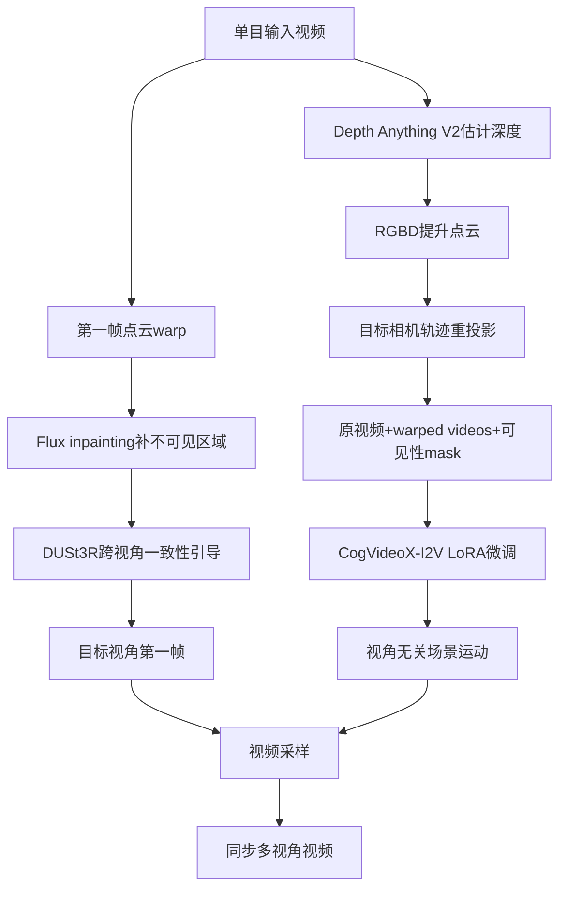

# 05 Reangle-A-Video：多视角重设

## 元信息
- **题目**：Reangle-A-Video: 4D Video Generation as Video-to-Video Translation
- **作者**：Hyeonho Jeong、Suhyeon Lee、Jong Chul Ye。
- **版本与发表**：arXiv:2503.09151v3，2025-09-10；对应ICCV 2025。静态/动态示例见图1–2，训练管线见图3，方法见3.2–3.4节，实验见第4节，局限见补充材料C节。

## 一句话
先把一段电影的“演员动作排练”从不同摄影机位置重新做成训练素材，再把第一帧布置到新视角，让同一套动作在新摄影机下发生。

## 控制对象、输入与输出
主要控制**相机视角和相机轨迹**，同时保持主体、背景及物体运动。输入是一段单目真实世界视频，以及静态目标视角或动态相机运动指令。输出是同步多视角视频，支持向左/右/上/下环绕、dolly zoom in/out。静态view transport从固定新视角重拍，dynamic camera control让相机沿路径移动。

## Mermaid流程

## 核心机制
论文将动态4D场景拆成视角相关外观和视角无关运动。阶段I用Depth Anything V2估计深度，把RGB-D提升为点云，再根据相机旋转和平移重投影，生成多个warped videos及visibility masks。静态模式使用固定目标视角，动态模式逐帧更新相机姿态。

阶段II在CogVideoX-5b I2V的3D full-attention上插入LoRA，用原视频和warped videos同步few-shot微调。由于warp结果有黑色/不可见区域，采用masked diffusion loss，只在可见区域计算损失，避免模型学会黑块和几何错误。动态模式因warped videos共用第一帧，训练和推理文字必须明确camera movement type，使文本token与视频token对应。

静态模式需要目标视角第一帧。阶段III先用Flux对warp后的第一帧inpainting，再用DUSt3R把候选补全投影到共同视角，以DINO特征相似度评价多视角一致性；每一步从多个随机路径选最高分者，避免独立补全造成视角间结构不一致。

## 运动与外观如何解耦
它不是两个LoRA分别表示外观和运动，而是让第一帧承担视角外观，让I2V模型承担动态运动。新视角的主体外观由warp/inpaint第一帧指定，人在走、动物在动等时间变化由视频LoRA学习。多视角warped videos提供同一运动的不同投影，帮助模型学习视角不变运动。但这不是完整三维重建，而是深度、投影和生成先验的近似4D一致性。

## 关键实验
使用28段公开视频，每段49帧、480×720，平均每段生成3.5个视角/相机运动，共98个视频。视频LoRA rank 128、训练400 steps、约占原Video DiT参数2%；静态模式使用12个warped videos，动态模式使用6个。表1中静态模式FID为53.448、FVD为2690.9，优于Vanilla CogVideoX的79.621和3664.2；动态模式FID为74.194、FVD为3019.7，优于NVS-Solver和Trajectory Attention。表2显示随机控制将MEt3R从0.1431降到0.1184，将TSED从0.5241升到0.5588；表3显示加入warped videos后动作保真度偏好80.44%，否则仅19.56%。

## 训练与推理成本
40GB A100上LoRA微调约1小时；补充材料报告80GB无checkpoint约18分钟，40GB降到25帧约26分钟。推理包括40步视频采样、Flux图像补全、50步SDE路径控制；静态模式每一步生成S=25个候选路径并比较，成本显著高于普通I2V。

## 局限
1. 点云warp依赖深度和相机内参，错误会产生几何错位、深度不一致和像素伪影。
2. 第一帧质量决定最终视频质量，I2V无法超越起始图像细节。
3. 单目视频缺少不可见区域信息，warp-and-inpaint只能猜测遮挡内容。
4. DUSt3R引导是推理时近似选择，不是真正三维重建；透明物体、快速运动和大视角变化仍会失败。

## 前后关系
它把运动—外观解耦推广到“视角外观—视角无关运动”。与MotionDirector都用LoRA从少量视频学习运动，但MotionDirector学主体动作，Reangle-A-Video学跨视角场景运动；与DIVE都保持运动并改变视觉内容，不过DIVE用DINO换主体，Reangle-A-Video用几何warp和I2V先验换相机；与DragAnything的相机控制相比，前者拖拽点间接控制相机，Reangle-A-Video直接定义六自由度相机轨迹并追求多视角同步。
