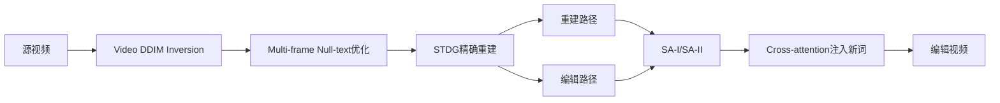

# VideoDirector：直接利用 T2V 模型进行精确编辑

## 元信息
- 题目：VideoDirector: Precise Video Editing via Text-to-Video Models
- 作者：Yukun Wang、Longguang Wang、Zhiyuan Ma、Qibin Hu、Kai Xu、Yulan Guo；CVPR 2025
- 基础模型：AnimateDiff；关键组件：DDIM inversion、multi-frame null-text、STDG、注意力控制、SAM2
- 任务：文本驱动的局部视频编辑

## 一句话
像先把原视频复刻成可重复播放的扩散轨道，再沿同一轨道只替换指定对象，保护背景和运动。

## 问题、输入与输出
Prompt-to-Prompt 和 Null-text inversion 在图像上有效，直接用于 T2V 却会颜色闪烁、背景变化和内容失真。论文第1节认为：视频中空间外观与时间运动高度耦合，共享 null-text 无法逐帧补偿反演误差；普通 cross-attention 也无法维护复杂时空布局。输入为源视频、源/目标文本和 SAM2 前景背景掩码，输出执行文字修改而保留未编辑区域、光照和原始运动的视频。

## 方法流程

## 核心机制
第3.2节把共享无条件文本扩展成每帧独立的 multi-frame null-text embedding，改善动态内容的重建。STDG 将“怎么动”和“长什么样”分开：Eq.7比较反演与去噪的 temporal attention，产生时间引导；Eq.8比较 self-attention key，产生外观引导。SAM2掩码又把二者拆成前景/背景四项，Eq.9加权汇总，Eq.10与 CFG 一起修正轨迹。

编辑阶段的 SA-I 在早期直接采用重建路径 self-attention map，先锁定时空布局；SA-II 拼接重建和编辑路径的 key/value，由编辑 query 选择信息，并用前景掩码阻止源内容回流到编辑区域（Fig.4、Eq.11）。Cross-attention 对共同词复用源注意力，只保留“钢铁侠”等新词提供编辑方向（Eq.12）。

## 保留与一致性策略
多帧 null-text 补偿每帧反演偏差；STDG 分离时间运动、空间外观及前景背景；SA-I 固定早期布局；SA-II 同时读取重建与编辑特征，使新对象继承环境光照和运动；cross-attention只替换新增语义。

## 关键实验
作者构建75组512×512样本，来自 DAVIS、MotionClone、TokenFlow 和网络视频，固定处理16帧。与 Video-P2P、RAVE、FLATTEN、TokenFlow 比较。Table 1中本文 Motion Smoothness 为 **97.68%**，PickScore **21.64**，masked PSNR **21.37**，masked LPIPS **0.270**，用户排名均值为 **1**。Fig.5展示呼吸、树叶、奔跑和车辆反光等动态细节；Fig.7和Table2显示去掉STDG、SA-I、SA-II或CA都会降低准确性和保真度；Fig.8说明前景/背景时间与外观引导分别改善不同重建问题。

## 成本
单张 A100 上 pivotal tuning约 **8.5分钟**，编辑约 **1分钟**，总计约9.5分钟，且只能处理16帧。它不用训练完整视频模型，但每个视频仍需反演和优化，明显比纯推理方法昂贵。

## 局限
1. 仍依赖近似 DDIM inversion，长视频和快运动会积累误差。
2. STDG依赖SAM2，分割错误会施加错误约束。
3. self-attention阈值需按视频手调，论文中 $	au_s$ 为0.2–0.5。
4. 逐视频pivotal tuning难以批量或实时处理。
5. 16帧限制使长视频需要分段，段间一致性未解决。

## 路线关系
它把 Prompt-to-Prompt、Null-text inversion 从图像推进到T2V。相比 TokenFlow、FLATTEN 的“T2I加时间约束”，它直接用T2V运动先验；相比 Align-A-Video，它强调精确重建轨迹而非奖励偏好；与 Visual Prompting 相反，它认为应该把反演修好，而不是完全绕开反演。
