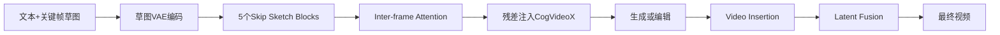

# SketchVideo：稀疏关键帧草图控制视频

## 元信息
- 题目：SketchVideo: Sketch-based Video Generation and Editing
- 作者：Feng-Lin Liu、Hongbo Fu、Xintao Wang、Weicai Ye、Pengfei Wan、Di Zhang、Lin Gao；arXiv:2503.23284v1，2025-03-30
- 基础模型：CogVideoX-2b；默认输出720×480、8fps、49帧、约6秒
- 任务：草图控制的视频生成与局部编辑

## 一句话
只画一两张关键动作草图，模型便根据帧间关系补出中间动作，并将几何修改传播到整段视频。

## 问题、输入与输出
文本难精确表达轮廓、位置、姿态和布局；逐帧控制太麻烦。SparseCtrl用白色占位帧填补稀疏条件，易造成中间帧模糊和闪烁；复制半个 DiT 作为ControlNet又耗显存。编辑时，新插入物没有原运动信息，未编辑区域还必须准确保留。输入为文本和任意时间点一到两张草图；编辑还需源视频、修改草图和全视频编辑掩码；输出是符合草图与文本的连续视频。

## 方法流程

## 核心机制
CogVideoX有30个 DiT block，论文只增加5个草图控制 block，均匀放在0、6、12、18、24层，预测残差并注入主干（Fig.2），覆盖不同特征层且节省显存。草图分支只处理真实草图，不处理白色占位帧。

第3.2节 Eq.3 的 inter-frame attention 使用所有帧 hidden feature 生成 query，控制关键帧 hidden feature 生成 key，草图 feature 生成 value。模型先利用视频内部帧间相似性判断当前帧更接近哪个关键帧，再传播草图的轮廓和位置。因此能做关键帧间插值，也能从中间帧向前后外推，不同于直接以草图同时产生 key/value 的普通 cross-attention。

编辑时，Video Insertion Module 分离编辑与未编辑区域：草图分支负责掩码内的新内容，视频分支负责源视频上下文，按掩码拼接后输出残差（Eq.4）。推理共50步，在第25和49步将未编辑区替换为源视频 DDIM inversion latent，恢复纹理细节。

## 保留与一致性策略
inter-frame attention让条件随视频内部相似性传播；图像+视频混合预训练学习几何，后续视频训练强化时间；编辑网络从生成网络初始化；Video Insertion吸收原视频空间和动态上下文；latent fusion直接恢复未编辑区。

## 关键实验
训练使用 OpenVid、LAION及草图数据，8张H800、batch size 8、梯度累积4，生成两阶段各10000步，编辑20000步，补充材料给出约53万视频片段和90万图像。生成比较 AMT、SparseCtrl、Ctrl-CogVideo；Table1中本文 LPIPS **27.56**、CLIP **98.31**，优于AMT的29.17/96.12和Ctrl-CogVideo的32.23/98.04。编辑比较 InsV2V、AnyV2V；Table2中本文 LPIPS **9.74**、CLIP **98.34**、未编辑区PSNR **36.48**，均最佳。Fig.5显示基线会闪烁、塔顶变形，本文能传播电线等细节；Fig.6支持插入、替换和删除。Table3消融验证 inter-frame、skip、图像预训练、Video Insertion、Latent Fusion 的作用。

## 成本
训练成本较高，需要8张H800和大规模图像视频。5个控制 block 比复制半个 DiT 节省显存，但推理仍基于 CogVideoX-2b，编辑还需反演和50步采样；论文没有报告单视频秒数，不能称为实时方法。

## 局限
1. 受 CogVideoX-2b 限制，主要是约6秒短视频，长视频未解决。
2. 人手、多人接触、多物体遮挡等复杂场景仍困难，二维草图缺少深度和三维拓扑。
3. 重点是几何和布局，颜色、材质和身份外观控制较弱。
4. 编辑依赖全视频掩码和DDIM inversion，掩码或反演错误会破坏边界。
5. 一两张草图不足以覆盖剧烈视角变化。

## 路线关系
SketchVideo延续 ControlNet、SparseCtrl 的条件残差路线，把“全帧控制”改成“关键帧控制”。相较 VideoDirector，它提供更直接的几何交互；相较 VACE，它是专用草图模块而非统一多条件接口；相较 Visual Prompting，它要求用户画出目标几何，而不是从第一帧前后对照中归纳编辑规则。
