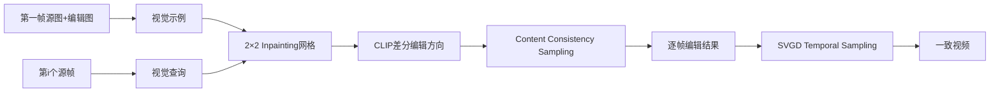

# Visual Prompting OCVE：无需反演的一次示例编辑

## 元信息
- 题目：Visual Prompting for One-shot Controllable Video Editing without Inversion
- 作者：Zhengbo Zhang、Yuxi Zhou、Duo Peng、Joo-Hwee Lim、Zhigang Tu、De Wen Soh、Lin Geng Foo；arXiv:2504.14335v1，2025-04-19
- 基础模型：Stable Diffusion Inpainting 1.5
- 任务：第一帧示例驱动的一次可控视频编辑

## 一句话
给模型看“第一帧修改前—修改后”的示范，再把每个后续源帧当作问题，让它照着示范学习编辑规则。

## 问题、输入与输出
OCVE允许用户只编辑第一帧，再把添加、删除、替换、颜色或纹理修改传播到整段视频。Videoshop、AnyV2V通常先用 DDIM inversion 把源视频变成噪声，再重建和编辑；但反演用近似噪声预测，误差随时间步累积，导致内容不一致。图像扩散模型又缺少时间先验，视频容易闪烁。本文把OCVE重述为visual prompting：第一帧源图和编辑图是示例，后续源帧是query。输出为保持源内容和运动、同时复制第一帧修改的编辑视频。

## 方法流程

## 核心机制
第4.1节把左上放第一帧源图，右上放第一帧编辑图，左下放第i帧源图，右下留空作为输出（Fig.2、Fig.3）。前三格构成“输入—输出示例+新输入”，直接交给 inpainting 模型推理，源帧经图像编码器输入，不经过 DDIM inversion。

用户修改可能无法用文字准确表达，Eq.3用 CLIP 编辑向量表示：$p=\lambda_1[E_{CLIP}(I^e(1))-E_{CLIP}(I^s(1))]$。CCS（第4.2节）修改采样，使每一步预测依赖前一步，第一步校准为源帧，再将源区与编辑区的去噪差 $\Delta\epsilon_t$ 加到一致性噪声（Eq.7），让结果逐步沿用户编辑方向变化。TCS（第4.3节）把源视频各帧看作一个分布，用SVGD联合更新编辑帧；RBF核的平均梯度提供共同方向，排斥项防止帧坍缩（Eq.8）。

## 保留与一致性策略
源帧直接作为图像特征输入，避免反演损失；前后对照示例明确编辑目标；CCS从源内容起步并逐步施加变化；TCS联合处理全部帧，迁移源视频的帧间分布；CCS还沿用self-attention cloning保护空间布局。简单说，CCS负责“像原帧”，TCS负责“仍像一段连续视频”。

## 关键实验
数据由 MagicBrush 构造，共 **10388** 组“源视频、编辑指令、第一帧编辑图”，覆盖添加、替换、删除、动作、颜色和纹理。Stable Diffusion Inpainting 1.5 中 CCS为30步、TCS为50步，$\lambda_1=0.7$、$\lambda_2=1.2$、$\eta=2.0$，单张A100运行。Table1中本文 CLIPtar **90.1**、TIFA **69.1**、CLIPsrc **93.2**、FVD **15.2**、CLIPTC **97.1**，处理时间约 **19秒**；AnyV2V为149秒、Videoshop为32秒。去掉CCS后CLIPsrc降至81.3，去掉TCS后CLIPTC由97.1降至89.8。Fig.4的水果替换、去头发和加眼镜案例显示传播较完整。

## 成本
无需训练视频模型、逐视频DDIM inversion或pivotal tuning。代价是每帧进行30步CCS，再对全体帧做50步TCS；A100上平均约19秒。比T2V编辑快，但长视频的联合SVGD会增加时间和显存。

## 局限
1. 第一帧必须代表后续对象；遮挡、出画、旋转和剧烈变形会超出单示例能力。
2. 基础模型是图像inpainting模型，没有真正视频物理先验，TCS只能做分布补偿。
3. CLIP差向量偏全局语义，可能丢失精细位置、尺度和局部像素关系。
4. 2×2网格压缩上下文，小目标和复杂背景可能受影响。
5. 主要在MagicBrush合成数据上评估，真实长视频和镜头切换仍待验证。

## 路线关系
它继承 Visual Prompting via Image Inpainting 与 Consistency Models，将OCVE从“反演后编辑”改成“视觉示例+查询”。它回应Videoshop、AnyV2V的反演误差；与VideoDirector相反，后者修复反演，本文完全绕开反演；与SketchVideo相比，本文不要求画草图，而从第一帧编辑前后对照归纳规则；与Align-A-Video相比，它不做奖励微调，速度更快但更依赖第一帧示例代表性。
