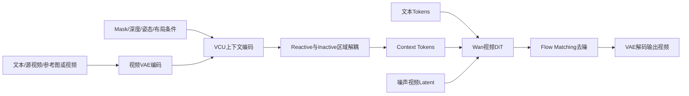

# Wan：开放视频基础模型与统一编辑底座

## 元信息

- **论文**：Wan: Open and Advanced Large-Scale Video Generative Models
- **版本**：arXiv:2503.20314v2
- **团队**：Wan Team，Alibaba Group
- **论文类型**：开放视频基础模型技术报告
- **重点关联**：VACE、Video Condition Unit（VCU）、视频到视频编辑、参考视频生成、局部重绘与扩展
- **参考原文**：[arXiv:2503.20314v2](https://arxiv.org/abs/2503.20314v2) · 本地 `../论文原文/27_Wan.pdf`

## 一句话理解

Wan 像一个功能齐全的视频操作系统：先提供强大的视频生成能力，再通过统一的条件接口接入参考视频、遮罩、深度、姿态、布局等编辑信号。

## 系统层定位

Wan 的主任务不是解决某一个局部编辑问题，而是建立一个开放的大规模视频生成底座。它覆盖文生视频、图生视频、参考视频生成、视频到视频编辑、masked video-to-video、inpainting、outpainting、视频延长以及深度、姿态、边缘、布局和对象控制等场景。对视频编辑而言，最值得关注的是 VACE/VCU 思路：把原本需要不同模型处理的条件，统一成视频 DiT 可以读取的上下文。

因此，Wan 更像“底层平台”，而不是专门追求编辑榜单分数的模型。它的意义在于让后续编辑方法不用从零学习人物、运动、纹理和镜头规律，而是在一个较强的视频生成先验上增加控制能力。

## 输入与输出

输入可以包含文本提示、参考图像、参考视频、源视频、与视频时空对齐的 mask，以及深度、姿态、灰度、边缘和布局等控制信号。生成过程还会接收噪声视频 latent。输出是新生成的视频，或者保留源视频主体、背景和运动结构后的编辑视频。

VACE 的上下文可以抽象为：

```text
V = [T; F; M]
```

其中 `T` 是文本，`F` 是上下文帧序列，`M` 是对应的 mask。这个表示的关键是：编辑不只靠“改成什么”的文字，还要把“参考什么”和“哪里允许变化”一起交给模型。

## 方法流程



Wan 首先使用时空 VAE 压缩视频，再由 DiT 在 latent 空间完成生成。对于编辑任务，参考帧、源视频和 mask 被编码为上下文 token，并与文本 token、噪声视频 token 一起进入 Transformer。训练时可以全量微调 Wan，也可以使用 Context Adapter，使编辑能力成为可插拔模块。

## 核心机制

最重要的机制是概念解耦。给定上下文帧 `F` 和 mask `M`，模型将其拆成：

```text
Fc = F × M
Fk = F × (1 − M)
```

`Fc` 表示需要响应编辑的区域，`Fk` 表示应当保留的区域。它把视频编辑中的两个相反目标显式分开：局部要变，其他内容不能被污染。相比只把源视频 latent 直接拼接到输入中，这种表示更容易表达编辑边界。

另一项工程选择是训练策略。全量微调上限较高，但成本大、容易破坏底座；Context Adapter 训练更轻量、便于复用，却会增加条件模块和部署路径。两者体现了研究能力与工程成本之间的取舍。

## 对视频编辑的意义

Wan 把视频编辑从“一个任务一个模型”推进到“一个底座、多种条件”。这对于实际系统尤其重要：背景替换、局部对象替换、姿态迁移、参考图生成和视频延长可以共用生成骨干。VCU 还把“改什么”和“保留什么”同时纳入条件，直接对应视频编辑最难的局部保真问题。

不过，统一接口不等于所有任务都同样可靠。大运动、遮挡、主体身份变化和局部重建仍需要更专门的数据与传播机制。

## 关键实验

Wan 的编辑章节主要通过统一能力图和定性样例展示：同一框架能够覆盖参考视频生成、视频到视频编辑、inpainting、outpainting、extension、深度和姿态控制、对象与人脸编辑等。基础模型部分则评估生成质量、文本一致性、分辨率、视频长度、模型规模和推理效率。

与专门的编辑 benchmark 论文相比，Wan 在编辑部分没有重点报告大量单项定量指标。因此，它更有说服力的地方是任务覆盖和底座开放性，而不是对某个编辑类别的绝对领先。

## 成本

14B 级别 Wan 模型推理和训练门槛较高。报告指出，未经专门优化时，单个视频推理在高端 GPU 上可能需要几十分钟。全量微调需要大量视频数据、显存和训练时间；Context Adapter 可以降低训练改造成本，但推理时仍要运行较大的视频 DiT，并维护额外的上下文编码路径。

## 局限

1. 大幅运动时，局部纹理、身份细节和未编辑区域的稳定性仍不足。
2. 编辑章节以定性展示为主，针对复杂编辑的系统性 benchmark 和失败分类仍不充分。
3. 大模型成本高，不适合所有实时编辑或低成本批处理场景。
4. 统一条件接口依赖高质量 mask、参考视频和控制信号；条件本身不准确时，模型很难自动判断编辑边界。

## 与 VACE、GenProp 等路线的关系

Wan 与 VACE 属于“强视频底座加统一条件接口”的路线。VACE 更直接聚焦统一视频创建与编辑框架，Wan 则把类似能力放入更完整的开放视频基础模型体系中。

GenProp 的问题更窄但更深入：先编辑首帧，再把变化传播到整段视频，并用 Selective Content Encoder、mask 预测和区域感知损失保护其他区域。Wan/VACE 解决“多类条件如何统一接入”，GenProp 解决“局部编辑如何沿时间稳定传播”。两者可以组合：Wan 提供生成先验，VACE 提供多任务接口，GenProp 负责某些局部编辑的时序执行。
