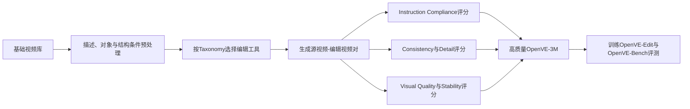

# OpenVE-3M：把视频编辑变成可训练、可评测的数据问题

## 元信息

- **论文**：OpenVE-3M: A Large-Scale High-Quality Dataset for Instruction-Guided Video Editing
- **版本**：arXiv:2512.07826v2
- **作者单位**：浙江大学、字节跳动
- **论文类型**：视频编辑数据集、Benchmark 与编辑模型
- **重点关联**：Instruction-guided Video Editing、OpenVE-Bench、OpenVE-Edit、MoE-Connector
- **参考原文**：[arXiv:2512.07826v2](https://arxiv.org/abs/2512.07826v2) · 本地 `../论文原文/28_OpenVE-3M.pdf`

## 一句话理解

OpenVE-3M 像给视频编辑建立了一套驾校教材、题库和评分标准：不仅提供更多训练样本，还规定编辑任务怎么分类、指令是否执行、哪些内容必须保持。

## 系统层定位

这篇论文首先解决的是数据问题，而不是提出一个全新的视频生成骨干。作者认为，已有 instruction-based video editing 数据常见四个缺陷：规模小、任务种类有限、指令过短、编辑结果质量不稳定。模型即使结构先进，也可能因为训练样本没有说清楚“要改什么”和“什么不能动”而学习失败。

OpenVE-3M 因此同时提供三部分：约 300 万条视频编辑样本、覆盖八类任务的 taxonomy，以及 431 条样本组成的 OpenVE-Bench。论文还训练了 5B 级 OpenVE-Edit，用来验证这些数据和组织方式是否确实能够提升编辑能力。

## 输入与输出

训练输入主要是源视频和自然语言编辑指令，部分任务还配有深度、边缘、目标检测和分割等辅助信息。输出是执行指令后的视频，同时尽量保留源视频中的主体、运动、背景结构和局部细节。

八类任务包括 Global Style、Background Change、Local Change、Local Remove、Local Add、Subtitle Edit、Camera Multi-Shot Edit 和 Creative Edit。前六类通常要求空间和时间结构较为对齐，后两类允许更明显的运动或镜头变化，但仍需保持主体语义和身份。

## 方法流程

数据构建分三阶段。第一阶段从多个视频来源建立基础视频库，统一截取约 65—129 帧、720P 片段，并用视觉语言模型生成长描述和可检测对象名称，同时产生深度、边缘、检测和分割结果。第二阶段按任务类别选择不同图像编辑、视频生成或多镜头工具构造编辑对。第三阶段使用三类质量标准过滤样本，尤其把指令遵循放在最优先位置。

## 核心机制

OpenVE-Edit 由 MLLM、MoE-Connector 和 DiT 组成。MLLM 先理解视频内容、指令和时空关系；MoE-Connector 根据任务特征选择若干专家；之后把得到的表示与文本特征一起送给 DiT。源视频也经过 VAE 编码，与噪声 latent 在通道维拼接，用于保留原始内容。

MoE 的作用是避免所有编辑共享同一套中间变换。例如字幕编辑需要关注文字位置，局部删除需要关注遮挡补全，背景替换需要关注前景边界。不同专家可以为这些任务提供偏专门的特征处理。Connector 的输出层采用零初始化，使训练初期新模块不会突然破坏已有文本条件，随后再逐步学习编辑增量。

## 对视频编辑的意义

OpenVE-3M 把“视频编辑能力”拆成可诊断的任务。一个模型可以擅长风格迁移，却不擅长局部删除；也可能能替换对象，却无法完成多镜头变化。细分 taxonomy 让模型训练、benchmark 设计和错误分析有了共同语言。

它还强调一个经常被忽略的原则：视频清晰但没有按指令修改，仍然是失败样本。因此，Instruction Compliance 不能被单纯画质指标掩盖。对于工程团队，这种数据与评价框架比一个孤立的总体分数更有参考价值。

## 关键实验

数据统计显示，OpenVE-3M 有约 3M 样本、8 类任务，平均指令长度约 40.6 个词，视频长度约 65—129 帧，分辨率约 1280×720，整体高于不少早期数据集的短指令和低分辨率设置。

OpenVE-Bench 包含 431 个 video-edit pair。OpenVE-Edit 在开源模型中取得较强总体表现，但闭源 Runway Aleph 仍明显领先。Camera Multi-Shot Edit 等非严格空间对齐任务得分下降较多，说明镜头改变、主体保持和指令遵循同时成立仍然困难。

## 成本

3M 样本并非简单抓取，而是依赖大规模视频生成、首帧图像编辑、分割与检测、MLLM 描述以及自动评分。部分数据生产环节依赖商业模型或内部模型，因此公开数据规模不等于低成本。训练阶段还需要同时处理 MLLM、MoE 和视频 DiT，资源需求明显高于普通图像编辑数据。

## 局限

1. 大量编辑对来自合成流程，可能与真实视频中的压缩、模糊、复杂遮挡和非理想镜头存在差异。
2. 数据过滤和 benchmark 依赖 MLLM 评委，不同评委的视觉理解能力可能造成系统偏差。
3. Camera Multi-Shot 和 Creative Edit 等非空间对齐任务仍然较弱。
4. 真实用户请求经常把局部替换、镜头变化、时间推理和字幕修改混在一起，八类 taxonomy 仍不能覆盖所有组合任务。

## 与 VACE、GenProp 等路线的关系

OpenVE-3M 与 VACE 并不处于同一层。VACE/Wan 解决“模型怎样统一接入视频、mask 和控制条件”，OpenVE-3M 解决“模型用什么数据学习这些任务，以及怎样判断是否成功”。它可以作为 VACE 或 Wan 的训练数据和评测补充。

GenProp 主要围绕首帧编辑后的时序传播，擅长对象移除、插入、替换和跟踪；OpenVE-3M 的覆盖范围更宽，包括字幕、风格、背景、局部变化和多镜头编辑。GenProp 可以作为某些局部编辑数据的执行模块，而 OpenVE-3M 可以为它提供更丰富的指令和评测场景。
