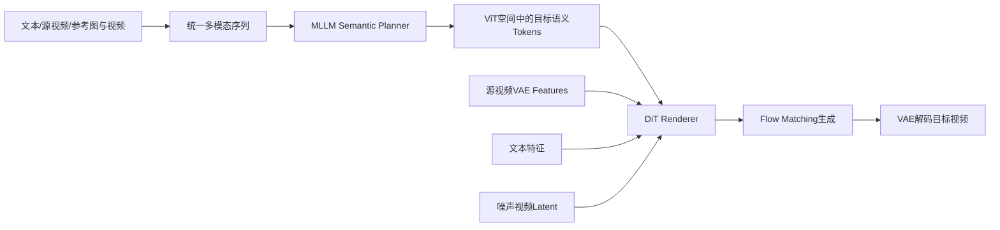

# Bernini：让 MLLM 先规划，再让 DiT 渲染

## 元信息

- **论文**：Bernini: Latent Semantic Planning for Video Diffusion
- **版本**：arXiv:2605.22344v1
- **团队**：Bernini Team，ByteDance
- **论文类型**：统一视频生成与编辑框架
- **重点关联**：MLLM Planner、DiT Renderer、ViT embedding、Source VAE Features、SA-3D RoPE、Latent CoT
- **参考原文**：[arXiv:2605.22344v1](https://arxiv.org/abs/2605.22344v1) · 本地 `../论文原文/29_Bernini.pdf`

## 一句话理解

Bernini 像“导演加摄影棚”：MLLM 导演先读懂剧本、源视频和参考素材，规划目标语义；DiT 摄影棚再把规划渲染成连续、逼真的视频。

## 系统层定位

Bernini 试图统一文本到视频、视频到视频、参考视频编辑、主体到视频，以及对象添加、删除、材质、表情、背景、天气、镜头和运动等任务。它针对的核心问题是：过去常把“复杂意图理解”和“高保真视频合成”都压给扩散模型，导致模型面对时间、因果和多参考关系时容易误解。

例如“过了一周后变得更成熟”“食物被煮过头”“让这个物体逐渐融化”等请求，不只是表面属性替换，而是要求推断目标状态。Bernini 通过显式划分职责，让 MLLM 负责语义规划，让视频 DiT 负责渲染和保真。

## 输入与输出

输入可以包含文本、源视频、参考视频、参考图像、主体图像以及目标视频占位符。输出是符合目标语义的视频；编辑场景还要尽量保留源视频中的主体身份、背景关系、纹理和运动结构。

Bernini 使用两条互补信息流：

- **Semantic embedding**：描述目标视频应该表达什么；
- **Source VAE features**：提供源视频中应该继续保留的低层视觉细节。

## 方法流程

Planner 首先读取所有多模态输入，在 ViT embedding 空间预测目标语义 token。训练时通过 masked generative modeling 学习恢复被遮蔽的目标视觉 token；推理时则从全遮蔽目标 token 开始逐步填充。Renderer 再在 VAE latent 空间中，根据语义计划、文本和源视频特征生成视频。

## 核心机制

Bernini 的关键接口不是普通文本 token，而是 MLLM 的视觉 embedding。这样，planner 可以直接在视觉语义空间中表达目标状态，避免先把复杂视觉意图说成文字、再让 DiT 二次猜测。

系统还使用 latent-space Chain-of-Thought，让 planner 在输出最终语义表示前进行中间推理。对于时间变化、因果变化和隐含状态，这比单步文本条件更有表达力。

多参考输入会带来另一个问题：不同视频段可能拥有相同的时间、高度和宽度坐标，普通 3D RoPE 容易让模型混淆来源。Segment-Aware 3D RoPE 为每个输入 segment 加入区分，使源视频、参考视频和目标占位符在时空编码上可以被识别为不同对象。Segment-wise hybrid attention 则进一步控制不同部分之间的注意力关系。

## 对视频编辑的意义

Bernini 把编辑系统拆成“理解与计划”和“生成与保真”两个阶段。复杂指令由 MLLM 处理，DiT 专注运动、纹理、光照和时序连续性；两者之间通过语义 embedding 传递目标状态，通过 source VAE features 保留原始细节。

这种分工有利于分析错误：如果目标属性理解错，问题可能在 planner；如果语义正确但画面破碎，问题更可能在 renderer 或训练数据。对于多参考编辑、时间推理和因果变化，它比单纯把文本送进视频扩散模型更有潜力。

## 关键实验

论文报告了 OpenVE-Bench、OpenS2V-Eval、Bernini-Bench，以及视频生成、视频编辑、推理增强编辑、消融和泛化实验。在开放式视频编辑偏好评测中，Bernini 的平均胜率约为 56.3%，接近同期强商业系统。

公开实现还区分 full Bernini 和 Bernini-R。full 版本包含 MLLM planner 和 DiT renderer，复杂指令分解能力更强；Bernini-R 更接近 renderer-only，系统简单、渲染一致性较好，但没有完整的语义规划能力。这一对照说明 planner 的价值主要体现在复杂语义，而不是所有简单编辑都必须使用完整链路。

## 成本

完整 Bernini 需要运行 MLLM planner、DiT renderer、VAE 和文本编码器。推理时既要完成多模态理解，又要进行视频扩散生成，显存、延迟和部署复杂度都高于单一 renderer。公开配置涉及高端 GPU、较新的 CUDA 和深度学习环境，研究原型到线上服务之间仍有较大的工程距离。

## 局限

1. Planner 的错误会传递给 renderer；语义计划一旦偏离目标，后续渲染通常无法完全补救。
2. 系统依赖强 MLLM，超出其视觉理解或推理范围的请求仍可能失败。
3. 语义规划变强并不自动保证像素和时序质量，最终结果仍受 DiT、VAE 和训练数据限制。
4. full pipeline 组件较多，模型权重、版本、推理并行和显存配置都会影响复现与部署。

## 与 VACE、GenProp 等路线的关系

Bernini 与 VACE 的主要差别在控制层次。VACE 通过上下文视频、mask 和条件 token 直接告诉 DiT 哪些内容可参考、哪些区域应保持；Bernini 在渲染前增加了语义规划层，先把复杂输入转换成目标视觉表示。

它与 GenProp 也不是替代关系。GenProp 关注“首帧改动如何沿时间传播并保护未编辑区域”，Bernini 关注“复杂意图和目标状态如何被理解”。组合起来，可以由 Bernini 规划“想怎样变化”，再由 VACE 或 GenProp 负责编辑边界、时序传播和内容保真。
