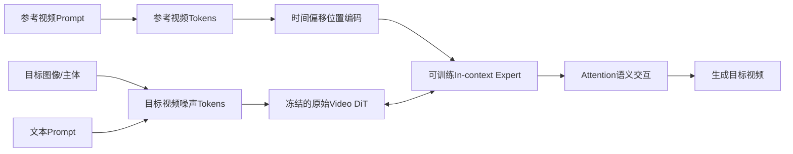

# Video-As-Prompt：把参考视频变成动态语义提示词

## 元信息

- **论文**：Video-As-Prompt: Unified Semantic Control for Video Generation
- **版本**：arXiv:2510.20888v1
- **作者**：Yuxuan Bian 等；香港中文大学、字节跳动
- **论文类型**：参考视频驱动的语义可控视频生成
- **重点关联**：Video-As-Prompt（VAP）、in-context generation、Mixture-of-Transformers、VAP-Data
- **参考原文**：[arXiv:2510.20888v1](https://arxiv.org/abs/2510.20888v1) · 本地 `../论文原文/30_Video-As-Prompt.pdf`
- **相关整理**：[补充阅读/2510.20888v1_report.md](../补充阅读/2510.20888v1_report.md)

## 一句话理解

VAP 像视频版的示范教学：与其让用户描述“请按这种方式变身、运动和运镜”，不如直接给模型一段示例视频，让它把其中的动态语义迁移到新的主体上。

## 系统层定位

Video-As-Prompt 面向统一、可泛化的语义控制视频生成。它区别于 depth、pose、flow、mask 等结构控制，也区别于每种特效分别训练一个 LoRA 或专用模块。

作者的出发点是，很多效果很难准确写成文字，也不适合用像素对齐的结构信号表达。例如“像这个视频一样逐渐变成黏土材质”“沿着类似轨迹绕主体运动”“使用同样的液态覆盖效果”。这些例子中，用户想迁移的是变化规律和动态语义，而不是参考视频的具体像素。

## 输入与输出

输入由三部分组成：目标图像或目标主体、可选的文本提示，以及包含目标语义的参考视频。输出是一个新视频：主体身份或目标图像内容来自目标输入，参考视频中的风格、动作、概念转化或镜头运动被迁移到新主体上。

因此，VAP 不等同于逐帧重绘源视频，而是试图从示例中抽取可复用的语义模式。

## 方法流程

VAP 冻结原有视频 DiT，新增一个可训练的 in-context expert transformer。推理时，参考视频 token 与目标视频噪声 token 一起进入 Transformer，生成过程通过 attention 读取参考视频中的信息。这样既保留原始生成能力，也避免在有限 VAP 数据上全量微调导致灾难性遗忘。

## 核心机制

VAP 的关键不是增加一种特定控制分支，而是把参考视频定义为统一的上下文提示。概念变化、风格、动作和镜头都可以通过同一种接口输入。

位置编码尤其重要。参考视频与目标视频并不逐像素、逐帧对应；如果两者使用完全相同的位置编码，模型可能误以为参考视频是目标视频的像素模板。论文为参考视频的时间索引加入偏移，使其位于目标噪声视频之前，弱化虚假的逐点映射先验，强化类似上下文学习的顺序关系。

训练数据 VAP-Data 包含超过 100K 组配对样本，覆盖约 100 类语义条件，包括概念变换、风格、人物或非人物动作以及镜头变化。数据规模消融显示，样本从 1K 增加到 100K 时，语义对齐和总体表现持续提升，说明该方法明显依赖语义覆盖。

## 对视频编辑的意义

VAP 为视频编辑增加了一个比文本更直观的控制接口：reference video。用户可以用一段视频示范“变化如何发生”，而不必写清每个时间点的动作、风格演变和镜头轨迹。

它适合动态特效迁移、角色动作复用、镜头运动复用、示例驱动的风格变化，以及难以形式化为 depth、pose 或 flow 的复杂效果。对创作者而言，它更接近“给一个案例，让模型照着理解”，而不是填写一组专业控制参数。

但需要注意，VAP 更接近参考视频引导的生成或重生成，并不天然保证源视频中每个未编辑区域都被严格保留。因此，精确局部修补仍需要 mask、VACE 或传播模块配合。

## 关键实验

论文比较了 VAP 与 VACE 的原始、深度和光流控制版本、CogVideoX-I2V 及其 LoRA 版本，以及 Kling/Vidu 等商业模型。最终 VAP 方案的 Overall 约为 70.44，Semantic Alignment 约为 77.08，明显高于使用相同位置编码的消融版本。

人工偏好率约为 38.7%，与论文比较的商业模型组接近。论文还展示了对训练中没有直接出现的 `crumble`、`dissolve`、`levitate` 和 `melt` 等语义进行零样本迁移，说明模型学习到了一定程度的抽象变化，而不是只记住固定特效名称。

## 成本

VAP 冻结主 DiT、只训练额外专家，因此微调成本低于全量更新大模型，也降低了灾难性遗忘风险。但推理时需要同时处理目标视频和参考视频 token，序列变长会增加 attention 计算量、显存和延迟。

数据构建同样昂贵：VAP-Data 依赖高质量参考图像、视频特效模板、社区 LoRA 和视频生成模型，还需要对成对样本进行筛选和组织。冻结底座降低了模型训练成本，却没有消除数据生产成本。

## 局限

1. 参考视频质量直接影响结果；示例中的主体变化混乱、运动抖动或语义不清都会降低迁移效果。
2. 约 100 类语义对研究已较大，但仍不足以覆盖复杂多主体因果、长时序叙事和精细物理过程。
3. 强语义形变与主体身份保持之间存在冲突，可能出现身份漂移、局部伪影或变化不完整。
4. 语义对齐主要依赖 Gemini、GPT 等视觉语言模型评分和人工偏好，评委模型对时间连续性与复杂迁移的判断仍需进一步验证。
5. 与严格的源视频编辑相比，VAP 对未编辑区域和像素级保真的约束较弱。

## 与 VACE、GenProp 等路线的关系

VAP 与 VACE 都使用视频作为控制条件，但目标不同。VACE 强调时空对齐、mask、上下文区域和内容保留，适合精确编辑；VAP 则有意避免把参考视频当作像素模板，重点迁移其中的抽象动态语义，适合效果、动作和镜头示范。

GenProp 是“先编辑首帧，再向时间维传播”，核心是区域保护和时序稳定；VAP 是“把一段视频作为动态示例，迁移其语义到新目标”，核心是语义泛化。三者可以组合：VAP 负责表达“想怎样变”，Bernini 或其他 MLLM 负责理解，VACE/GenProp 负责确定编辑边界并把变化稳定执行到整段视频。
