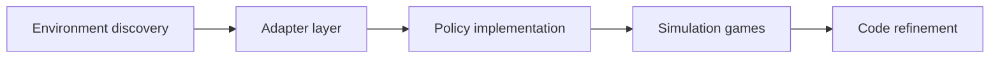

# Agents of Change: Self-Evolving LLM Agents for Strategic Planning

## 论文信息
- 标签：policy artifact；what=policy code；when=simulation loop；how=simulation games + code refinement；where=strategy game environments
- 中文定位：长程策略 artifact 自进化
- 作者：Nikolas Belle / Dakota Barnes / Alfonso Amayuelas / Ivan Bercovich / Xin Eric Wang / William Wang
- 年份：2025
- arXiv：2506.04651
- PDF：https://arxiv.org/pdf/2506.04651
- 代码：未在当前元数据中明确；需要按论文题名继续查官方仓库。

## 一句话总结
Agents of Change 的核心价值是：复杂业务流程也可把策略沉淀成 workflow/policy code，再用离线回放评估。

## 这篇论文解决什么问题
长程策略任务里，Agent 每一步临时推理会反复遗忘全局策略。Agents of Change 把策略编译成可执行 artifact，再通过模拟持续改写。

如果放到 Agent skill 自进化的大图里，它解决的不是“模型有没有知识”，而是“Agent 如何把执行经验变成之后能稳定复用的外部能力”。这类外部能力可能是 `SKILL.md`、技能库、prompt、程序性记忆、world model、verifier 或 curator。区别只在于它把经验沉淀到哪一层。

## 方法图：先抓住机制闭环

这张图可以按从左到右读：左边是问题或数据来源，中间是论文提出的关键机制，右边是更新后的能力如何被复用或验证。读这篇论文时，最重要的是不要只看最后的分数，而要看中间那一层到底把什么东西变成了什么。

## 核心创新点
1. Agents of Change 的核心价值是：复杂业务流程也可把策略沉淀成 workflow/policy code，再用离线回放评估。
2. 它把方法链条明确拆成 Environment discovery → Adapter layer → Policy implementation → Simulation games → Code refinement 这样的闭环，中间每一步都在把原始轨迹压缩成更稳定的中间表示，而不是把所有经验原样塞给模型。
3. 它不是只证明“能写出 skill”，而是尽量证明“更新后的 skill / repo / curator / verifier / policy 能在后续任务里稳定被复用”。

这三点合在一起，说明这篇论文关注的不是孤立模块，而是一个能持续积累的外部能力系统。读的时候先盯住这三件事：输入是什么、哪一步发生了真正的压缩或筛选、最后能不能复用到别的任务或别的模型上。

## 方法详解

### 1. 先发现环境规则
Agents of Change 面向长程策略任务，第一步不是直接让 LLM 每回合行动，而是发现环境规则、状态变量、动作接口和胜负条件。以 Catanatron 这类模拟环境为例，Agent 需要理解资源、行动、对手、阶段转换等规则。

这一步为后续代码化策略建立边界：如果环境规则没有被结构化，策略代码就只能依赖临场解释，难以稳定回放和优化。

### 2. 构建 adapter layer
Adapter layer 把环境观察、可用动作和规则约束整理成 policy code 能调用的接口。它相当于在复杂环境和策略实现之间加一层稳定 API：策略不直接解析杂乱状态，而是通过 adapter 获取规范化状态和动作空间。

这个层很关键，因为 policy refinement 需要稳定输入输出。如果环境表示每轮都被重新解释，策略代码很难收敛。

### 3. 生成可执行 policy implementation
在 adapter 之上，系统生成 player implementation，也就是可运行的策略代码。它包含行动优先级、资源评估、风险判断、对手建模或局面选择等策略逻辑。

与纯 prompt 策略相比，policy code 可以被 diff、回放、测试和局部修订。它把长程策略从上下文里的想法变成可验证 artifact。

### 4. 用 simulation games 批量评估
策略代码生成后，会在模拟环境中大量对局。simulation games 提供可重复、低成本、高吞吐的评价分布，可以统计 win rate、失败模式、局面退化和策略稳定性。

这一步是论文收敛逻辑的核心：策略不是靠单局反馈改，而是在分布级模拟表现上被评估。

### 5. 根据模拟结果做 code refinement
当模拟暴露出系统性失败，LLM 不再重写整套 prompt，而是定位并修改策略代码。可能修改资源权重、行动排序、边界判断或对手响应逻辑。修改后再进入模拟评估，形成 policy artifact 的迭代闭环。

## 机制拆解表：输入、处理、输出

| 环节 | 输入 | 处理 | 输出 |
| --- | --- | --- | --- |
| Environment discovery | 游戏/任务规则、状态观察、动作反馈 | 识别状态变量、动作集合、约束和目标 | 环境规则理解 |
| Adapter layer | 环境规则、原始 observation、action API | 封装稳定接口，规范化状态和可选动作 | 策略可调用的环境适配层 |
| Policy implementation | adapter 接口、策略目标、历史表现 | 生成可运行 player / policy code | 初始策略 artifact |
| Simulation games | policy code、模拟器、对手和随机种子 | 批量对局，统计胜率和失败模式 | 分布级策略评估 |
| Code refinement | 模拟结果、失败案例、当前代码 | 局部修改策略逻辑并再次评估 | 更稳定的 policy artifact |

这张表的重点是：Agents of Change 把长程策略从每步 prompt 推理转成可执行、可回放、可修订的代码 artifact。

## 实验与证据怎么理解
在 Catanatron 上，HexMachina 从零演化出的 player 超过 AlphaBeta 人类手写 baseline，达到 54% win rate。

更具体地说，读实验时建议抓三条线：第一，是否有和无 skill / 旧 skill / 新 skill 的公平对比；第二，是否证明收益来自 skill 本身，而不是模型或 prompt 其他部分变化；第三，是否展示跨任务、跨模型或 OOD 的迁移能力。只有同时满足这些条件，才能说明它真的是“自进化能力”，而不是一次性的 benchmark 调参。

## 一个具体例子

可以把它想成把临场发挥变成可测试战术脚本，然后在模拟器里反复对战修改。

假设一个 Agent 连续处理十个相似任务。如果它每次都从零推理，那只是“会做题”；如果它能从前几次任务中提炼出规则、检查点、工具调用顺序或失败规避策略，并在后面任务中稳定复用，那才是这篇论文关心的自进化。

## 为什么这条路线要依赖模拟

Agents of Change 不是把模拟当成便宜替代品，而是把模拟当成策略演化的必要中间层。复杂策略如果每次都靠真实环境试错，代价和延迟都太高；把策略先编译成 code，再在模拟回放里迭代，才能不断收敛到更稳定的 artifact。

它真正关心的不是某一局表现，而是策略 code 是否能持续被 refinement。也就是说，环境发现、adapter layer、policy implementation 和 simulation games 不是四个松散步骤，而是一个“先落成可执行策略，再在虚拟游戏里修”的闭环。

## 代码化策略为什么比纯 prompt 更稳

Agents of Change 的核心判断是：长程策略如果一直放在 prompt 里，每一轮都会重新解释，状态很容易散；一旦把策略编译成代码 artifact，就可以像程序一样持续修订、回放和对比。

它的 adapter layer 其实在做两件事：一是把环境里抽象出的规则接口化，二是把这些规则绑定到可执行的 player implementation。这样做的好处是，策略不再只是“想法”，而是可以在 simulation games 中被稳定验证的对象。

这也解释了为什么论文强调离线回放。真正要演化的不是某一次决策，而是策略代码本身是否越来越稳定、越来越少依赖临场补丁。对复杂流程来说，这种 artifact 化通常比单纯的语言记忆更可维护。

## 和相关方法的差异

| 对象 | 做法 | 关键差异 |
| --- | --- | --- |
| Per-turn ReAct | 每步重新思考 | 长程不稳定 |
| Hand-coded strategy | 稳定但人工成本高 | 不自适应 |
| HexMachina | 策略代码 artifact 自进化 | 可模拟、可测试、可修订 |

这张表的重点是定位：同样都叫 self-evolving，不同论文改的层完全不同。有的改记忆，有的改 prompt，有的改 skill 文档，有的训练 curator 或 policy。把层级分清楚，论文就容易读很多。

## 对“收敛”的实质参考价值
按正常论文解读，Agents of Change 里的“收敛”不是参数训练意义上的 loss convergence，而是策略 artifact 在一个可模拟任务分布上逐步稳定。它要回答的问题是：LLM 生成和改写出来的 policy code，能否经过多轮 simulation games 和 code refinement，从临场、不稳定的策略草稿，变成一个在验证对局中表现更高、更稳的 player implementation。

这篇论文的收敛对象是策略代码，而不是 prompt、记忆或模型权重。系统先通过 environment discovery 理解环境规则，再用 adapter layer 把观察、动作和规则接口化，随后生成可执行 policy implementation。之后每一轮不是让 Agent 在真实任务中继续自由试错，而是把同一份 policy code 放进模拟环境中批量对局，根据胜率、失败模式和策略缺陷继续改代码。换句话说，它的优化路径是：环境规则结构化 -> 策略代码化 -> 模拟评估 -> 错误归因 -> 代码修订 -> 再模拟评估。

它“怎么收敛”，关键靠两件事。第一是 simulation games 提供稳定、可重复的评价分布；同一版策略可以在大量局面、随机种子和对手设置下反复运行，避免单局胜负带来的噪声。第二是 code refinement 让更新落在可定位的程序结构上，例如行动优先级、资源分配、风险判断、状态估计或对手建模，而不是笼统改 prompt。这样每轮 refinement 都能把上一轮模拟暴露出的系统性错误写回 policy artifact，形成小步迭代。

它“怎么判断收敛”，主要看策略在保留模拟分布上的表现是否进入平台期，以及改写后的收益是否不再显著提升。论文语境下最直观的指标是 win rate，例如报告中 HexMachina 在 Catanatron 上达到 54% win rate，并超过 AlphaBeta 人类手写 baseline。更完整地看，还应同时观察：不同随机种子下胜率方差是否下降，典型失败模式是否减少，策略代码是否不再频繁大改，新增 refinement 是否只带来边际收益，以及面对不同对手或局面分布时是否保持稳定。

因此，这里的收敛判断不应只看“最后分数最高”。更合理的论文式读法是看四个层次：第一，平均表现是否持续提高；第二，跨局面表现是否更稳定；第三，失败是否从基础规则错误转向少数高阶策略取舍；第四，后续代码 refinement 是否逐渐从结构性重写变成局部微调。满足这些条件，才可以说 policy artifact 在模拟任务分布上趋于收敛。

需要注意的是，这种收敛有明确边界：它是对 simulator 分布的收敛，不自动等价于真实环境收敛。如果模拟器漏掉真实约束、对手策略单一、随机种子覆盖不足，policy code 可能只是过拟合 simulation games。因此论文的实质启发不是“有仿真就能保证策略收敛”，而是：当任务可以被可靠模拟时，把策略固化成代码，再用批量模拟和回放指标判断是否稳定，是比每轮 prompt 临场推理更可检验的收敛路径。

## 适合怎么读
- 先看论文把经验沉淀到哪里：记忆、skill、prompt、policy、verifier、world model，还是 SkillRepo。
- 再看它如何防止坏经验进入系统：是否有 verifier、held-out gate、reward、score-based maintenance 或人工审核。
- 最后看它如何证明迁移：跨任务、跨模型、跨用户、跨环境，至少要有一种。

## 局限与风险
仿真环境和真实环境之间可能有偏差；策略可能过拟合 simulator。

从工程角度还要额外警惕两点。第一，skill 越自进化，越容易把错误规则长期固化；第二，skill 越共享，越需要权限、来源、版本和回滚机制。论文实验里有效，不代表上线系统里可以无审核运行。

## 工程启发
复杂业务流程也可把策略沉淀成 workflow/policy code，再用离线回放评估。

如果把这篇论文转成可落地方案，我会把它拆成四个组件：经验采集器、技能更新器、验证器、发布/回滚器。没有验证器和回滚器的“自进化”，本质上只是自动改文件，风险很高。
