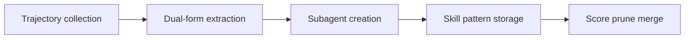

# AutoRefine: From Trajectories to Reusable Expertise for Continual LLM Agent Refinement

## 论文信息
- 标签：expertise management；what=subagents + skill patterns；when=iterative；how=dual-form extraction + prune/merge；where=trajectory refinement
- 中文定位：轨迹到可复用专家经验
- 作者：Libin Qiu / Zhirong Gao / Junfu Chen / Yuhang Ye / Weizhi Huang / Xiaobo Xue / Wenkai Qiu / Shuo Tang
- 年份：2026
- arXiv：2601.22758
- PDF：https://arxiv.org/pdf/2601.22758
- 代码：未在当前元数据中明确；需要按论文题名继续查官方仓库。

## 一句话总结
AutoRefine 的核心价值是：企业工作流里可以把稳定子流程抽成 subagent，把领域规则抽成 skill pattern，二者分开维护。

## 这篇论文解决什么问题
Agent 从轨迹里学经验时，常把流程逻辑和静态知识混在一起。AutoRefine 试图区分 procedural subtasks 和 static skill patterns，并持续维护经验库。

如果放到 Agent skill 自进化的大图里，它解决的不是“模型有没有知识”，而是“Agent 如何把执行经验变成之后能稳定复用的外部能力”。这类外部能力可能是 `SKILL.md`、技能库、prompt、程序性记忆、world model、verifier 或 curator。区别只在于它把经验沉淀到哪一层。

## 方法图：先抓住机制闭环

这张图可以按从左到右读：左边是问题或数据来源，中间是论文提出的关键机制，右边是更新后的能力如何被复用或验证。读这篇论文时，最重要的是不要只看最后的分数，而要看中间那一层到底把什么东西变成了什么。

## 核心创新点
1. AutoRefine 的核心价值是：企业工作流里可以把稳定子流程抽成 subagent，把领域规则抽成 skill pattern，二者分开维护。
2. 它把方法链条明确拆成 Trajectory collection → Dual-form extraction → Subagent creation → Skill pattern storage → Score prune merge 这样的闭环，中间每一步都在把原始轨迹压缩成更稳定的中间表示，而不是把所有经验原样塞给模型。
3. 它不是只证明“能写出 skill”，而是尽量证明“更新后的 skill / repo / curator / verifier / policy 能在后续任务里稳定被复用”。

这三点合在一起，说明这篇论文关注的不是孤立模块，而是一个能持续积累的外部能力系统。读的时候先盯住这三件事：输入是什么、哪一步发生了真正的压缩或筛选、最后能不能复用到别的任务或别的模型上。

## 方法详解

### 1. 从轨迹中收集可复用经验
AutoRefine 的输入是 Agent 执行任务后留下的 trajectories，包括计划、动作、工具调用、失败点、成功路径和反馈。论文关心的不是保存整条轨迹，而是把轨迹中的专家经验提炼出来，用于后续任务持续改进。

这一步的关键是过滤噪声：轨迹里既有真正可复用的流程，也有一次性环境细节。如果不先筛选，经验库会变成长日志，而不是可复用知识。

### 2. 做 dual-form extraction
AutoRefine 把经验拆成两种形态。第一种是 procedural subtasks，适合抽成 specialized subagents，由子 Agent 承担稳定的流程步骤。第二种是 static skill patterns，适合写成 guideline、规则、示例或代码片段，在主 Agent 执行时作为知识约束。

这个拆分是论文的核心。很多方法把所有经验都写成一段反思，但流程经验和静态规则的复用方式不同：流程需要执行主体，规则需要检索和注入。

### 3. 把流程类经验转成 specialized subagents
对于可重复的子流程，例如搜索、校验、规划、表格处理或多步工具操作，AutoRefine 更倾向于生成 specialized subagent。Subagent 可以封装 reasoning 和 memory 分工，使主 Agent 不必每次重新展开完整流程。

这适合企业工作流里的稳定步骤：一旦某类流程反复出现，就应该从主上下文中抽离，变成可调用角色。

### 4. 把知识类经验转成 skill patterns
对于领域规则、检查项、格式要求、代码片段和失败规避策略，AutoRefine 会沉淀为 skill patterns。这些 pattern 更像可检索知识，不一定需要独立 Agent 执行，但能在相关任务中约束主 Agent 的判断。

这样，AutoRefine 同时维护“谁来做”的流程资产和“怎么判断”的知识资产。

### 5. 用 score、prune、merge 维护经验库
持续演化会带来经验库膨胀。AutoRefine 通过 score、prune、merge 维护 subagents 和 skill patterns：高价值经验保留，重复或低收益经验删除，相近经验合并。维护机制决定经验库能否长期稳定，而不是越用越乱。

## 机制拆解表：输入、处理、输出

| 环节 | 输入 | 处理 | 输出 |
| --- | --- | --- | --- |
| Trajectory collection | 任务轨迹、工具调用、反馈、成功/失败结果 | 过滤一次性细节，定位可复用流程和规则 | 候选专家经验 |
| Dual-form extraction | 候选经验、任务类型、复用方式 | 区分 procedural subtasks 和 static skill patterns | 两类经验表示 |
| Subagent creation | 流程类经验、执行步骤、角色边界 | 封装成 specialized subagent，承担可重复子流程 | 可调用子 Agent |
| Skill pattern storage | 规则类经验、示例、代码片段、适用条件 | 写入 guideline / pattern 库，供后续检索注入 | 可复用 skill patterns |
| Score prune merge | 使用日志、任务收益、重复和冲突检测 | 打分、删除低质项、合并相似项 | 更紧凑的经验库 |

这张表的重点是：AutoRefine 的创新在 dual-form expertise，把流程能力和静态规则分开沉淀、分开维护。

## 实验与证据怎么理解
在 ALFWorld、ScienceWorld、TravelPlanner 上，它提升成功率并减少步骤，说明结构化经验比原始轨迹更可用。

更具体地说，读实验时建议抓三条线：第一，是否有和无 skill / 旧 skill / 新 skill 的公平对比；第二，是否证明收益来自 skill 本身，而不是模型或 prompt 其他部分变化；第三，是否展示跨任务、跨模型或 OOD 的迁移能力。只有同时满足这些条件，才能说明它真的是“自进化能力”，而不是一次性的 benchmark 调参。

## 一个具体例子

可以把它想成从录像复盘中提炼专家经验：流程类经验变成子 Agent，规则类经验变成 skill pattern。

假设一个 Agent 连续处理十个相似任务。如果它每次都从零推理，那只是“会做题”；如果它能从前几次任务中提炼出规则、检查点、工具调用顺序或失败规避策略，并在后面任务中稳定复用，那才是这篇论文关心的自进化。

## 和相关方法的差异

| 对象 | 做法 | 关键差异 |
| --- | --- | --- |
| Raw trajectory | 完整但噪声大 | 难以复用 |
| Single memory summary | 压缩但粗糙 | 流程和知识混杂 |
| AutoRefine | dual-form patterns | 把流程外包成子 Agent，把知识沉淀成 skill |

这张表的重点是定位：同样都叫 self-evolving，不同论文改的层完全不同。有的改记忆，有的改 prompt，有的改 skill 文档，有的训练 curator 或 policy。把层级分清楚，论文就容易读很多。

## 适合怎么读
- 先看论文把经验沉淀到哪里：记忆、skill、prompt、policy、verifier、world model，还是 SkillRepo。
- 再看它如何防止坏经验进入系统：是否有 verifier、held-out gate、reward、score-based maintenance 或人工审核。
- 最后看它如何证明迁移：跨任务、跨模型、跨用户、跨环境，至少要有一种。

## 局限与风险
自动判断一条经验属于流程还是知识并不容易，分类错会影响后续复用。

从工程角度还要额外警惕两点。第一，skill 越自进化，越容易把错误规则长期固化；第二，skill 越共享，越需要权限、来源、版本和回滚机制。论文实验里有效，不代表上线系统里可以无审核运行。

## 工程启发
企业工作流里可以把稳定子流程抽成 subagent，把领域规则抽成 skill pattern，二者分开维护。

如果把这篇论文转成可落地方案，我会把它拆成四个组件：经验采集器、技能更新器、验证器、发布/回滚器。没有验证器和回滚器的“自进化”，本质上只是自动改文件，风险很高。
