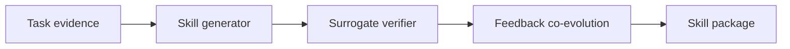

# CoEvoSkills: Self-Evolving Agent Skills via Co-Evolutionary Verification

## 论文信息
- 标签：co-evolution；what=skill package + verifier；when=iterative；how=generator/verifier co-evolution；where=skill generation and validation
- 中文定位：生成器与验证器共进化
- 作者：Hanrong Zhang / Shicheng Fan / Henry Peng Zou / Yankai Chen / Zhenting Wang / Jiayu Zhou / Chengze Li / Wei-Chieh Huang 等
- 年份：2026
- arXiv：2604.01687
- PDF：https://arxiv.org/pdf/2604.01687
- 代码：未在当前元数据中明确；需要按论文题名继续查官方仓库。

## 一句话总结
CoEvoSkills 的核心价值是：自进化技能系统至少需要两个角色：写 skill 的 agent 和审 skill 的 agent。二者不能混成同一个无约束 prompt。

## 这篇论文解决什么问题
生成 skill 不难，难的是知道生成出来的 skill 是否真的可用。CoEvoSkills 把 skill generator 和 surrogate verifier 放进同一个演化回路，解决缺少真实验证信号的问题。

如果放到 Agent skill 自进化的大图里，它解决的不是“模型有没有知识”，而是“Agent 如何把执行经验变成之后能稳定复用的外部能力”。这类外部能力可能是 `SKILL.md`、技能库、prompt、程序性记忆、world model、verifier 或 curator。区别只在于它把经验沉淀到哪一层。

## 方法图：先抓住机制闭环

这张图可以按从左到右读：左边是问题或数据来源，中间是论文提出的关键机制，右边是更新后的能力如何被复用或验证。读这篇论文时，最重要的是不要只看最后的分数，而要看中间那一层到底把什么东西变成了什么。

## 核心创新点
1. CoEvoSkills 的核心价值是：自进化技能系统至少需要两个角色：写 skill 的 agent 和审 skill 的 agent。二者不能混成同一个无约束 prompt。
2. 它把方法链条明确拆成 Task evidence → Skill generator → Surrogate verifier → Feedback co-evolution → Skill package 这样的闭环，中间每一步都在把原始轨迹压缩成更稳定的中间表示，而不是把所有经验原样塞给模型。
3. 它不是只证明“能写出 skill”，而是尽量证明“更新后的 skill / repo / curator / verifier / policy 能在后续任务里稳定被复用”。

这三点合在一起，说明这篇论文关注的不是孤立模块，而是一个能持续积累的外部能力系统。读的时候先盯住这三件事：输入是什么、哪一步发生了真正的压缩或筛选、最后能不能复用到别的任务或别的模型上。

## 方法详解

### 1. 先把 skill 生成和 skill 验证拆成两个角色
CoEvoSkills 的出发点是：LLM 很容易生成一段看似合理的 skill，但生成者自己判断这段 skill 是否有效并不可靠。因此论文把系统拆成 Skill Generator 和 Surrogate Verifier。Generator 负责根据任务证据、轨迹和已有经验提出 skill package；Verifier 负责评估这个 package 是否真的能提高任务表现，并指出失败原因。

这个拆分让 skill 自进化不再是单 Agent 的自说自话。Generator 可以负责覆盖更多候选方案，Verifier 则提供外部约束，防止 skill 只在语言上完整、格式上漂亮，却无法帮助执行。

### 2. Generator 生成的是能力包，而不是单条建议
论文强调的 skill 更接近可复用能力包，而不是一句经验总结或一个工具函数。一个 skill package 可能包含说明、示例、调用方式、约束、辅助文件或面向执行环境的结构化内容。这样做的意义是让 skill 可以被不同执行 Agent 加载，而不是只服务于当前一次提示。

从自进化角度看，Generator 的目标不是把轨迹压缩成最短摘要，而是把任务证据转成后续可执行、可迁移、可验证的技能资产。

### 3. Surrogate Verifier 提供可操作反馈
真实环境里的验证信号可能昂贵、稀疏或不可频繁调用，所以 CoEvoSkills 引入 surrogate verifier。它不是只检查格式，而是尽量预测某个 skill package 对任务执行是否有帮助，并给出可反馈给 Generator 的诊断，例如触发条件不清、步骤缺失、依赖工具不明确、示例过拟合或边界条件不足。

Verifier 的价值在于把“通过/不通过”变成可学习的反馈。没有这一步，Generator 只能靠最终任务分数或自评更新，容易把错误 skill 固化进仓库。

### 4. Generator 和 Verifier 共进化
CoEvoSkills 的重点在 co-evolution：Verifier 不是永远固定的裁判，Generator 也不是一次性被训练好的写作者。随着任务分布和候选 skill 变化，Verifier 需要学习更细的缺陷判断；Generator 也要根据 Verifier 的反馈学会写出更可执行、更容易验证的 skill package。

这形成了一个双向闭环：Generator 的产物推动 Verifier 暴露评估盲点，Verifier 的反馈又推动 Generator 修正技能生成策略。相比单独优化 generator，这种设计更接近真实工程里的“写作-审查-返修”流程。

### 5. 最终目标是可迁移的 skill package
经过多轮生成、验证和反馈后，系统保留的是能在后续任务和不同执行环境中复用的 skill package。论文报告其在 SkillsBench 上优于多个 baseline，并能跨 Claude Code、Codex 等执行环境泛化，说明它关注的不只是当前 benchmark 的单次提分，而是 skill asset 的跨环境可用性。

## 机制拆解表：输入、处理、输出

| 环节 | 输入 | 处理 | 输出 |
| --- | --- | --- | --- |
| Task evidence | 任务描述、执行轨迹、已有 skill、失败或成功反馈 | 整理出 skill 需要覆盖的操作流程、错误模式和边界条件 | 可供 Generator 使用的证据包 |
| Skill Generator | 证据包、已有技能格式、目标执行环境约束 | 生成或修订多文件 skill package，补充说明、步骤、示例和依赖 | 候选 skill package |
| Surrogate Verifier | 候选 package、任务目标、验证标准或历史表现 | 判断 skill 是否有助于任务，识别不完整、不可执行或过拟合之处 | 通过/拒绝信号和可操作反馈 |
| Feedback co-evolution | Verifier 反馈、Generator 历史产物、任务表现 | 同时改进生成策略和验证判断，使二者适应新的任务分布 | 更可靠的 generator / verifier 闭环 |
| Skill package | 通过验证的 package、版本和适用条件 | 发布到技能库，供后续 Agent 加载和迁移 | 可复用、可审查的技能资产 |

这张表的重点是：CoEvoSkills 的创新不只是“自动生成 skill”，而是把生成和验证变成两个互相推动的学习对象。它提醒工程系统不要让同一个 prompt 同时负责写、审、放行，否则很难控制坏 skill 的进入。 

## 实验与证据怎么理解
论文报告在 SkillsBench 上优于多个 baseline，并能跨 Claude Code、Codex 等不同执行环境泛化。

更具体地说，读实验时建议抓三条线：第一，是否有和无 skill / 旧 skill / 新 skill 的公平对比；第二，是否证明收益来自 skill 本身，而不是模型或 prompt 其他部分变化；第三，是否展示跨任务、跨模型或 OOD 的迁移能力。只有同时满足这些条件，才能说明它真的是“自进化能力”，而不是一次性的 benchmark 调参。

## 一个具体例子

可以把它想成“写作者 + 审稿人”共同进步：generator 写 skill，verifier 审 skill，二者都在迭代。

假设一个 Agent 连续处理十个相似任务。如果它每次都从零推理，那只是“会做题”；如果它能从前几次任务中提炼出规则、检查点、工具调用顺序或失败规避策略，并在后面任务中稳定复用，那才是这篇论文关心的自进化。

## 和相关方法的差异

| 对象 | 做法 | 关键差异 |
| --- | --- | --- |
| Tool generation | 生成单个函数 | 覆盖面窄 |
| One-shot skill writing | 一次性写 skill | 缺少验证反馈 |
| CoEvoSkills | generator + verifier 共进化 | 同时优化 skill 内容和评估反馈 |

这张表的重点是定位：同样都叫 self-evolving，不同论文改的层完全不同。有的改记忆，有的改 prompt，有的改 skill 文档，有的训练 curator 或 policy。把层级分清楚，论文就容易读很多。

## 适合怎么读
- 先看论文把经验沉淀到哪里：记忆、skill、prompt、policy、verifier、world model，还是 SkillRepo。
- 再看它如何防止坏经验进入系统：是否有 verifier、held-out gate、reward、score-based maintenance 或人工审核。
- 最后看它如何证明迁移：跨任务、跨模型、跨用户、跨环境，至少要有一种。

## 局限与风险
Surrogate verifier 仍可能学习 benchmark 偏好；如果评估信号不代表真实任务，skill 会过拟合。

从工程角度还要额外警惕两点。第一，skill 越自进化，越容易把错误规则长期固化；第二，skill 越共享，越需要权限、来源、版本和回滚机制。论文实验里有效，不代表上线系统里可以无审核运行。

## 工程启发
自进化技能系统至少需要两个角色：写 skill 的 agent 和审 skill 的 agent。二者不能混成同一个无约束 prompt。

如果把这篇论文转成可落地方案，我会把它拆成四个组件：经验采集器、技能更新器、验证器、发布/回滚器。没有验证器和回滚器的“自进化”，本质上只是自动改文件，风险很高。
