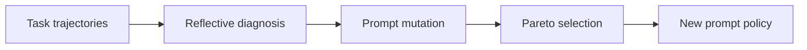

# GEPA: Reflective Prompt Evolution Can Outperform Reinforcement Learning

## 论文信息
- 标签：prompt optimization；what=prompt policy；when=iterative search；how=trajectory reflection + Pareto selection；where=prompt search
- 中文定位：反思式 Prompt 演化
- 作者：Lakshya A Agrawal / Shangyin Tan / Dilara Soylu / Noah Ziems / Rishi Khare / Krista Opsahl-Ong / Arnav Singhvi / Herumb Shandilya 等
- 年份：2025
- arXiv：2507.19457
- PDF：https://arxiv.org/pdf/2507.19457
- 代码：https://github.com/gepa-ai/gepa

## 一句话总结
GEPA 的核心价值是：可用于优化 skill generator prompt、verifier prompt、review rubric，而不只用于普通任务提示词。

## 这篇论文解决什么问题
RL 能优化任务表现，但 rollout 成本高，且自然语言错误分析没有被充分利用。GEPA 用轨迹反思来直接改 prompt。

如果放到 Agent skill 自进化的大图里，它解决的不是“模型有没有知识”，而是“Agent 如何把执行经验变成之后能稳定复用的外部能力”。这类外部能力可能是 `SKILL.md`、技能库、prompt、程序性记忆、world model、verifier 或 curator。区别只在于它把经验沉淀到哪一层。

## 方法图：先抓住机制闭环

这张图可以按从左到右读：左边是问题或数据来源，中间是论文提出的关键机制，右边是更新后的能力如何被复用或验证。读这篇论文时，最重要的是不要只看最后的分数，而要看中间那一层到底把什么东西变成了什么。

## 核心创新点
1. GEPA 的核心价值是：可用于优化 skill generator prompt、verifier prompt、review rubric，而不只用于普通任务提示词。
2. 它把方法链条明确拆成 Task trajectories → Reflective diagnosis → Prompt mutation → Pareto selection → New prompt policy 这样的闭环，中间每一步都在把原始轨迹压缩成更稳定的中间表示，而不是把所有经验原样塞给模型。
3. 它不是只证明“能写出 skill”，而是尽量证明“更新后的 skill / repo / curator / verifier / policy 能在后续任务里稳定被复用”。

这三点合在一起，说明这篇论文关注的不是孤立模块，而是一个能持续积累的外部能力系统。读的时候先盯住这三件事：输入是什么、哪一步发生了真正的压缩或筛选、最后能不能复用到别的任务或别的模型上。

## 方法详解

### 1. 读取完整任务轨迹
GEPA 的输入不是只有最终分数，而是完整 task trajectories，包括 reasoning、tool calls、tool outputs、中间错误、最终答案和反馈。完整轨迹让系统知道失败发生在哪里，而不是只知道某个 prompt 得分低。

这比纯 RL rollout 更高效：标量 reward 提供方向有限，而轨迹文本本身包含大量可诊断信息。

### 2. 用 reflective diagnosis 定位可改规则
GEPA 让模型对轨迹做自然语言反思，找出 prompt 中哪些指令缺失、顺序不合理、约束不清或导致模型误判。反思的目标不是写总结，而是产出可操作的 prompt mutation 依据。

这一步把失败轨迹转成文本梯度：不是数值梯度，而是“下一版 prompt 应该如何改变”的语义诊断。

### 3. 生成 prompt mutation
根据 reflective diagnosis，系统生成候选 prompt 更新。更新可以增加检查步骤、改变任务分解方式、补充工具调用约束、修正输出格式，或删除误导性指令。

与随机搜索不同，GEPA 的 mutation 来自失败归因，因此通常需要更少 rollouts 就能找到有效改动。

### 4. 用 Pareto selection 维护候选前沿
GEPA 不只保留单一最高分 prompt，而是在候选之间维护 Pareto frontier。不同 prompt 可能在不同任务子集、成本或鲁棒性上各有优势；Pareto 选择可以避免过早丢掉有潜力的变体。

这对 prompt / skill 优化都很重要：一个版本在平均分上稍低，但在边界任务上更稳，可能比短期高分版本更值得保留。

### 5. 形成低 rollout 成本的反思式演化
最终 GEPA 通过“轨迹 -> 反思 -> mutation -> Pareto 选择”的闭环优化 prompt policy。论文报告它能用远少于 GRPO 的 rollouts 获得更好结果，说明语言反思在 prompt 空间中是很强的搜索信号。

## 机制拆解表：输入、处理、输出

| 环节 | 输入 | 处理 | 输出 |
| --- | --- | --- | --- |
| Task trajectories | reasoning、tool calls、tool outputs、答案和反馈 | 保留可诊断的执行细节 | 可反思轨迹 |
| Reflective diagnosis | 轨迹、当前 prompt、任务失败信息 | 找出 prompt 缺陷和可修改规则 | 语义诊断 |
| Prompt mutation | 诊断、旧 prompt、目标约束 | 生成候选 prompt 更新 | 新 prompt 候选 |
| Pareto selection | 候选 prompt、验证任务表现、成本和鲁棒性 | 维护非支配候选而非单点最优 | Pareto frontier |
| New prompt policy | 被选候选、后续任务反馈 | 部署或继续迭代优化 | 更稳的 prompt / policy |

这张表的重点是：GEPA 把轨迹反思当成 prompt 演化的高效搜索信号，用 Pareto 选择防止只追逐单一指标。

## 实验与证据怎么理解
论文报告 GEPA 在多个任务上能用远少于 GRPO 的 rollouts 获得更好结果，说明语言反思能提供高效优化信号。

更具体地说，读实验时建议抓三条线：第一，是否有和无 skill / 旧 skill / 新 skill 的公平对比；第二，是否证明收益来自 skill 本身，而不是模型或 prompt 其他部分变化；第三，是否展示跨任务、跨模型或 OOD 的迁移能力。只有同时满足这些条件，才能说明它真的是“自进化能力”，而不是一次性的 benchmark 调参。

## 一个具体例子

可以把它想成自动复盘 prompt：看失败轨迹，写改进意见，挑出 Pareto 更优版本。

假设一个 Agent 连续处理十个相似任务。如果它每次都从零推理，那只是“会做题”；如果它能从前几次任务中提炼出规则、检查点、工具调用顺序或失败规避策略，并在后面任务中稳定复用，那才是这篇论文关心的自进化。

## 和相关方法的差异

| 对象 | 做法 | 关键差异 |
| --- | --- | --- |
| GRPO/RL | 依赖大量 rollout | 成本高 |
| Manual prompt tuning | 依赖人工经验 | 不可扩展 |
| GEPA | reflective prompt evolution | 利用轨迹诊断做高效文本优化 |

这张表的重点是定位：同样都叫 self-evolving，不同论文改的层完全不同。有的改记忆，有的改 prompt，有的改 skill 文档，有的训练 curator 或 policy。把层级分清楚，论文就容易读很多。

## 适合怎么读
- 先看论文把经验沉淀到哪里：记忆、skill、prompt、policy、verifier、world model，还是 SkillRepo。
- 再看它如何防止坏经验进入系统：是否有 verifier、held-out gate、reward、score-based maintenance 或人工审核。
- 最后看它如何证明迁移：跨任务、跨模型、跨用户、跨环境，至少要有一种。

## 局限与风险
反思质量依赖模型能力和反馈质量；反馈脏时 prompt 也会被误改。

从工程角度还要额外警惕两点。第一，skill 越自进化，越容易把错误规则长期固化；第二，skill 越共享，越需要权限、来源、版本和回滚机制。论文实验里有效，不代表上线系统里可以无审核运行。

## 工程启发
可用于优化 skill generator prompt、verifier prompt、review rubric，而不只用于普通任务提示词。

如果把这篇论文转成可落地方案，我会把它拆成四个组件：经验采集器、技能更新器、验证器、发布/回滚器。没有验证器和回滚器的“自进化”，本质上只是自动改文件，风险很高。
