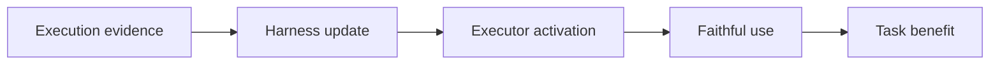

# Harness Updating Is Not Harness Benefit: Disentangling Evolution Capabilities in Self-Evolving LLM Agents

## 论文信息
- 标签：harness evolution；what=harness；when=inter-test-time；how=update generation + benefit analysis；where=execution framework
- 中文定位：Harness 更新收益拆解
- 作者：Minhua Lin / Juncheng Wu / Zijun Wang / Zhan Shi / Yisi Sang / Bing He / Zewen Liu / Tianxin Wei 等
- 年份：2026
- arXiv：2605.30621
- PDF：https://arxiv.org/pdf/2605.30621
- 代码：https://github.com/A-EVO-Lab/a-evolve/tree/release/harness-evolution

## 一句话总结
Harness Updating vs Benefit 的核心价值是：每个 skill 更新都应该记录 activation rate、faithfulness、task benefit 和 negative transfer。

## 这篇论文解决什么问题
很多自进化系统只证明自己能更新 skill、memory 或 prompt，却没有证明执行 Agent 真能用好这些更新。本文把 updating 和 benefit 分开评估。

如果放到 Agent skill 自进化的大图里，它解决的不是“模型有没有知识”，而是“Agent 如何把执行经验变成之后能稳定复用的外部能力”。这类外部能力可能是 `SKILL.md`、技能库、prompt、程序性记忆、world model、verifier 或 curator。区别只在于它把经验沉淀到哪一层。

## 方法图：先抓住机制闭环

这张图可以按从左到右读：左边是问题或数据来源，中间是论文提出的关键机制，右边是更新后的能力如何被复用或验证。读这篇论文时，最重要的是不要只看最后的分数，而要看中间那一层到底把什么东西变成了什么。

## 核心创新点
1. Harness Updating vs Benefit 的核心价值是：每个 skill 更新都应该记录 activation rate、faithfulness、task benefit 和 negative transfer。
2. 它把方法链条明确拆成 Execution evidence → Harness update → Executor activation → Faithful use → Task benefit 这样的闭环，中间每一步都在把原始轨迹压缩成更稳定的中间表示，而不是把所有经验原样塞给模型。
3. 它不是只证明“能写出 skill”，而是尽量证明“更新后的 skill / repo / curator / verifier / policy 能在后续任务里稳定被复用”。

这三点合在一起，说明这篇论文关注的不是孤立模块，而是一个能持续积累的外部能力系统。读的时候先盯住这三件事：输入是什么、哪一步发生了真正的压缩或筛选、最后能不能复用到别的任务或别的模型上。

## 方法详解

### 1. 区分 harness updating 和 harness benefit
这篇论文最重要的概念拆分是：harness updating 指系统能否根据执行证据写出持久更新；harness benefit 指执行模型在未来任务中能否激活、理解、遵循并受益于这些更新。两者不能混为一谈。

一个 Agent 可能很会总结经验、修改文档或更新 skill，但后续执行器根本没检索到、没理解或没按更新行动。反过来，强模型也可能不依赖更新就完成任务，掩盖 harness 本身无效的问题。

### 2. 分别评估更新生成者和更新使用者
论文把生成更新的能力和使用更新的能力拆开评估。前者关心 update 是否覆盖了正确经验、是否写入持久 harness；后者关心 executor 是否在新任务里激活更新并忠实遵循。

这个设计能定位瓶颈：如果 update 质量差，问题在经验蒸馏；如果 update 很好但 executor 没用，问题在检索、触发或模型理解；如果用了但任务变差，问题可能是负迁移或适用条件错误。

### 3. 用四类指标观察 benefit
论文强调 activation rate、faithfulness、task benefit 和 negative transfer。Activation rate 看更新有没有被触发；faithfulness 看触发后是否按更新执行；task benefit 看最终任务是否变好；negative transfer 看更新是否误伤其它任务。

这四个指标必须一起看。单看任务分数无法区分模型自身能力和 harness 更新收益；单看 update 内容又无法证明它被真实使用。

### 4. 分析模型能力与 benefit 的非单调关系
论文发现 updating 对基础模型能力不一定敏感，但 benefit 与模型能力可能呈非单调关系。弱模型可能不会激活或遵循更新；强模型可能靠自身能力完成任务而不依赖更新；中间能力模型反而最容易体现 harness benefit。

这说明自进化系统的收益不只取决于写出了什么更新，还取决于执行模型是否具备利用这些更新的能力。

## 机制拆解表：输入、处理、输出

| 环节 | 输入 | 处理 | 输出 |
| --- | --- | --- | --- |
| Execution evidence | 历史任务、轨迹、失败原因、反馈 | 提取可写入 harness 的经验或规则 | 候选更新依据 |
| Harness update | 候选依据、harness 格式、持久化位置 | 生成或修改 prompt、skill、memory、workflow 等持久组件 | 新 harness 版本 |
| Executor activation | 新任务、更新后的 harness、执行模型 | 观察相关更新是否被检索、注入或触发 | activation rate |
| Faithful use | 被触发的更新、执行轨迹 | 判断模型是否按更新要求行动，而不是只表面引用 | faithfulness 指标 |
| Task benefit | 有无更新的成对运行、任务结果、迁移任务 | 统计收益和负迁移，区分真实 benefit 与噪声 | harness 更新有效性结论 |

这张表的重点是：自进化系统不能只记录“更新已生成”，还必须记录更新是否被激活、是否被忠实使用、是否真正带来任务收益。

## 实验与证据怎么理解
论文发现 updating 对基础模型能力不一定敏感，但 benefit 与模型能力呈非单调关系；弱模型常常不会激活或不会忠实遵循 harness。

更具体地说，读实验时建议抓三条线：第一，是否有和无 skill / 旧 skill / 新 skill 的公平对比；第二，是否证明收益来自 skill 本身，而不是模型或 prompt 其他部分变化；第三，是否展示跨任务、跨模型或 OOD 的迁移能力。只有同时满足这些条件，才能说明它真的是“自进化能力”，而不是一次性的 benchmark 调参。

## 一个具体例子

可以把它想成把“会写笔记”和“会用笔记”分开考试，避免只看笔记写得漂亮。

假设一个 Agent 连续处理十个相似任务。如果它每次都从零推理，那只是“会做题”；如果它能从前几次任务中提炼出规则、检查点、工具调用顺序或失败规避策略，并在后面任务中稳定复用，那才是这篇论文关心的自进化。

## 为什么 updating 和 benefit 必须分开看

这篇论文最重要的贡献是把两个经常被混淆的概念拆开：一个是 harness 有没有被更新，另一个是执行器有没有真的从更新里受益。前者关心文档、接口、检索结构是不是变了，后者关心模型有没有激活、有没有忠实遵循、有没有带来真实任务收益。

这点对实际系统很关键。很多时候一个 harness 改得很漂亮，但模型根本没用上；也有时候更新本身很弱，但强模型还能靠自身能力补回来。只有把 activation rate、faithfulness、task benefit 和 negative transfer 放在一起看，才知道问题出在生成、执行还是评估。

## 四个指标到底在看什么

这篇论文其实是在给 harness 更新建立一套可审计的仪表盘。activation rate 看的是更新有没有被用到；faithfulness 看的是用了以后有没有按预期执行；task benefit 看的是最终任务有没有变好；negative transfer 看的是更新有没有误伤其他场景。

这四个指标放在一起，才能把“看起来很合理”与“真的有收益”分开。单看更新质量，容易高估一个漂亮的 harness；单看任务分数，又容易把模型自身能力、环境噪声和更新效果混在一起。把两边拆开后，才知道系统问题究竟出在更新、执行还是迁移。

## 和相关方法的差异

| 对象 | 做法 | 关键差异 |
| --- | --- | --- |
| 只看 update quality | 评估文档是否像样 | 可能无实际收益 |
| 只看 task score | 看最终成功率 | 不知道问题在生成还是使用 |
| 本文拆分 | updating vs benefit | 能定位瓶颈 |

这张表的重点是定位：同样都叫 self-evolving，不同论文改的层完全不同。有的改记忆，有的改 prompt，有的改 skill 文档，有的训练 curator 或 policy。把层级分清楚，论文就容易读很多。

## 适合怎么读
- 先看论文把经验沉淀到哪里：记忆、skill、prompt、policy、verifier、world model，还是 SkillRepo。
- 再看它如何防止坏经验进入系统：是否有 verifier、held-out gate、reward、score-based maintenance 或人工审核。
- 最后看它如何证明迁移：跨任务、跨模型、跨用户、跨环境，至少要有一种。

## 局限与风险
它是评估框架，不直接给出训练算法；后续还要把这些指标纳入优化闭环。

从工程角度还要额外警惕两点。第一，skill 越自进化，越容易把错误规则长期固化；第二，skill 越共享，越需要权限、来源、版本和回滚机制。论文实验里有效，不代表上线系统里可以无审核运行。

## 工程启发
每个 skill 更新都应该记录 activation rate、faithfulness、task benefit 和 negative transfer。

如果把这篇论文转成可落地方案，我会把它拆成四个组件：经验采集器、技能更新器、验证器、发布/回滚器。没有验证器和回滚器的“自进化”，本质上只是自动改文件，风险很高。
