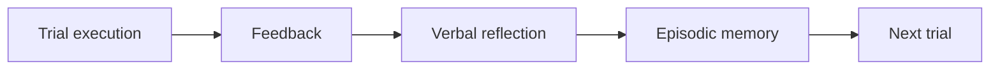

# Reflexion: Language Agents with Verbal Reinforcement Learning

## 论文信息
- 标签：reflection memory；what=episodic reflection；when=trial-to-trial；how=verbal reflection；where=general agent memory
- 中文定位：语言反思记忆基础
- 作者：Noah Shinn / Federico Cassano / Edward Berman / Ashwin Gopinath / Karthik Narasimhan / Shunyu Yao
- 年份：2023
- arXiv：2303.11366
- PDF：https://arxiv.org/pdf/2303.11366
- 代码：未在当前元数据中明确；需要按论文题名继续查官方仓库。

## 一句话总结
Reflexion 的核心价值是：把 Reflexion 当作 skill 生成前的缓冲层：多次验证有效的反思再升级成正式 skill。

## 这篇论文解决什么问题
Agent 失败后，如果每次都重新来过，就没有学习。Reflexion 提出不改参数，只用语言反思和 episodic memory 改进行为。

如果放到 Agent skill 自进化的大图里，它解决的不是“模型有没有知识”，而是“Agent 如何把执行经验变成之后能稳定复用的外部能力”。这类外部能力可能是 `SKILL.md`、技能库、prompt、程序性记忆、world model、verifier 或 curator。区别只在于它把经验沉淀到哪一层。

## 方法图：先抓住机制闭环

这张图可以按从左到右读：左边是问题或数据来源，中间是论文提出的关键机制，右边是更新后的能力如何被复用或验证。读这篇论文时，最重要的是不要只看最后的分数，而要看中间那一层到底把什么东西变成了什么。

## 核心创新点
1. Reflexion 的核心价值是：把 Reflexion 当作 skill 生成前的缓冲层：多次验证有效的反思再升级成正式 skill。
2. 它把方法链条明确拆成 Trial execution → Feedback → Verbal reflection → Episodic memory → Next trial 这样的闭环，中间每一步都在把原始轨迹压缩成更稳定的中间表示，而不是把所有经验原样塞给模型。
3. 它不是只证明“能写出 skill”，而是尽量证明“更新后的 skill / repo / curator / verifier / policy 能在后续任务里稳定被复用”。

这三点合在一起，说明这篇论文关注的不是孤立模块，而是一个能持续积累的外部能力系统。读的时候先盯住这三件事：输入是什么、哪一步发生了真正的压缩或筛选、最后能不能复用到别的任务或别的模型上。

## 方法详解

### 1. 执行一个 trial 并收集反馈
Reflexion 的基本单位是 trial。Agent 先按当前策略执行任务，得到环境反馈、单元测试结果、成功/失败标记、标量 reward 或自评信号。模型参数不更新，所有学习都发生在外部语言记忆里。

这一步提供反思的依据。没有可验证反馈，反思很容易变成泛泛而谈的建议。

### 2. 把反馈转成 verbal reflection
系统让 LLM 根据执行轨迹和反馈写出自然语言反思，回答“为什么失败”“下次应该注意什么”“哪些动作应该避免或改进”。这就是论文所说的 verbal reinforcement：反馈不是梯度，而是一段可读的语言经验。

反思的价值在于快速、低成本和可解释；限制在于它通常还不是严格的程序性 skill，缺少触发条件、终止条件和验证门。

### 3. 将反思写入 episodic memory
生成的 reflection 被保存到 episodic memory。下一次相似任务或下一轮 trial 时，系统把这些反思注入上下文，影响 Agent 的计划和行动。

这一步让 Agent 不需要更新权重也能跨 trial 改善表现。它是很多后续 skill 自进化方法的前置形态：先把失败变成记忆，再进一步把记忆压缩成 skill。

### 4. 下一轮 trial 读取记忆并调整行为
新 trial 开始时，Agent 会读取上轮或多轮反思，避免重复错误。若任务成功，说明反思可能有效；若仍失败，系统继续生成新的 reflection，形成 trial -> feedback -> reflection -> memory -> next trial 的闭环。

Reflexion 的收敛边界在于：它能快速修正当前任务族中的错误，但如果反思越积越多、互相冲突或缺少验证，就需要进一步升级成更结构化的 skill 管理机制。

## 机制拆解表：输入、处理、输出

| 环节 | 输入 | 处理 | 输出 |
| --- | --- | --- | --- |
| Trial execution | 当前任务、策略提示、已有反思记忆 | 执行任务并记录动作、推理和结果 | 完整 trial 轨迹 |
| Feedback | 环境结果、测试反馈、reward、自评 | 判断成功/失败并定位主要问题 | 可反思的反馈信号 |
| Verbal reflection | trial 轨迹、反馈、任务目标 | 生成自然语言教训和下一轮改进建议 | reflection 文本 |
| Episodic memory | reflection、任务标识、历史经验 | 保存可在后续 trial 注入的语言记忆 | 反思记忆库 |
| Next trial | 新任务、相关 reflection、当前提示 | 读取反思并调整计划和行动 | 改进后的执行尝试 |

这张表的重点是：Reflexion 是语言反思记忆机制，不是完整 skill package；它更适合作为 skill 生成前的经验缓冲层。

## 实验与证据怎么理解
论文在顺序决策、代码、语言推理等任务上报告明显提升，并在 HumanEval 上达到很高 pass@1。

更具体地说，读实验时建议抓三条线：第一，是否有和无 skill / 旧 skill / 新 skill 的公平对比；第二，是否证明收益来自 skill 本身，而不是模型或 prompt 其他部分变化；第三，是否展示跨任务、跨模型或 OOD 的迁移能力。只有同时满足这些条件，才能说明它真的是“自进化能力”，而不是一次性的 benchmark 调参。

## 一个具体例子

可以把它想成失败后的错题本：下次做题前先读错因，但还没有升级成正式技能库。

假设一个 Agent 连续处理十个相似任务。如果它每次都从零推理，那只是“会做题”；如果它能从前几次任务中提炼出规则、检查点、工具调用顺序或失败规避策略，并在后面任务中稳定复用，那才是这篇论文关心的自进化。

## 为什么 Reflexion 不是最终 skill

Reflexion 更像自进化链条的前置缓冲层，而不是最终产物。它把失败后的自然语言反馈写进 episodic memory，让下一轮 trial 先读到“应该怎么改”，但它还没有把这条经验压成稳定、可发布、可治理的 skill package。

这也是它和后续 skill 论文的分界线：Reflexion 擅长把错误变成可读的反思，Trace2Skill、SkillX、SkillOpt 这类工作则进一步把反思压成可复用资产。也就是说，Reflexion 解决的是“记住教训”，后面的技能路线解决的是“把教训交付给别人用”。

## 反思、记忆和技能的边界

Reflexion 的位置要看清楚：它让 Agent 学会从失败中写出下一轮可用的反思，但这些反思仍然是短句式、上下文式的记忆，不是稳定的 skill package。

因此它更像一个“经验缓冲层”。反思适合快速纠错，记忆适合跨 trial 提示，真正的技能资产还需要后续方法把这些文本进一步结构化、压缩和验证。换句话说，Reflexion 解决的是“别忘了上次错在哪”，而不是“把错因沉淀成可发布资产”。

这一区分很重要，因为很多人会把反思成功误读成技能自进化成功。实际上，从反思到技能之间，还隔着格式化、版本管理、冲突消解和效果验证几道门。

## 和相关方法的差异

| 对象 | 做法 | 关键差异 |
| --- | --- | --- |
| Parameter RL | 更新模型权重 | 成本高 |
| Static prompt | 不吸收失败 | 重复犯错 |
| Reflexion | 语言记忆更新 | 轻量、可解释、快速 |

这张表的重点是定位：同样都叫 self-evolving，不同论文改的层完全不同。有的改记忆，有的改 prompt，有的改 skill 文档，有的训练 curator 或 policy。把层级分清楚，论文就容易读很多。

## 适合怎么读
- 先看论文把经验沉淀到哪里：记忆、skill、prompt、policy、verifier、world model，还是 SkillRepo。
- 再看它如何防止坏经验进入系统：是否有 verifier、held-out gate、reward、score-based maintenance 或人工审核。
- 最后看它如何证明迁移：跨任务、跨模型、跨用户、跨环境，至少要有一种。

## 局限与风险
反思可能错误，记忆越多越容易冲突；模型读到正确反思也可能不执行。

从工程角度还要额外警惕两点。第一，skill 越自进化，越容易把错误规则长期固化；第二，skill 越共享，越需要权限、来源、版本和回滚机制。论文实验里有效，不代表上线系统里可以无审核运行。

## 工程启发
把 Reflexion 当作 skill 生成前的缓冲层：多次验证有效的反思再升级成正式 skill。

如果把这篇论文转成可落地方案，我会把它拆成四个组件：经验采集器、技能更新器、验证器、发布/回滚器。没有验证器和回滚器的“自进化”，本质上只是自动改文件，风险很高。
