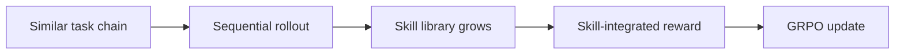

# Reinforcement Learning for Self-Improving Agent with Skill Library

## 论文信息
- 标签：RL + skill library；what=skill library；when=inter-test-time across rollouts；how=sequential rollout + skill-integrated reward + GRPO；where=RL skill learning
- 中文定位：Skill library 纳入 GRPO 训练
- 作者：Jiongxiao Wang / Qiaojing Yan / Yawei Wang / Yijun Tian / Soumya Smruti Mishra / Zhichao Xu / Megha Gandhi / Panpan Xu 等
- 年份：2025
- arXiv：2512.17102
- PDF：https://arxiv.org/pdf/2512.17102
- 代码：未在当前元数据中明确；需要按论文题名继续查官方仓库。

## 一句话总结
SAGE / Skill Library RL 的核心价值是：可借鉴它做离线训练集构造：让任务按相似性排序，测试技能是否减少后续任务成本。

## 这篇论文解决什么问题
如果技能库只靠 prompt 临时生成，Agent 不一定会稳定使用。SAGE 把 skill library 直接放进 RL 训练过程，让模型学会生成和复用技能。

如果放到 Agent skill 自进化的大图里，它解决的不是“模型有没有知识”，而是“Agent 如何把执行经验变成之后能稳定复用的外部能力”。这类外部能力可能是 `SKILL.md`、技能库、prompt、程序性记忆、world model、verifier 或 curator。区别只在于它把经验沉淀到哪一层。

## 方法图：先抓住机制闭环

这张图可以按从左到右读：左边是问题或数据来源，中间是论文提出的关键机制，右边是更新后的能力如何被复用或验证。读这篇论文时，最重要的是不要只看最后的分数，而要看中间那一层到底把什么东西变成了什么。

## 核心创新点
1. SAGE / Skill Library RL 的核心价值是：可借鉴它做离线训练集构造：让任务按相似性排序，测试技能是否减少后续任务成本。
2. 它把方法链条明确拆成 Similar task chain → Sequential rollout → Skill library grows → Skill-integrated reward → GRPO update 这样的闭环，中间每一步都在把原始轨迹压缩成更稳定的中间表示，而不是把所有经验原样塞给模型。
3. 它不是只证明“能写出 skill”，而是尽量证明“更新后的 skill / repo / curator / verifier / policy 能在后续任务里稳定被复用”。

这三点合在一起，说明这篇论文关注的不是孤立模块，而是一个能持续积累的外部能力系统。读的时候先盯住这三件事：输入是什么、哪一步发生了真正的压缩或筛选、最后能不能复用到别的任务或别的模型上。

## 方法详解

### 1. 把相似任务组织成 sequential rollout
SAGE / Skill Library RL 的关键不是让模型在单个任务后随手写 skill，而是把一组相似任务串成序列。前面任务产生的技能可以被后面任务复用，因此训练过程能够观察“当前留下的 skill 是否减少未来任务成本”。

这种任务链设计把 skill 从即时辅助变成跨任务资产。若任务之间完全无关，skill library 的收益很难体现；若任务过于相似，又可能只学到模板化技巧。因此相似性排序是训练数据构造里的核心变量。

### 2. 在 rollout 中让 Skill Library 增长
执行序列任务时，Agent 可以根据经验生成或更新 skill，并把它写入 Skill Library。后续任务执行时，模型可以检索、使用这些技能，而不是每次重新探索工具调用和任务流程。

这一步让训练过程显式暴露技能复用：一个 skill 不是生成后就算成功，必须在后续任务中被调用并带来更高成功率、更少交互步骤或更低 token 成本。

### 3. 设计 skill-integrated reward
论文把技能生成和复用写进奖励。奖励不仅看当前任务是否完成，还看技能是否帮助后续任务、是否减少交互步骤和 token 消耗、是否形成可复用的库内容。这样模型才会学到“为未来任务留下资产”，而不是只追求当前 episode 的短期回报。

这也是它与 prompt-only skill 方法的差别：skill 不是临时提示，而是 RL 目标中的一部分。

### 4. 用 GRPO 更新策略
基于 sequential rollout 和 skill-integrated reward，系统用 GRPO 更新策略。更新后的 Agent 会更倾向于生成可复用技能、在合适时机调用技能，并避免写入无用或噪声 skill。

因此，这条路线把 Skill Library 纳入 RL 训练，而不是把技能库作为训练后的外挂。实验中 AppWorld 上成功率提升、交互步骤和 token 下降，正说明它关注的不只是做对任务，还包括执行成本和复用效率。

## 机制拆解表：输入、处理、输出

| 环节 | 输入 | 处理 | 输出 |
| --- | --- | --- | --- |
| Similar task chain | 按相似性组织的任务序列、初始策略、初始技能库 | 让前序任务经验有机会影响后序任务 | 可评估跨任务复用的 rollout 设置 |
| Sequential rollout | 任务链、当前策略、Skill Library | 依次执行任务，记录技能生成、调用和任务结果 | 带技能复用证据的轨迹 |
| Skill library grows | 前序轨迹、新生成技能、已有技能 | 写入、更新或复用技能，观察后续任务收益 | 动态增长的 Skill Library |
| Skill-integrated reward | 任务成功率、交互步数、token 成本、skill usage | 同时奖励当前任务表现和未来可复用技能资产 | 训练用复合奖励 |
| GRPO update | 复合奖励、rollout 轨迹、当前策略 | 更新模型，使其更会生成和使用有价值技能 | skill-aware 的自改进 Agent |

这张表的重点是：SAGE 把技能库从提示工程对象推进到 RL 训练对象，让“留下可复用 skill”成为策略优化的一部分。

## 实验与证据怎么理解
在 AppWorld 上，论文报告 Scenario Goal Completion 提升 8.9%，交互步骤减少 26%，token 生成减少 59%。这说明 skill 不只涨成功率，也能降执行成本。

更具体地说，读实验时建议抓三条线：第一，是否有和无 skill / 旧 skill / 新 skill 的公平对比；第二，是否证明收益来自 skill 本身，而不是模型或 prompt 其他部分变化；第三，是否展示跨任务、跨模型或 OOD 的迁移能力。只有同时满足这些条件，才能说明它真的是“自进化能力”，而不是一次性的 benchmark 调参。

## 一个具体例子

可以把它想成把技能库写进训练目标：当前任务做对还不够，还要留下后续能用的技能。

假设一个 Agent 连续处理十个相似任务。如果它每次都从零推理，那只是“会做题”；如果它能从前几次任务中提炼出规则、检查点、工具调用顺序或失败规避策略，并在后面任务中稳定复用，那才是这篇论文关心的自进化。

## 和相关方法的差异

| 对象 | 做法 | 关键差异 |
| --- | --- | --- |
| Prompt-only skill | 靠上下文生成 | 稳定性弱 |
| Static library | 库不随训练变 | 利用不足 |
| SAGE | Sequential rollout + reward | 把技能积累纳入 RL 目标 |

这张表的重点是定位：同样都叫 self-evolving，不同论文改的层完全不同。有的改记忆，有的改 prompt，有的改 skill 文档，有的训练 curator 或 policy。把层级分清楚，论文就容易读很多。

## 适合怎么读
- 先看论文把经验沉淀到哪里：记忆、skill、prompt、policy、verifier、world model，还是 SkillRepo。
- 再看它如何防止坏经验进入系统：是否有 verifier、held-out gate、reward、score-based maintenance 或人工审核。
- 最后看它如何证明迁移：跨任务、跨模型、跨用户、跨环境，至少要有一种。

## 局限与风险
任务链相似性设计很关键；如果链路不合理，技能可能无法迁移。

从工程角度还要额外警惕两点。第一，skill 越自进化，越容易把错误规则长期固化；第二，skill 越共享，越需要权限、来源、版本和回滚机制。论文实验里有效，不代表上线系统里可以无审核运行。

## 工程启发
可借鉴它做离线训练集构造：让任务按相似性排序，测试技能是否减少后续任务成本。

如果把这篇论文转成可落地方案，我会把它拆成四个组件：经验采集器、技能更新器、验证器、发布/回滚器。没有验证器和回滚器的“自进化”，本质上只是自动改文件，风险很高。
