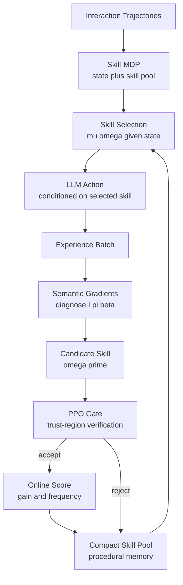

# Skill-Pro: Learning Reusable Skills from Experience via Non-Parametric PPO for LLM Agents

## 论文信息
- 标签：skill pool optimization；what=skill pool；when=batch maintenance；how=PPO gate + online score + maintenance；where=programmatic memory management
- 中文定位：程序性记忆 / Skill-MDP / Non-Parametric PPO
- 作者：Qirui Mi / Zhijian Ma / Mengyue Yang / Haoxuan Li / Yisen Wang / Haifeng Zhang / Jun Wang
- 年份：2026
- 会议状态：ICML 2026 Spotlight，arXiv v3，22 页，6 张图，5 张表
- arXiv：2602.01869
- PDF：https://arxiv.org/pdf/2602.01869
- 官方代码：https://github.com/Miracle1207/ProcMEM
- 代码状态：已公开，MIT License。当前环境尝试 clone GitHub 失败，因此下面的源码对应主要来自公开 README 和 raw 文件抽取；路径以仓库展示为准。

## 一句话总结
Skill-Pro 要解决的是“经验如何从一次性轨迹变成可执行、可复用、可筛选的程序性技能”。它不是把历史对话原样放进 RAG，而是把技能表示成 initiation / policy / termination 三段式 option，再用 semantic gradients 生成候选更新，用 PPO Gate 做信任域式验证，并用在线分数维护一个紧凑的 Skill Pool。

## 这篇论文真正解决什么问题
LLM Agent 在长程任务中经常表现得像“每次都从零开工”：它能读当前状态、临时推理、调用工具或输出动作，但遇到相似局面时仍然反复重做同一套分析。论文把这个现象称为 insufficient experience reuse：经验被保存了，未必能在运行时被稳定激活；即使被激活，也未必能转成动作流程。

传统 episodic memory、RAG 或反思记忆的共同问题是：它们大多记录“曾经发生过什么”或“上次失败的总结是什么”。这类信息是被动叙述，Agent 下一次仍要判断它是否相关、如何转换成动作、什么时候停止使用。Skill-Pro 的观点更强：长期自治需要 procedural memory，也就是“何时启动、怎么执行、何时退出”的可执行过程。

论文把挑战拆成三个条件。C1 是 executability：存下来的经验不能只是叙述，必须能在决策时直接实例化。C2 是 reusability：技能被调用后要稳定带来收益，而不是偶然命中。C3 是 non-parametric optimization：整个学习过程不更新 LLM 参数，只优化外部 Skill Pool，避免持续微调带来的成本、灾难性遗忘和部署复杂度。

放到 Agent skill 自进化的大图里，Skill-Pro 是“程序性记忆层”的代表。它既不像 Voyager 那样主要存可执行代码技能，也不像 Reflexion 那样主要存语言反思；它更接近把 classical options framework 搬到 LLM Agent 上：每个 skill 是一个 option，Skill Pool 是外部策略资产，Skill Evolution 是不改权重的优化器。

## 方法总图：从轨迹到程序性记忆



这张图里有两个闭环。执行闭环是 Skill Pool 参与每一步决策：先选 skill，再把 skill 注入提示词，让 LLM 输出原子动作。演化闭环发生在 batch 轨迹之后：系统诊断旧 skill 的触发、执行、终止问题，生成候选 skill，再通过 PPO-style gate 和在线分数决定是否进入池子。

关键点是：Skill-Pro 并不把“生成 skill”当作终点。它要证明的是 skill 被生成后会被复用，复用后有收益，长期维护后池子仍然小。这正是当前很多 agent skill 自进化方案容易漏掉的部分。

## 核心概念 1：Skill-MDP
论文把普通 MDP 扩展成 Skill-augmented Markov Decision Process：

$$
\mathcal{M}_{\Omega}=(\mathcal{S},\mathcal{A},\Omega,P,R,\gamma)
$$

这里 $\mathcal{S}$ 是自然语言状态空间，$\mathcal{A}$ 是原子动作空间，$\Omega=\{\omega^{(1)},\ldots,\omega^{(K)}\}$ 是动态 Skill Pool。人话解释：Agent 的策略不再只看 state 后直接出 action，而是多了一个外部程序性记忆库，先决定“这一步该不该套用某个过程”。

每一步先由 skill selection policy $\mu$ 选技能：

$$
\omega_t \sim \mu(\omega \mid s_t,\Omega)
$$

然后 LLM 在当前状态和被选 skill 的共同条件下输出动作：

$$
a_t \sim \pi_{\text{LLM}}(a \mid s_t,\omega_t)
$$

合起来，Skill-MDP 的联合策略可以写成：

$$
\pi_{\Omega}(\omega_t,a_t \mid s_t)=\mu(\omega_t \mid s_t,\Omega)\,\pi_{\text{LLM}}(a_t \mid s_t,\omega_t)
$$

这几个公式对应的工程含义很直接：skill 不是一段离线文档，而是运行时策略的一部分。一个 skill 是否有价值，不只看它写得是否漂亮，还要看它是否在正确状态被选中、是否让 LLM 输出更好的动作。

## 核心概念 2：Skill 是三段式 option
论文将 skill 定义为：

$$
\omega=\langle \mathcal{I}_{\omega},\pi_{\omega},\beta_{\omega}\rangle
$$

其中 $\mathcal{I}_{\omega}$ 是 initiation / activation condition，说明什么时候启动；$\pi_{\omega}$ 是 execution procedure，说明怎么做；$\beta_{\omega}$ 是 termination condition，说明什么时候停止。这个结构比“自然语言经验总结”更工程化，因为它把 skill 的生命周期写进了表示本身。

官方实现中的 `data_structures.py` 也对应这个设计：`Skill` 包含 `name`、`initiation`、`policy`、`termination`，并维护 `frequency`、`avg_gain`、`total_gain`、`maturity`、`success_count`、`parent_id`、`version` 等统计字段。也就是说，源码里不是只存 prompt 文本，而是同时存技能内容和它在在线运行中的表现。

简化后的 schema 可以理解为：

```python
@dataclass
class Skill:
    name: str
    initiation: str
    policy: List[str]
    termination: str
    frequency: int
    avg_gain: float
    total_gain: float
    maturity: int
```

这段设计对 Agent skill 系统很有启发：如果一个技能没有触发条件，它会污染上下文；如果没有终止条件，它可能在状态已经变化后继续误导动作；如果没有收益统计，它就无法被自动淘汰。

## 核心概念 3：Non-Parametric PPO
Skill-Pro 的优化目标不是更新 LLM 参数，而是更新外部 Skill Pool。论文写成：

$$
\Omega_{\text{new}}=\mathcal{E}(\Omega_{\text{old}},\mathcal{T}^{(B)})
$$

$\mathcal{T}^{(B)}$ 是一批交互轨迹，$\mathcal{E}$ 是 skill evolution operator。人话解释：每轮训练后，系统拿一批真实经历来改技能池，而不是反向传播改模型权重。

进一步，长期目标是让经过 $N$ 次演化后的 Skill Pool 带来更高回报：

$$
\max_{\mathcal{E}}\;\mathbb{E}_{\tau\sim\pi_{\Omega^*}}\left[\sum_{t=0}^{T}\gamma^t r_t\right],\quad \Omega^*=\mathcal{E}^{(N)}(\Omega_0)
$$

这就是它被称为 Non-Parametric PPO 的原因：PPO 的思想用在“候选 skill 是否进入池子”的信任域验证上，而不是用在模型参数梯度更新上。它优化的是外部、可读、可版本化的 procedural memory。

## 方法步骤 1：运行时选择和注入 skill
在执行阶段，Skill-Pro 先从 Skill Pool 中选择当前状态最相关的技能，再把技能内容注入 prompt，最后让 LLM 输出动作。论文给出两类选择方式：一种是按 initiation condition 与 state 的语义相似度选；另一种是先 Top-K 检索，再用 LLM 或价值估计重排。

对应公式是：

$$
\omega_t=\arg\max_{\omega\in\Omega_t}\mathrm{Sim}(s_t,\mathcal{I}_{\omega})
$$

以及 Top-K 版本：

$$
\Omega_t^{(k)}=\operatorname{TopK}_{\omega\in\Omega_t}\mathrm{Sim}(s_t,\mathcal{I}_{\omega}),\quad
\omega_t=\arg\max_{\omega\in\Omega_t^{(k)}}Q(s_t,\omega)
$$

官方 `Skills/skill_pool.py` 的 README 描述与此一致：Skill Pool 支持 `llm_model`、`llm_topk_lcb` 等选择策略，并对 initiation 条件做 embedding cache。工程上，这意味着 skill 的第一句话非常关键：它不是说明文案，而是检索和激活接口。

## 方法步骤 2：从轨迹生成 semantic gradients
Skill-Pro 没有把失败轨迹直接改写成新 skill，而是先生成 semantic gradient。对一个旧技能 $\omega$ 和轨迹 $\tau_i$，论文定义：

$$
g_i=\nabla_{\mathrm{sem}}(\tau_i,\omega)=\left(g_i^{(\mathcal{I})},g_i^{(\pi)},g_i^{(\beta)}\right)
$$

这三个分量分别诊断 initiation、policy、termination。比如：skill 是否在错误场景启动？执行步骤是否漏了检查？终止条件是否过早或过晚？这比一句“下次更仔细”更有用，因为它直接指向 skill 的哪个字段需要改。

随后，系统把 batch 里的多个 semantic gradients 聚合：

$$
\bar{g}_{\omega}=\text{Aggregate}(\{g_i\}_{i=1}^{B})
$$

再把聚合梯度应用到旧技能：

$$
\omega' = \omega \oplus \bar{g}_{\omega}
$$

官方 `Skills/skill_evolution.py` 的公开片段显示，这一步由 LLM 扮演 Skill Doctor / Skill Evolver：它读取 `old_skill.format_for_llm()`、轨迹、reward，输出 JSON，字段包括 `diagnosis`、`is_related`、`semantic_gradient.initiation`、`semantic_gradient.policy`、`semantic_gradient.termination`。这说明论文里的 semantic gradient 在实现上是结构化自然语言诊断，而不是数值梯度。

## 方法步骤 3：PPO Gate 验证候选 skill
候选 skill 生成后不能直接进入池子。Skill-Pro 引入 PPO-style trust-region verification，核心是比较旧 skill 与候选 skill 对历史动作的支持程度。论文定义 ratio：

$$
\rho_t(\omega')=\frac{\pi_{\text{LLM}}(a_t\mid s_t,\omega')}{\pi_{\text{LLM}}(a_t\mid s_t,\omega)}
$$

再用 PPO clipped objective 评估候选：

$$
L^{\text{CLIP}}(\omega')=\hat{\mathbb{E}}_{\tau\sim\mathcal{B}}\left[\frac{1}{|\tau|}\sum_{t\in\tau}\min\left(\rho_t(\omega')\hat{A}_t,\operatorname{clip}(\rho_t(\omega'),1-\epsilon,1+\epsilon)\hat{A}_t\right)\right]
$$

人话解释：新 skill 不能为了少数轨迹大幅改变行为分布，必须在一个受限范围内带来正向收益。最终接受规则是：

$$
\omega_{\text{new}}=\arg\max_{\omega'}J(\omega'),\quad \text{subject to }J(\omega_{\text{new}})>0
$$

这一步是论文相对一般“LLM 自我改 prompt / 自我写 skill”方法的关键差异。普通方法往往让 LLM 生成一个更像样的规则就保存；Skill-Pro 要用历史轨迹上的优势信号和 clipped objective 做 gate，尽量避免错误经验被固化。

## 方法步骤 4：在线分数和 Skill Pool 维护
Skill Pool 容量固定，不能无限增长。论文定义 skill gain：

$$
G(\omega;\tau)=\frac{1}{|\mathcal{T}_{\omega}(\tau)|}\sum_{t\in\mathcal{T}_{\omega}(\tau)}\tilde{r}_t
$$

其中 $\mathcal{T}_{\omega}(\tau)$ 是轨迹中 skill $\omega$ 被执行的时间步集合，$\tilde{r}_t$ 是相对于运行 baseline 的 advantage-style reward。如果只有轨迹级 return，则把 $R(\tau)-\bar{R}$ 均分到轨迹步上。

每个 batch 后，系统更新累计收益 $G_b$ 和调用次数 $N_b$：

$$
G_{b+1}=G_b+\sum G(\omega;\tau),\quad N_{b+1}=N_b+\sum c(\omega;\tau),\quad
\text{Score}_{b+1}=\frac{G_{b+1}}{\max(1,N_{b+1})}
$$

官方 `data_structures.py` 中的 `update_stats` 与这个思想一致：它计算 `advantage = reward - baseline`，按轨迹中的 skill 调用数分配 per-call gain，再更新 `total_gain`、`frequency` 和 `avg_gain`。`Skills/skill_pool.py` 还包含语义去重和 `maintain_fifo` 消融路径；这对应论文里“score-based maintenance 优于 FIFO”的实验。

## 机制拆解表：每一步到底吃什么、产出什么

| 环节 | 输入 | 关键处理 | 输出 | 失败风险 |
| --- | --- | --- | --- | --- |
| Skill-MDP 执行 | 当前状态、Skill Pool、LLM | 先选 skill，再让 LLM 在 skill 条件下输出 action | 带 skill 使用记录的轨迹 | skill 选错会污染后续动作 |
| Semantic Gradient | 旧 skill、轨迹、reward | 诊断 initiation / policy / termination 哪一段需要改 | 结构化自然语言梯度 | LLM 诊断可能把偶然失败当规律 |
| Candidate Update | 旧 skill、聚合梯度 | 将共性失败模式写回 skill 字段 | 候选 skill $\omega'$ | 过度泛化或把任务细节写死 |
| PPO Gate | 候选 skill、历史 batch、advantage | 用 clipped objective 限制行为偏移并要求正收益 | 接受或拒绝候选 | gate 依赖历史 batch，可能漏掉长尾风险 |
| Score Maintenance | 调用次数、收益、成熟度、语义相似度 | 保留高贡献 skill，删除低分或重复 skill | 紧凑 Skill Pool | 短期低频但关键的 skill 可能被误删 |

## 实验设置
论文在三类场景上验证 Skill-Pro。第一类是 ALFWorld，用 success rate 衡量 embodied text environment 中的任务完成；它区分 train 和 out-of-distribution 环境。第二类是 TextArena 的 Mastermind-v0，并扩展到 Hard、Extreme 难度，用 average return 衡量策略质量。第三类是 cross-agent 复用，把学到的 skill 迁移到 Gemma-3 4B、Qwen3 32B、Llama-3.3 70B 等不同 LLM backbone 上。

基线包括 State、CoT、ReAct，以及多种记忆增强方法：RAG、Expel、A-MEM、AWM、G-Memory。这样设计的好处是能区分三种收益来源：普通 prompt 推理带来的收益、原始经验检索带来的收益、程序性 skill 带来的收益。

论文还在 Appendix C.2 用 Berkeley Function Calling Leaderboard v4 做额外泛化实验。这个设置很重要，因为它从游戏 / 文本环境跳到工具调用，验证 skill 是否捕捉到参数校验、约束检查、调用顺序这类更接近真实软件 Agent 的流程逻辑。

## 主实验结果：不是只赢分数，而是赢“复用密度”

| Method    | In-domain reuse | Hard reuse | Extreme reuse | Gemma reuse | Qwen reuse | Stored tokens | Prompt tokens / step |
| -----------| ----------------:| -----------:| --------------:| ------------:| -----------:| --------------:| ---------------------:|
| RAG       | 0.349           | 0.441      | 0.467         | 0.111       | 0.146      | 116,527      | 2,698               |
| Expel     | 0.285           | 0.242      | 0.258         | 0.254       | 0.270      | 294,447      | 5,210               |
| A-MEM     | 0.020           | 0.017      | 0.015         | 0.020       | 0.018      | 200,129      | 1,214               |
| AWM       | 0.080           | 0.063      | 0.075         | 0.073       | 0.060      | 391,706      | 3,658               |
| G-Memory  | 0.091           | 0.170      | 0.092         | 0.360       | 0.264      | 40,510       | 434                  |
| Skill-Pro | 0.925           | 0.825      | 0.900         | 0.850       | 0.875      | 816           | 273                  |

Table 1 最值得看的不是某个单点复用率，而是复用率和存储成本的组合。Skill-Pro 的 stored tokens 只有 816，而 RAG 是 116,527，Expel 是 294,447，AWM 是 391,706。换句话说，它不是靠“把更多历史塞进上下文”取胜，而是把历史压缩成少量高可用程序。

Prompt tokens / step 也说明同一件事。RAG 每步额外 2,698 tokens，Expel 每步 5,210 tokens，Skill-Pro 只有 273 tokens。对长期 Agent 来说，这个差别不仅是成本问题，也是可靠性问题：上下文越长，错误检索、指令冲突和注意力稀释的概率越高。

## 性能结果：程序性 skill 带来任务收益

| Algorithm | ALFWorld Train | ALFWorld OOD | Mastermind v0 | Hard | Extreme | Gemma | Qwen | Llama |
| --- | ---: | ---: | ---: | ---: | ---: | ---: | ---: | ---: |
| State | 0.312 | 0.262 | 0.388 | 0.336 | 0.272 | 0.414 | 0.497 | 0.613 |
| CoT | 0.600 | 0.620 | 0.531 | 0.381 | 0.254 | 0.417 | 0.470 | 0.542 |
| ReAct | 0.580 | 0.640 | 0.557 | 0.405 | 0.263 | 0.408 | 0.425 | 0.604 |
| Expel | 0.680 | 0.740 | 0.424 | 0.305 | 0.239 | 0.429 | 0.483 | 0.575 |
| A-MEM | 0.520 | 0.640 | 0.471 | 0.310 | 0.253 | 0.388 | 0.570 | 0.542 |
| AWM | 0.700 | 0.900 | 0.546 | 0.299 | 0.294 | 0.417 | 0.592 | 0.550 |
| G-Memory | 0.681 | 0.812 | 0.577 | 0.406 | 0.356 | 0.428 | 0.475 | 0.535 |
| Skill-Pro | 0.900 | 0.909 | 0.606 | 0.463 | 0.333 | 0.444 | 0.615 | 0.647 |

Table 2 的信息更细。ALFWorld 上 Skill-Pro 在 train 达到 0.900，在 OOD 达到 0.909，说明它不仅拟合训练环境，也能迁移到分布外任务。Mastermind-v0 上从 State 的 0.388 提到 0.606，Hard 从 0.336 提到 0.463，Extreme 从 0.272 提到 0.333，说明难度上升后仍有收益，但收益会收窄。

Cross-agent 结果说明了另一个重点：Skill-Pro 学到的是外部可读 skill，不绑定单一模型权重。Gemma、Qwen、Llama 都能复用同一类 procedural memory，其中 Qwen 和 Llama 上分别达到 0.615 和 0.647。这个结果支持“skill 作为跨模型 artifact”的观点。

## 消融实验：三个组件缺一不可

| Method | Reuse rate | Performance | Online score | PPO Gate pass rate |
| --- | ---: | ---: | ---: | ---: |
| Skill-Pro Full | 0.925 | 0.606 | 0.0406 | 59.49% |
| w/o Skill | N/A | 0.388 | N/A | N/A |
| w/o NP-PPO | 0.563 | 0.482 | 0.0265 | N/A |
| w/o Semantic Gradient | 0.306 | 0.530 | 0.0015 | 41.54% |
| w/o PPO Gate | 0.222 | 0.453 | 0.0011 | 100.00% |
| w/o Score (FIFO) | 0.131 | 0.439 | -0.0064 | 57.18% |

这张表能解释为什么原报告不能只写“semantic gradients 和 PPO gate 很重要”。具体看，去掉 NP-PPO 后 performance 从 0.606 掉到 0.482，reuse rate 从 0.925 掉到 0.563。去掉 Semantic Gradient 后 reuse rate 只有 0.306，说明候选生成质量直接决定长期复用。

最有意思的是 w/o PPO Gate：pass rate 变成 100%，但 reuse rate 只有 0.222，performance 只有 0.453。这说明“什么都放行”并不会让系统更强，反而把低质量或不稳定 skill 引入池子。PPO Gate 的价值不是让更多 skill 通过，而是让应该通过的 skill 通过。

w/o Score (FIFO) 更能说明维护机制的重要性。FIFO 的 online score 变成 -0.0064，performance 只有 0.439。长期 skill 系统如果只按时间淘汰，很可能删掉低频但高价值 skill，或者留下近期但无效的 skill。

## 额外泛化：函数调用任务
Appendix C.2 在 BFCL v4 上报告：State accuracy 为 0.233，ReAct 为 0.383，CoT 为 0.367，Skill-Pro 为 0.433。这个结果不像 ALFWorld 那样高，但很有工程意义：函数调用需要参数验证、约束匹配和调用格式稳定性，这些都适合沉淀成程序性 skill。

这也说明 Skill-Pro 的适用范围不是“游戏技巧库”。只要任务中存在重复流程，例如信息抽取、参数校验、搜索-验证-提交、错误诊断、工具调用回退，就可以尝试用 initiation / policy / termination 的形式存成 skill。

## 论文图表该怎么看
Figure 1 主要说明问题动机：普通 Agent 依赖即时推理，难以把重复经验转为可执行程序。Figure 2 展示 Skill-Pro 框架，重点是 Skill-MDP 和 Skill Evolution 两条链路。Figure 3 对应在线训练 / ablation 趋势，说明 score-based maintenance 能保住长期收益。Figure 4 展示 evolutionary trajectories，让读者看到 skill 如何从旧版本被 refine 成新版本。Figure 5 展示 Skill distribution，说明池子不是平均使用，而是形成了高复用核心技能和低频边缘技能。Figure 6 位于附录案例或补充分析中，用来解释具体 skill 的演化和使用情形。

这些图的共同作用是补足表格数字无法表达的部分：Skill-Pro 不是黑盒提分，而是能展示哪些 skill 被创建、如何变体、何时被使用、哪些被淘汰。

## 和相关方法的差异

| 方法 | 存的是什么 | 运行时怎么用 | 主要短板 | Skill-Pro 的区别 |
| --- | --- | --- | --- | --- |
| RAG | 原始文本片段或轨迹 | 检索后塞进上下文 | 信息长、噪声大、还要重新解释 | 压缩成可执行 skill，token 成本低 |
| Reflexion | 失败反思和语言建议 | 下次 trial 作为提示 | 反思不一定可执行，也缺少终止条件 | 把建议结构化成 initiation / policy / termination |
| Expel | 经验或规则总结 | 通过经验库辅助推理 | 可能存很多任务细节 | 用 PPO Gate 和 score 控制质量 |
| Voyager | Minecraft 代码技能 | 检索并执行代码函数 | 强依赖可执行环境和代码验证 | Skill-Pro 更偏自然语言程序性 option |
| CoEvoSkills | 多文件 skill package | verifier 和 generator 共演化 | 更关注 package 生成和验证 | Skill-Pro 更关注运行时 reuse 和 non-parametric PPO |
| SAGE / Skill Library RL | skill library + RL 信号 | 训练 agent 学会生成和调用 skill | 需要 RL 训练 | Skill-Pro 不改权重，部署更轻 |

这张表里最关键的区别是优化对象。Skill-Pro 优化的是外部 Skill Pool；它既不要求模型微调，也不要求每个 skill 都是可执行代码。它适合那些流程可以自然语言描述、但又需要运行时稳定激活的 Agent 场景。

## 官方代码对应关系
官方仓库 README 给出的结构如下：`main.py` 解析参数并启动 SkillMDP；`run.py` 包含核心 training / evaluation loop；`data_structures.py` 定义 `Skill` 和 `Experience`；`pool_managers.py` 管理经验池；`Skills/skill_pool.py` 负责 skill 选择、检索、维护；`Skills/skill_evolution.py` 负责 skill 演化和验证；`Skills/loss.py` 处理 log-prob 和训练损失。

源码中的关键对应关系可以这样读：

| 论文概念 | 代码位置 | 对应内容 |
| --- | --- | --- |
| Skill 三段式 | `data_structures.py` | `Skill.initiation`、`Skill.policy`、`Skill.termination` |
| 在线收益统计 | `data_structures.py` | `update_stats` 更新 `total_gain`、`frequency`、`avg_gain` |
| Skill Pool | `Skills/skill_pool.py` | 初始化 seed skills、embedding cache、select_skill、maintenance、semantic dedup |
| Semantic Gradient | `Skills/skill_evolution.py` | LLM 读取轨迹和 reward，输出结构化 gradient JSON |
| PPO Gate / verification | `Skills/skill_evolution.py` / `Skills/loss.py` | 对候选 skill 做验证，决定是否接受 |
| 训练闭环 | `run.py` | 每轮收集 experience，触发 `run_skill_evolution_with_verification`，然后维护 pool |
| 日志 | `run.py` / README | 输出 `pool_snapshot`、`evolution_details`、`maintenance_details`、`delta_prompt_tokens_per_step` |

实现里有一个很值得借鉴的细节：`Skill.format_for_llm()` 把 skill 格式化成简洁结构，包括 Skill Name、Initiation、Strategy Steps、Termination。这个格式既服务于运行时注入，也服务于 evolution prompt。换句话说，skill 的“人可读格式”和“模型可消费格式”是同一份资产。

## 一个具体例子：从 episodic memory 到 procedural skill
假设 Agent 在 Mastermind 里多次失败，原始经验可能是：“上次猜 1234 后得到两个位置正确，一个数字正确；后来我忘了排除 5。”RAG 会保存这段历史，下次检索出来让模型自己理解。

Skill-Pro 更希望沉淀出这样的 skill：

```text
Skill Name: ConstraintUpdateAfterFeedback
Initiation: When a guess receives exact-position and color-only feedback.
Policy:
- Record confirmed positions first.
- Separate digits that are present from digits that are impossible.
- Before proposing the next guess, check it against all previous feedback.
Termination: Stop after the candidate set is updated and the next guess satisfies every known constraint.
```

这里的重点不是文本更整齐，而是 skill 有明确边界。它知道何时启动、做哪些步骤、何时退出。后续任务中，即使具体数字不同，这个流程仍然能复用。

## 对“收敛”的实质参考价值
Skill-Pro 对收敛最有参考价值的地方，是它把“技能越积越多”改造成“技能池向少量高收益程序性记忆收敛”。这个收敛不是数学上保证全局最优，而是工程上同时压住三个量：候选更新的行为漂移、低质量技能进入池子的概率、长期上下文和存储成本。

第一层收敛来自 PPO Gate。semantic gradient 负责提出候选，但候选不会直接保存，而是要在历史 batch 上证明相对旧 skill 有正收益，并且不能让行为分布发生过大偏移。这个设计给自进化 skill 系统一个很重要的原则：更新器可以激进地产生想法，发布器必须保守地接受变化。对工程系统来说，PPO 公式可以替换成回放集、金标任务、静态检查或人工审核，但“候选必须相对旧版本赢，且漂移受限”这个 gate 不能省。

第二层收敛来自 online score。Skill-Pro 不只记录 skill 有没有被创建，而是持续记录调用频次、每次调用带来的 advantage-style gain、累计收益和平均收益。这样 Skill Pool 的维护目标从“保留最近经验”变成“保留长期边际贡献最高的过程”。这对企业 Agent 特别关键：很多失败不是因为没有经验，而是因为经验库里重复、过期、低收益规则太多，导致检索和注入阶段反而污染决策。

第三层收敛来自 maintenance。容量固定、语义去重、score-based retention 共同把 Skill Pool 推向紧凑形态。Table 1 里 Skill-Pro 用极少 stored tokens 和 prompt tokens 获得高 reuse rate，说明它压缩的不是信息量本身，而是把原始轨迹压缩成可执行的 initiation / policy / termination。这个结果比单纯性能分数更重要，因为长期 Agent 真正的瓶颈通常是记忆膨胀、上下文膨胀和负迁移。

第四层收敛来自三段式 option 表示。initiation 控制何时进入，policy 控制如何执行，termination 控制何时退出；这让每个 skill 自带生命周期边界。没有 initiation 的规则会过度触发，没有 termination 的规则会在上下文中滞留，没有 gain 的规则无法淘汰。Skill-Pro 的收敛经验可以概括成一句工程规则：要让技能库收敛，skill 必须是有触发接口、有退出条件、有收益统计的策略单元，而不是一段永久追加的建议文本。

因此，Skill-Pro 最适合作为“程序性记忆治理层”的参考：先让轨迹产生候选，再用 gate 控制写入，再用 online score 控制保留，最后用固定容量维护让技能池向高收益核心集收敛。它不适合直接替代安全 verifier 或领域规则检查，但非常适合定义自进化 skill 系统的最小闭环。

## 工程启发：如果把它落到 Agent skill 系统
第一，skill 文件不要只写“注意事项”。Skill-Pro 的结构提示我们，稳定技能至少要有触发条件、执行步骤、终止条件、失败示例和收益信号。只有执行步骤没有触发条件，会导致过度调用；只有触发条件没有终止条件，会导致上下文长期被旧技能污染。

第二，skill 自进化需要 gate。任何自动生成或自动修改 skill 的系统，都应该有最低限度的验证：旧任务回放、新任务抽样、冲突检测、权限检查、成本变化、负迁移检查。Skill-Pro 的 PPO Gate 可以不照搬公式，但它提出的原则应该保留：新 skill 必须证明自己相对旧 skill 有正收益，而且不能造成过大的行为漂移。

第三，skill pool 需要维护，不只是增长。长期系统中最危险的不是没有 skill，而是过期、重复、冲突、低质量 skill 越积越多。Skill-Pro 用 online score、frequency、gain 和语义去重来控制容量；工程系统里还应该补版本、来源证据、人工审核、禁用开关和回滚路径。

第四，评估必须看“是否真的被用”。只看 skill 生成质量是不够的。应该同时记录 retrieval hit rate、activation rate、faithfulness、task success、token cost、latency、negative transfer 和 rollback rate。Skill-Pro 的 Table 1 之所以有价值，就是它把 reuse rate、storage cost 和 execution cost 放到同一张表里看。

## 局限与风险
作者在讨论中承认，Skill-Pro 的目标是提升自治 Agent 的效率和复用能力，但仍然依赖交互轨迹质量、候选生成质量和验证信号。论文的 Impact Statement 没有展开具体社会风险，只说该工作旨在推进更高效、可复用的自治 Agent，并认为没有必须特别强调的社会后果。

从方法本身看，第一个局限是 semantic gradients 仍由 LLM 生成。它比普通反思更结构化，但不保证诊断正确。如果 reward 稀疏、轨迹噪声大或失败原因来自环境随机性，LLM 可能把偶然现象写成通用规则。

第二个局限是 PPO Gate 依赖历史 batch 和可估计的 action likelihood。它能降低候选 skill 的行为漂移，但不能覆盖未见状态、权限风险、安全约束或业务规则变化。对于真实软件 Agent，必须增加 domain verifier，而不是只依赖轨迹回报。

第三个局限是 skill 的自然语言表示仍有歧义。同一个 initiation condition 在不同模型上可能被理解不同；policy step 看似明确，执行时仍可能被跳过；termination condition 也可能需要环境状态解析器支持。论文的 cross-agent 结果说明迁移可行，但不能说明所有模型都会忠实执行。

第四个局限是实验场景仍以 ALFWorld、TextArena 和 BFCL 为主。它们覆盖了顺序决策和工具调用，但还不足以代表企业级代码修改、数据权限、长周期项目记忆、多人协作和审计要求。上线系统还需要更强的 provenance、review、rollback 和 sandbox 机制。

## 适合怎么读
读这篇论文时，不要先纠结 PPO 公式，而要按四个问题读：第一，skill 在系统里是不是运行时策略的一部分；第二，经验如何被拆成 initiation / policy / termination 的改动；第三，新 skill 进入池子前有没有 gate；第四，长期维护时有没有证明 token 成本下降、复用率上升、任务分数不掉。

如果和其他 self-evolving agent 论文放在一起读，Skill-Pro 应该被放在“外部程序性记忆优化”这一格。它连接了 Reflexion 的语言经验、Voyager 的 skill library、SAGE 的 RL 复用目标，以及 CoEvoSkills 的 skill package 治理。它的独特价值是把 reuse、verification 和 memory compression 放进同一套实验证据里。

## 最后结论
Skill-Pro 的核心贡献不是“让 Agent 会写更多 skill”，而是给出了一条更完整的 skill 生命周期：运行时激活，轨迹后诊断，候选更新，PPO Gate 验证，在线分数维护，再回到运行时复用。这个闭环解释了为什么它能在极低存储成本下获得高复用率。

对工程实践来说，最值得带走的一句话是：自进化 skill 系统的难点不在“自动生成”，而在“正确触发、有效执行、及时停止、持续验证、按收益淘汰”。没有这些机制，skill library 只是更长的 prompt；有了这些机制，它才接近真正的程序性记忆。
