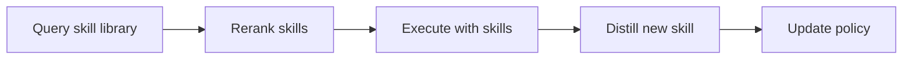

# Skill1: Unified Evolution of Skill-Augmented Agents via Reinforcement Learning

## 论文信息
- 标签：RL + skill selection；what=skill library/policy；when=recursive inter-test-time；how=selection + utilization + distillation；where=skill-conditioned RL
- 中文定位：选择-使用-蒸馏统一强化学习
- 作者：Yaorui Shi / Yuxin Chen / Zhengxi Lu / Yuchun Miao / Shugui Liu / Qi GU / Xunliang Cai / Xiang Wang 等
- 年份：2026
- arXiv：2605.06130
- PDF：https://arxiv.org/pdf/2605.06130
- 代码：未在当前元数据中明确；需要按论文题名继续查官方仓库。

## 一句话总结
Skill1 的核心价值是：适合训练端到端自进化 Agent，但工程实现要记录每次 skill 选择和收益，否则很难调试。

## 这篇论文解决什么问题
许多 skill agent 把选择技能、使用技能、蒸馏新技能拆成三个模块，导致奖励归因不清。Skill1 试图用一个统一 policy 同时训练这三件事。

如果放到 Agent skill 自进化的大图里，它解决的不是“模型有没有知识”，而是“Agent 如何把执行经验变成之后能稳定复用的外部能力”。这类外部能力可能是 `SKILL.md`、技能库、prompt、程序性记忆、world model、verifier 或 curator。区别只在于它把经验沉淀到哪一层。

## 方法图：先抓住机制闭环

这张图可以按从左到右读：左边是问题或数据来源，中间是论文提出的关键机制，右边是更新后的能力如何被复用或验证。读这篇论文时，最重要的是不要只看最后的分数，而要看中间那一层到底把什么东西变成了什么。

## 核心创新点
1. Skill1 的核心价值是：适合训练端到端自进化 Agent，但工程实现要记录每次 skill 选择和收益，否则很难调试。
2. 它把方法链条明确拆成 Query skill library → Rerank skills → Execute with skills → Distill new skill → Update policy 这样的闭环，中间每一步都在把原始轨迹压缩成更稳定的中间表示，而不是把所有经验原样塞给模型。
3. 它不是只证明“能写出 skill”，而是尽量证明“更新后的 skill / repo / curator / verifier / policy 能在后续任务里稳定被复用”。

这三点合在一起，说明这篇论文关注的不是孤立模块，而是一个能持续积累的外部能力系统。读的时候先盯住这三件事：输入是什么、哪一步发生了真正的压缩或筛选、最后能不能复用到别的任务或别的模型上。

## 方法详解

### 1. 用同一个 policy 统一技能选择、使用和蒸馏
Skill1 要解决的是 skill-augmented agent 中的模块割裂问题。很多系统先用一个模块检索 skill，再用另一个模块执行任务，最后再用第三个模块从轨迹中写新 skill。这样做虽然清楚，但最终任务奖励很难分配：成功到底来自检索得好、使用得好，还是新 skill 蒸馏得好。

Skill1 的思路是用统一 policy 覆盖 query、rerank、execution 和 distillation，让这些动作共享同一个 task-outcome signal。这样训练目标不只是“会选 skill”，而是让选择、使用和更新共同服务于最终任务收益。

### 2. 先查询 Skill Library，再重排候选技能
执行时，policy 先根据任务状态生成查询，从 skill library 中召回候选 skill。召回后还需要 rerank，因为语义相似不等于任务有用；某个 skill 可能词面相关，但触发条件、工具依赖或适用阶段并不匹配。

Rerank 阶段实际在做技能选择的信用分配：哪些技能值得注入上下文，哪些技能会造成干扰。对长期系统来说，这一步直接影响 skill library 的有效复用率。

### 3. 在 skill 条件下执行任务
选中 skill 后，Agent 在 skill 提供的策略、步骤或约束条件下执行任务。这里要记录的不只是任务是否成功，还包括使用了哪些 skill、在哪个阶段使用、是否遵循 skill、是否出现负迁移。

这些记录是后续 RL 训练和 skill distillation 的证据。没有细粒度 skill usage trace，就很难判断某个 skill 是真正有用，还是只是碰巧和成功轨迹同时出现。

### 4. 从执行轨迹中蒸馏新技能
任务完成后，系统从成功或失败轨迹里提炼可复用经验，形成新 skill 或更新已有 skill。Skill distillation 的目标不是保存整条轨迹，而是抽出之后能被检索和执行的流程性知识，例如触发条件、操作步骤、检查点和失败规避规则。

这一步让 Skill1 不只是“用技能的 RL agent”，而是一个能把执行经验反哺 skill library 的闭环系统。

### 5. 用统一结果信号做 credit assignment
Skill1 的难点是 credit assignment：最终 reward 很稀疏，但要同时训练 selection、utilization 和 distillation。论文的核心思路是把不同时间尺度的信号分解给不同环节：低频、跨任务的趋势更适合评估 skill selection 和 library 质量；高频、局部的执行变化更适合评估 skill utilization 和 distillation。

因此，Skill1 的价值在于把 skill agent 的三个动作放进同一个强化学习框架，而不是让每个模块各自优化局部指标。

## 机制拆解表：输入、处理、输出

| 环节 | 输入 | 处理 | 输出 |
| --- | --- | --- | --- |
| Query skill library | 当前任务状态、Skill Library、历史使用记录 | 生成检索查询，召回可能相关的 skill | 候选 skill 集合 |
| Rerank skills | 候选 skill、任务目标、当前状态和工具约束 | 判断技能适用性、排序并选择要注入的技能 | 被选中的 skill 和选择轨迹 |
| Execute with skills | 当前状态、选中 skill、执行 policy | 在技能条件下规划和行动，记录遵循情况与任务结果 | 带 skill usage 的执行轨迹 |
| Distill new skill | 成功/失败轨迹、任务 reward、已有 skill | 抽取可复用流程，新增或修订 skill | 新 skill 或 skill update |
| Update policy | 任务结果、skill 选择记录、执行轨迹、蒸馏结果 | 用统一奖励信号训练选择、使用和蒸馏行为 | 更好的 skill-augmented policy |

这张表的重点是：Skill1 的创新不在某一个 skill 表示，而在把“找技能、用技能、写技能”放进同一个可训练闭环里处理信用分配。

## 实验与证据怎么理解
论文在 ALFWorld、WebShop 等任务上优于 skill-based baseline 和 RL baseline，说明统一训练比模块割裂更稳。

更具体地说，读实验时建议抓三条线：第一，是否有和无 skill / 旧 skill / 新 skill 的公平对比；第二，是否证明收益来自 skill 本身，而不是模型或 prompt 其他部分变化；第三，是否展示跨任务、跨模型或 OOD 的迁移能力。只有同时满足这些条件，才能说明它真的是“自进化能力”，而不是一次性的 benchmark 调参。

## 一个具体例子

可以把它想成“三合一训练”：同一个策略既要学会找技能，也要学会用技能，还要从完成任务的轨迹里提炼新技能。

假设一个 Agent 连续处理十个相似任务。如果它每次都从零推理，那只是“会做题”；如果它能从前几次任务中提炼出规则、检查点、工具调用顺序或失败规避策略，并在后面任务中稳定复用，那才是这篇论文关心的自进化。

## 和相关方法的差异

| 对象 | 做法 | 关键差异 |
| --- | --- | --- |
| Pipeline skill agent | 先选再用再蒸馏 | 模块间归因断裂 |
| Pure RL agent | 直接学策略 | 缺少可复用技能资产 |
| Skill1 | 统一 policy + skill evolution | 把选择、使用、蒸馏合成一个闭环 |

这张表的重点是定位：同样都叫 self-evolving，不同论文改的层完全不同。有的改记忆，有的改 prompt，有的改 skill 文档，有的训练 curator 或 policy。把层级分清楚，论文就容易读很多。

## 适合怎么读
- 先看论文把经验沉淀到哪里：记忆、skill、prompt、policy、verifier、world model，还是 SkillRepo。
- 再看它如何防止坏经验进入系统：是否有 verifier、held-out gate、reward、score-based maintenance 或人工审核。
- 最后看它如何证明迁移：跨任务、跨模型、跨用户、跨环境，至少要有一种。

## 局限与风险
频率分解式 credit assignment 对奖励信号质量敏感，奖励太稀疏或太噪时会不稳。

从工程角度还要额外警惕两点。第一，skill 越自进化，越容易把错误规则长期固化；第二，skill 越共享，越需要权限、来源、版本和回滚机制。论文实验里有效，不代表上线系统里可以无审核运行。

## 工程启发
适合训练端到端自进化 Agent，但工程实现要记录每次 skill 选择和收益，否则很难调试。

如果把这篇论文转成可落地方案，我会把它拆成四个组件：经验采集器、技能更新器、验证器、发布/回滚器。没有验证器和回滚器的“自进化”，本质上只是自动改文件，风险很高。
