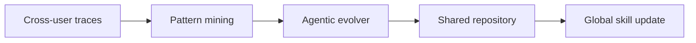

# SkillClaw: Let Skills Evolve Collectively with Agentic Evolver

## 论文信息
- 标签：cross-user skill sharing；what=shared skill repo；when=continuous；how=pattern mining + agentic evolver + governance；where=multi-user skill ecosystem
- 中文定位：多用户集体技能演化
- 作者：Ziyu Ma / Shidong Yang / Yuxiang Ji / Xucong Wang / Yong Wang / Yiming Hu / Tongwen Huang / Xiangxiang Chu
- 年份：2026
- arXiv：2604.08377
- PDF：https://arxiv.org/pdf/2604.08377
- 代码：未在当前元数据中明确；需要按论文题名继续查官方仓库。

## 一句话总结
SkillClaw 的核心价值是：必须配套权限、分组、回滚和灰度发布。共享 skill 不应直接全量上线，而应先在相似用户/任务簇内验证。

## 这篇论文解决什么问题
个人 Agent 的技能来自单用户经验，覆盖慢且容易局部最优。SkillClaw 要解决的是如何让多个用户、多个会话中的经验共同沉淀为共享技能仓库。

如果放到 Agent skill 自进化的大图里，它解决的不是“模型有没有知识”，而是“Agent 如何把执行经验变成之后能稳定复用的外部能力”。这类外部能力可能是 `SKILL.md`、技能库、prompt、程序性记忆、world model、verifier 或 curator。区别只在于它把经验沉淀到哪一层。

## 方法图：先抓住机制闭环

这张图可以按从左到右读：左边是问题或数据来源，中间是论文提出的关键机制，右边是更新后的能力如何被复用或验证。读这篇论文时，最重要的是不要只看最后的分数，而要看中间那一层到底把什么东西变成了什么。

## 核心创新点
1. SkillClaw 的核心价值是：必须配套权限、分组、回滚和灰度发布。共享 skill 不应直接全量上线，而应先在相似用户/任务簇内验证。
2. 它把方法链条明确拆成 Cross-user traces → Pattern mining → Agentic evolver → Shared repository → Global skill update 这样的闭环，中间每一步都在把原始轨迹压缩成更稳定的中间表示，而不是把所有经验原样塞给模型。
3. 它不是只证明“能写出 skill”，而是尽量证明“更新后的 skill / repo / curator / verifier / policy 能在后续任务里稳定被复用”。

这三点合在一起，说明这篇论文关注的不是孤立模块，而是一个能持续积累的外部能力系统。读的时候先盯住这三件事：输入是什么、哪一步发生了真正的压缩或筛选、最后能不能复用到别的任务或别的模型上。

## 方法详解

### 1. 收集跨用户、跨会话轨迹
SkillClaw 关注的不是单个用户的长期记忆，而是多个用户、多个任务和多个会话中反复出现的经验。系统收集 cross-user traces，包括任务类型、执行过程、用户反馈、失败模式和成功路径。

这些轨迹不能直接共享，因为其中可能包含隐私、个性化偏好和只适用于局部场景的做法。因此第一步既是经验采集，也是后续分组、脱敏和适用范围控制的基础。

### 2. 挖掘 recurring behavioral patterns
Agentic evolver 会分析跨用户轨迹中的重复行为模式：哪些错误经常发生，哪些操作顺序稳定有效，哪些用户偏好只是个体差异，哪些模式可以升级为共享技能。

这里的关键是区分 refine 和 extend：如果已有 skill 覆盖了问题但不够精确，就 refine 旧技能；如果轨迹暴露出全新能力缺口，就 extend 新 capability。这样共享技能库不会只靠追加膨胀，也能不断修订已有内容。

### 3. 生成共享技能更新并控制传播范围
被挖掘出的模式会进入 shared repository，成为候选共享技能更新。但共享不等于全量发布。一个用户或任务簇里的有效 skill 可能对另一个群体有害，因此需要按相似用户、相似任务或相似工具环境控制传播范围。

这也是 SkillClaw 相比个人 AutoSkill 的主要差异：它要处理群体经验的泛化和隔离，避免错误技能或隐私信息被放大传播。

### 4. 持续同步、版本演化和回滚
共享技能库需要版本化维护。新 skill 可以灰度到相似任务簇中验证，表现稳定后再扩大范围；如果出现负迁移或用户反馈变差，需要回滚或降权。持续同步让一个用户踩过的坑有机会转成其他用户可用的公共 SOP。

因此 SkillClaw 的工程核心不是“把所有人的经验合起来”，而是“把可泛化的群体经验变成有权限、有版本、有范围的共享技能”。

## 机制拆解表：输入、处理、输出

| 环节 | 输入 | 处理 | 输出 |
| --- | --- | --- | --- |
| Cross-user traces | 多用户任务轨迹、反馈、成功/失败记录、上下文元信息 | 聚合、脱敏、按任务和用户簇分组 | 可分析的群体经验池 |
| Pattern mining | 群体经验池、已有共享技能 | 识别重复错误、稳定流程和能力缺口 | 可共享的行为模式 |
| Agentic evolver | 行为模式、适用范围、仓库状态 | 判断 refine 旧技能还是 extend 新能力，并生成候选更新 | 候选共享 skill update |
| Shared repository | 候选更新、权限、版本、灰度策略 | 发布到相似任务/用户簇，记录来源和效果 | 受控共享技能库 |
| Global skill update | 使用反馈、负迁移信号、跨簇表现 | 扩大传播、降权、回滚或继续修订 | 持续演化的群体技能资产 |

这张表的重点是：SkillClaw 讨论的是 collective skill evolution，核心风险是共享经验的适用范围、隐私和错误传播，而不是单用户技能抽取。

## 实验与证据怎么理解
论文在 WildClawBench 上展示了有限交互和反馈下的性能提升，说明集体经验能加速 skill evolution。

更具体地说，读实验时建议抓三条线：第一，是否有和无 skill / 旧 skill / 新 skill 的公平对比；第二，是否证明收益来自 skill 本身，而不是模型或 prompt 其他部分变化；第三，是否展示跨任务、跨模型或 OOD 的迁移能力。只有同时满足这些条件，才能说明它真的是“自进化能力”，而不是一次性的 benchmark 调参。

## 一个具体例子

可以把它想成团队共享 SOP：一个用户踩过的坑，被系统归纳后变成所有用户都能受益的技能。

假设一个 Agent 连续处理十个相似任务。如果它每次都从零推理，那只是“会做题”；如果它能从前几次任务中提炼出规则、检查点、工具调用顺序或失败规避策略，并在后面任务中稳定复用，那才是这篇论文关心的自进化。

## 和相关方法的差异

| 对象 | 做法 | 关键差异 |
| --- | --- | --- |
| Single-user memory | 只服务个人 | 覆盖窄，重复犯错 |
| Manual shared docs | 人工维护公共文档 | 更新慢 |
| SkillClaw | 多用户轨迹驱动共享技能库 | 把群体经验转为系统能力 |

这张表的重点是定位：同样都叫 self-evolving，不同论文改的层完全不同。有的改记忆，有的改 prompt，有的改 skill 文档，有的训练 curator 或 policy。把层级分清楚，论文就容易读很多。

## 适合怎么读
- 先看论文把经验沉淀到哪里：记忆、skill、prompt、policy、verifier、world model，还是 SkillRepo。
- 再看它如何防止坏经验进入系统：是否有 verifier、held-out gate、reward、score-based maintenance 或人工审核。
- 最后看它如何证明迁移：跨任务、跨模型、跨用户、跨环境，至少要有一种。

## 局限与风险
共享技能会放大错误传播和隐私风险；一个用户场景里的有效 skill 未必适合所有用户。

从工程角度还要额外警惕两点。第一，skill 越自进化，越容易把错误规则长期固化；第二，skill 越共享，越需要权限、来源、版本和回滚机制。论文实验里有效，不代表上线系统里可以无审核运行。

## 工程启发
必须配套权限、分组、回滚和灰度发布。共享 skill 不应直接全量上线，而应先在相似用户/任务簇内验证。

如果把这篇论文转成可落地方案，我会把它拆成四个组件：经验采集器、技能更新器、验证器、发布/回滚器。没有验证器和回滚器的“自进化”，本质上只是自动改文件，风险很高。
