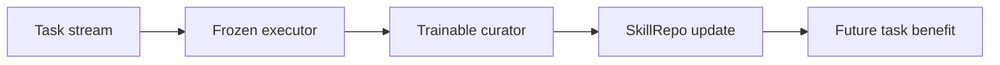

# SkillOS: Learning Skill Curation for Self-Evolving Agents

## 论文信息
- 标签：skill governance；what=SkillRepo；when=continuous；how=curator + skill-relevant dependency；where=skill repository management
- 中文定位：技能仓库管理与策展
- 作者：Siru Ouyang / Jun Yan / Yanfei Chen / Rujun Han / Zifeng Wang / Bhavana Dalvi Mishra / Rui Meng / Chun-Liang Li 等
- 年份：2026
- arXiv：2605.06614
- PDF：https://arxiv.org/pdf/2605.06614
- 代码：未在当前元数据中明确；需要按论文题名继续查官方仓库。

## 一句话总结
SkillOS 的核心价值是：适合长期运行的 Agent 平台：把“维护技能库”从人工运营转为可训练角色，但仍要有审计和回滚。

## 这篇论文解决什么问题
技能库不是越大越好。真正难的是哪些技能该留、该改、该合并、该删除，以及不同任务应该路由到哪些技能。SkillOS 把这个问题建模成可学习的 curation 任务。

如果放到 Agent skill 自进化的大图里，它解决的不是“模型有没有知识”，而是“Agent 如何把执行经验变成之后能稳定复用的外部能力”。这类外部能力可能是 `SKILL.md`、技能库、prompt、程序性记忆、world model、verifier 或 curator。区别只在于它把经验沉淀到哪一层。

## 方法图：先抓住机制闭环

这张图可以按从左到右读：左边是问题或数据来源，中间是论文提出的关键机制，右边是更新后的能力如何被复用或验证。读这篇论文时，最重要的是不要只看最后的分数，而要看中间那一层到底把什么东西变成了什么。

## 核心创新点
1. SkillOS 的核心价值是：适合长期运行的 Agent 平台：把“维护技能库”从人工运营转为可训练角色，但仍要有审计和回滚。
2. 它把方法链条明确拆成 Task stream → Frozen executor → Trainable curator → SkillRepo update → Future task benefit 这样的闭环，中间每一步都在把原始轨迹压缩成更稳定的中间表示，而不是把所有经验原样塞给模型。
3. 它不是只证明“能写出 skill”，而是尽量证明“更新后的 skill / repo / curator / verifier / policy 能在后续任务里稳定被复用”。

这三点合在一起，说明这篇论文关注的不是孤立模块，而是一个能持续积累的外部能力系统。读的时候先盯住这三件事：输入是什么、哪一步发生了真正的压缩或筛选、最后能不能复用到别的任务或别的模型上。

## 方法详解

### 1. 把执行者和策展者解耦
SkillOS 的核心设定是 executor 和 curator 分工。Executor 负责在当前任务中读取 SkillRepo、选择或使用技能并完成任务；curator 不直接执行任务，而是根据任务流、执行结果和技能使用记录维护 SkillRepo。

这个分工解决了长期技能库的一个基本问题：执行 Agent 关注当前任务成功，未必适合判断哪些技能该长期保留；curator 则把技能库本身当成优化对象，负责整理、合并、删除和路由。

### 2. 用任务流构造 skill-relevant dependency
SkillOS 不是随机拿任务训练 curator，而是关注任务之间的 skill-relevant dependency：前面任务产生或更新的 skill，应该能帮助后面相关任务。这样才能判断一次 SkillRepo 更新是否真的有未来收益，而不是只对当前样例有效。

这个设计把技能库维护从静态分类问题变成序列决策问题。Curator 的一次保留、合并或删除决定，会影响后续任务能否检索到合适技能，因此需要在任务流上评估长期效果。

### 3. Curator 学习维护动作
Curator 的动作空间不只是“新增 skill”。它需要决定哪些 skill 保留，哪些 skill 合并成更抽象的 meta-skill，哪些过窄或过期的 skill 删除，哪些任务应该路由到哪些技能。技能库不是越大越好，真正目标是形成高覆盖、低冗余、可检索的 SkillRepo。

这让 SkillOS 区别于普通 memory bank：普通记忆库强调存储和检索，SkillOS 强调对仓库质量的持续治理。

### 4. 复合奖励约束 SkillRepo 的长期质量
论文使用复合奖励，不只看任务成功率，也关注效率、技能调用质量和仓库维护效果。因为一个 curator 如果只追求短期成功，可能会留下大量重复技能；如果只追求压缩，又可能删掉低频但关键的技能。

因此，奖励需要同时表达几类目标：后续任务是否成功，是否更少调用模型或工具，技能选择是否相关，SkillRepo 是否保持紧凑。这个奖励设计决定了 curator 学到的是“仓库治理”而不是“无限追加”。

### 5. 形成可迁移的 meta-skills
训练后的 SkillRepo 不应只是任务碎片合集，而应逐步形成更抽象的 meta-skills。Meta-skill 捕捉的是一类任务共享的处理流程、检查点或工具组合，因此能跨任务和跨 executor backbone 复用。

这也是 SkillOS 的工程价值：它把长期运行 Agent 的技能库维护，从人工运营问题改造成可训练的 curation 问题。

## 机制拆解表：输入、处理、输出

| 环节 | 输入 | 处理 | 输出 |
| --- | --- | --- | --- |
| Task stream | 连续任务、任务间依赖、执行结果、技能调用记录 | 识别哪些任务共享技能需求，构造前后任务的收益检验关系 | skill-relevant 任务序列 |
| Frozen executor | 当前任务、SkillRepo、可调用工具 | 检索和使用技能完成任务，记录成功率、效率和 skill usage | 带技能使用证据的轨迹 |
| Trainable curator | 轨迹、SkillRepo 状态、后续任务反馈 | 学习新增、保留、合并、删除、路由等维护动作 | 候选 SkillRepo 更新 |
| SkillRepo update | curator 动作、版本约束、重复和冲突检测 | 更新技能仓库，使其更抽象、更紧凑、更适合检索 | 新版 SkillRepo 或 meta-skills |
| Future task benefit | 新版 SkillRepo、后续相关任务、复合奖励 | 检验更新是否提高后续任务成功率和效率 | curator 的训练信号和仓库质量评估 |

这张表的重点是：SkillOS 不是研究“如何写一条 skill”，而是研究“如何长期管理一个会增长、会冲突、会过期的 SkillRepo”。

## 实验与证据怎么理解
论文报告在多轮 agentic task 与单轮 reasoning task 上优于无记忆和强记忆 baseline，并能跨 executor backbone 泛化。

更具体地说，读实验时建议抓三条线：第一，是否有和无 skill / 旧 skill / 新 skill 的公平对比；第二，是否证明收益来自 skill 本身，而不是模型或 prompt 其他部分变化；第三，是否展示跨任务、跨模型或 OOD 的迁移能力。只有同时满足这些条件，才能说明它真的是“自进化能力”，而不是一次性的 benchmark 调参。

## 一个具体例子

可以把它想成“技能仓库管理员”：执行 Agent 负责干活，curator 负责决定哪些技能该保留、合并、重写或删除。

假设一个 Agent 连续处理十个相似任务。如果它每次都从零推理，那只是“会做题”；如果它能从前几次任务中提炼出规则、检查点、工具调用顺序或失败规避策略，并在后面任务中稳定复用，那才是这篇论文关心的自进化。

## 和相关方法的差异

| 对象 | 做法 | 关键差异 |
| --- | --- | --- |
| Vector memory | 存得多 | 不负责维护质量 |
| Static skill repo | 技能固定 | 无法适应新任务流 |
| SkillOS | 学习 curator | 让技能仓库自己学会整理和更新 |

这张表的重点是定位：同样都叫 self-evolving，不同论文改的层完全不同。有的改记忆，有的改 prompt，有的改 skill 文档，有的训练 curator 或 policy。把层级分清楚，论文就容易读很多。

## 适合怎么读
- 先看论文把经验沉淀到哪里：记忆、skill、prompt、policy、verifier、world model，还是 SkillRepo。
- 再看它如何防止坏经验进入系统：是否有 verifier、held-out gate、reward、score-based maintenance 或人工审核。
- 最后看它如何证明迁移：跨任务、跨模型、跨用户、跨环境，至少要有一种。

## 局限与风险
任务流分组会影响训练，若 dependency 构造不对，curator 可能学到局部偏好。

从工程角度还要额外警惕两点。第一，skill 越自进化，越容易把错误规则长期固化；第二，skill 越共享，越需要权限、来源、版本和回滚机制。论文实验里有效，不代表上线系统里可以无审核运行。

## 工程启发
适合长期运行的 Agent 平台：把“维护技能库”从人工运营转为可训练角色，但仍要有审计和回滚。

如果把这篇论文转成可落地方案，我会把它拆成四个组件：经验采集器、技能更新器、验证器、发布/回滚器。没有验证器和回滚器的“自进化”，本质上只是自动改文件，风险很高。
