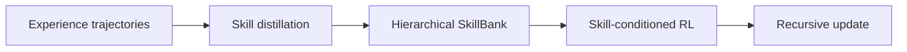

# SkillRL: Evolving Agents via Recursive Skill-Augmented Reinforcement Learning

## 论文信息
- 标签：RL + skill library；what=skill bank；when=recursive inter-test-time；how=skill-conditioned RL + distillation；where=skill library learning
- 中文定位：递归式 Skill-Augmented RL
- 作者：Peng Xia / Jianwen Chen / Hanyang Wang / Jiaqi Liu / Kaide Zeng / Yu Wang / Siwei Han / Yiyang Zhou 等
- 年份：2026
- arXiv：2602.08234
- PDF：https://arxiv.org/pdf/2602.08234
- 代码：https://github.com/aiming-lab/SkillRL

## 一句话总结
SkillRL 的核心价值是：适合训练型 Agent，但需要配套 skill quality score、版本控制和使用日志。

## 这篇论文解决什么问题
把经验存在轨迹里并不会自动变成技能。SkillRL 要解决的是如何从经验里提炼层次化 SkillBank，并让 SkillBank 与策略在 RL 中共同演化。

如果放到 Agent skill 自进化的大图里，它解决的不是“模型有没有知识”，而是“Agent 如何把执行经验变成之后能稳定复用的外部能力”。这类外部能力可能是 `SKILL.md`、技能库、prompt、程序性记忆、world model、verifier 或 curator。区别只在于它把经验沉淀到哪一层。

## 方法图：先抓住机制闭环

这张图可以按从左到右读：左边是问题或数据来源，中间是论文提出的关键机制，右边是更新后的能力如何被复用或验证。读这篇论文时，最重要的是不要只看最后的分数，而要看中间那一层到底把什么东西变成了什么。

## 核心创新点
1. SkillRL 的核心价值是：适合训练型 Agent，但需要配套 skill quality score、版本控制和使用日志。
2. 它把方法链条明确拆成 Experience trajectories → Skill distillation → Hierarchical SkillBank → Skill-conditioned RL → Recursive update 这样的闭环，中间每一步都在把原始轨迹压缩成更稳定的中间表示，而不是把所有经验原样塞给模型。
3. 它不是只证明“能写出 skill”，而是尽量证明“更新后的 skill / repo / curator / verifier / policy 能在后续任务里稳定被复用”。

这三点合在一起，说明这篇论文关注的不是孤立模块，而是一个能持续积累的外部能力系统。读的时候先盯住这三件事：输入是什么、哪一步发生了真正的压缩或筛选、最后能不能复用到别的任务或别的模型上。

## 方法详解

### 1. 从经验轨迹蒸馏技能
SkillRL 的第一步是把 RL 过程中产生的 experience trajectories 转成 skill，而不是把轨迹原样存进记忆库。轨迹中包含任务状态、动作、工具调用、成功或失败结果；蒸馏阶段要从中抽取可复用流程。

论文区分 general skills 和 task-specific skills。前者描述跨任务通用的策略或检查点，后者描述某类任务中特定的操作方式。这个区分避免 SkillBank 只有碎片化经验，也避免所有规则都被过度泛化。

### 2. 组织成层次化 SkillBank
蒸馏出的技能被放入 Hierarchical SkillBank，而不是扁平列表。层次结构让策略可以先找到高层策略，再进入具体任务技能；也方便后续维护重复、冲突和过窄技能。

这一步是 SkillRL 与普通 episodic memory 的关键区别：它保存的是可以被策略调用的技能资产，而不是需要模型重新解释的历史片段。

### 3. RL 策略在执行时条件化使用 SkillBank
在后续任务中，RL policy 会检索并使用 SkillBank。技能作为外部条件影响 action generation，使策略不必每次从零探索。执行过程中需要记录 skill 是否被调用、是否带来更高 reward、是否减少 token footprint 或交互步骤。

这使 SkillBank 成为 RL 状态和策略的一部分，而不是训练外部的静态辅助资料。

### 4. 递归更新策略和 SkillBank
策略使用 SkillBank 后会产生新的轨迹；这些轨迹再被蒸馏成新技能或用于修订旧技能。于是系统形成递归闭环：SkillBank 改变策略行为，策略行为产生新经验，新经验再改变 SkillBank。

这也是 SkillRL 名字里的 recursive 含义。它试图让“策略变强”和“技能库变好”同时发生，而不是先训练策略、再离线整理技能。

### 5. 关键难点是技能资产的 credit assignment
递归闭环带来的问题是归因：成功来自模型本身、技能选择、技能内容，还是任务随机性？如果归因做不好，SkillBank 可能膨胀但无人使用，或者策略只追求短期 reward 而不留下可复用资产。

因此工程实现需要记录 skill quality score、版本、调用日志和收益统计。没有这些证据，就很难判断 SkillBank 是否真的在和策略共同进化。

## 机制拆解表：输入、处理、输出

| 环节 | 输入 | 处理 | 输出 |
| --- | --- | --- | --- |
| Experience trajectories | RL rollout、状态动作序列、工具调用、reward | 从成功和失败轨迹中抽取可复用流程和检查点 | 候选 general / task-specific skills |
| Skill distillation | 候选经验、任务类型、已有 SkillBank | 归纳技能内容、适用条件和层级位置 | 可写入 SkillBank 的技能 |
| Hierarchical SkillBank | 新技能、旧技能、层次结构 | 组织、去重、分层和维护技能资产 | 可检索的层次化技能库 |
| Skill-conditioned RL | 当前任务、策略、SkillBank | 检索并使用技能执行任务，记录 skill usage 和 reward | 技能条件化的 rollout |
| Recursive update | 新 rollout、任务收益、技能使用日志 | 更新策略并继续蒸馏或修订 SkillBank | 策略与技能库的共同演化 |

这张表的重点是：SkillRL 把技能库放进 RL 闭环，使技能既是历史经验的产物，也是后续策略学习的条件。

## 实验与证据怎么理解
论文在 ALFWorld、WebShop 和搜索增强任务中报告较强表现，同时降低 token footprint，说明技能库可以减少重复推理。

更具体地说，读实验时建议抓三条线：第一，是否有和无 skill / 旧 skill / 新 skill 的公平对比；第二，是否证明收益来自 skill 本身，而不是模型或 prompt 其他部分变化；第三，是否展示跨任务、跨模型或 OOD 的迁移能力。只有同时满足这些条件，才能说明它真的是“自进化能力”，而不是一次性的 benchmark 调参。

## 一个具体例子

可以把它想成一个会自我增补的技能银行：策略用技能完成任务，任务产生新经验，新经验再补进 SkillBank。

假设一个 Agent 连续处理十个相似任务。如果它每次都从零推理，那只是“会做题”；如果它能从前几次任务中提炼出规则、检查点、工具调用顺序或失败规避策略，并在后面任务中稳定复用，那才是这篇论文关心的自进化。

## 这篇论文真正新增的训练信号

SkillRL 最值得注意的不是“有 skill”，而是它把 skill 的价值写进了 RL 的目标里。这样一来，策略不再只追求当前任务回报，还会关心自己有没有留下可复用的技能资产。

这件事具体体现在两层：一层是 hierarchical SkillBank 让技能组织不再扁平，另一层是 recursive update 让每轮策略改进都会反过来扩充技能库。对长期训练来说，这比单轮奖励更接近“能力积累”。

## 递归闭环里的 credit assignment

SkillRL 真正想改变的，是 RL 对“技能资产”的归因方式。普通 RL 只问这一步动作有没有带来即时回报，SkillRL 还要问这一步是不是在帮助未来任务形成更好的 SkillBank。

这就引入了递归闭环：经验轨迹先被蒸馏成技能，技能再反过来影响后续策略，后续策略又产生新的轨迹去扩充 SkillBank。这样一来，奖励不再只落在单次任务上，而是延伸到“留下了什么可复用资产”这件事上。

如果这个归因做得不好，系统就会出现两种偏差：要么只会追逐当前任务收益，技能库越来越空；要么技能库膨胀得很快，但每条技能都没有被真实使用过。SkillRL 的重点就是避免这两种极端。

## 和相关方法的差异

| 对象 | 做法 | 关键差异 |
| --- | --- | --- |
| Episodic memory | 保存经历 | 冗余大 |
| Static skill library | 固定技能 | 无法跟策略一起变 |
| SkillRL | 递归 SkillBank + RL | 让技能库和策略共同进化 |

这张表的重点是定位：同样都叫 self-evolving，不同论文改的层完全不同。有的改记忆，有的改 prompt，有的改 skill 文档，有的训练 curator 或 policy。把层级分清楚，论文就容易读很多。

## 适合怎么读
- 先看论文把经验沉淀到哪里：记忆、skill、prompt、policy、verifier、world model，还是 SkillRepo。
- 再看它如何防止坏经验进入系统：是否有 verifier、held-out gate、reward、score-based maintenance 或人工审核。
- 最后看它如何证明迁移：跨任务、跨模型、跨用户、跨环境，至少要有一种。

## 局限与风险
递归更新增加复杂度，如果没有去重和冲突管理，SkillBank 会膨胀。

从工程角度还要额外警惕两点。第一，skill 越自进化，越容易把错误规则长期固化；第二，skill 越共享，越需要权限、来源、版本和回滚机制。论文实验里有效，不代表上线系统里可以无审核运行。

## 工程启发
适合训练型 Agent，但需要配套 skill quality score、版本控制和使用日志。

如果把这篇论文转成可落地方案，我会把它拆成四个组件：经验采集器、技能更新器、验证器、发布/回滚器。没有验证器和回滚器的“自进化”，本质上只是自动改文件，风险很高。
