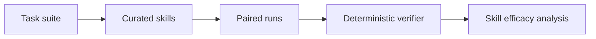

# SkillsBench: Benchmarking How Well Agent Skills Work Across Diverse Tasks

## 论文信息
- 标签：evaluation benchmark；what=skill efficacy benchmark；when=n/a；how=paired evaluation + deterministic verifier；where=skill utility assessment
- 中文定位：评测基准
- 作者：Xiangyi Li / Yimin Liu / Wenbo Chen / Bingran You / Zonglin Di / Yifeng He / Shenghan Zheng / Kyoung Whan Choe 等
- 年份：2026
- arXiv：2602.12670
- PDF：https://arxiv.org/pdf/2602.12670
- 代码：https://github.com/benchflow-ai/skillsbench

## 一句话总结
SkillsBench 的核心价值是：任何 self-evolving skill 系统都应建立自己的 paired evaluation：旧 skill、新 skill、无 skill、错误 skill 都要测。

## 这篇论文解决什么问题
大家都在写 skills，但没有标准证明 skill 到底有没有提升 Agent。更麻烦的是，skill 的效果和模型、执行 harness、任务域都有关，单一成功案例无法说明问题。

如果放到 Agent skill 自进化的大图里，它解决的不是“模型有没有知识”，而是“Agent 如何把执行经验变成之后能稳定复用的外部能力”。这类外部能力可能是 `SKILL.md`、技能库、prompt、程序性记忆、world model、verifier 或 curator。区别只在于它把经验沉淀到哪一层。

## 方法图：先抓住机制闭环

这张图可以按从左到右读：左边是问题或数据来源，中间是论文提出的关键机制，右边是更新后的能力如何被复用或验证。读这篇论文时，最重要的是不要只看最后的分数，而要看中间那一层到底把什么东西变成了什么。

## 核心创新点
1. SkillsBench 的核心价值是：任何 self-evolving skill 系统都应建立自己的 paired evaluation：旧 skill、新 skill、无 skill、错误 skill 都要测。
2. 它把方法链条明确拆成 Task suite → Curated skills → Paired runs → Deterministic verifier → Skill efficacy analysis 这样的闭环，中间每一步都在把原始轨迹压缩成更稳定的中间表示，而不是把所有经验原样塞给模型。
3. 它不是只证明“能写出 skill”，而是尽量证明“更新后的 skill / repo / curator / verifier / policy 能在后续任务里稳定被复用”。

这三点合在一起，说明这篇论文关注的不是孤立模块，而是一个能持续积累的外部能力系统。读的时候先盯住这三件事：输入是什么、哪一步发生了真正的压缩或筛选、最后能不能复用到别的任务或别的模型上。

## 方法详解

### 1. 构建面向 skill efficacy 的任务集
SkillsBench 不是普通模型能力 benchmark，而是专门评估 skill 对 Agent 是否有帮助。论文构建了覆盖 8 个领域的 87 个任务，每个任务配套 curated skill 和确定性 verifier。任务设计的重点不是难度本身，而是要能观察“加入 skill 后是否改变结果”。

这让评测对象从“模型会不会做题”变成“skill 是否能稳定提升同一个模型和 harness 的表现”。

### 2. 用 paired evaluation 做干净归因
核心评测方式是 paired evaluation：同一个任务、同一个模型、同一个 harness，在 no-skill 和 curated-skill 两种条件下分别运行。这样可以尽量控制模型能力、任务难度和执行框架变量，把差异归因到 skill 本身。

这个设计对 self-evolving skill 系统很重要。自动更新一个 skill 后，不能只看新版本任务分数，还要和无 skill、旧 skill、错误 skill 或大 bundle 做成对比较，否则无法判断收益到底来自哪里。

### 3. 使用确定性 verifier 降低评估噪声
每个任务配有 deterministic verifier，用来判断输出是否满足任务要求。确定性验证避免了用 LLM-as-judge 带来的主观波动，也让不同模型和 harness 的结果更可比。

对 skill 评测来说，verifier 的可靠性决定结论边界。如果 verifier 只检查表面格式，skill 可能学会迎合格式；如果 verifier 能覆盖真实任务目标，skill efficacy 的结论才更可信。

### 4. 横跨 model-harness 组合测试泛化
论文覆盖多种 model-harness 组合，目的是看 skill 是否只对某个模型有效，还是能跨执行环境稳定提升。这个维度很关键：一个 skill 如果只对某个 prompt 模板或某个模型有效，更像调参；如果能跨模型和 harness 有收益，才更像可迁移能力。

### 5. 比较 focused skills 和大而全 bundle
SkillsBench 还比较 focused skills 与 larger / exhaustive bundles。结果显示 focused skills 通常更有效，说明 skill 不是越多越好。大而全 bundle 会带来上下文噪声、冲突指令和注意力稀释。

这对自进化系统的启发是：skill 更新要评估粒度和组合方式。新增更多 skill 不一定提升表现，紧凑、相关、可触发的 skill 才更有价值。

## 机制拆解表：输入、处理、输出

| 环节 | 输入 | 处理 | 输出 |
| --- | --- | --- | --- |
| Task suite | 多领域任务、期望输出、任务难度和验证需求 | 设计能暴露 skill 效果的任务实例 | 87 个可评测任务 |
| Curated skills | 任务需求、专家经验、目标 Agent 执行方式 | 为任务配套 focused skill 或 skill bundle | 可注入的标准 skill 条件 |
| Paired runs | 同一模型、同一 harness、no-skill / with-skill 条件 | 成对运行并控制非 skill 变量 | 可归因的结果差异 |
| Deterministic verifier | Agent 输出、任务标准答案或规则 | 稳定判定任务是否通过 | pass/fail 和 pass rate |
| Skill efficacy analysis | 成对结果、模型-harness 维度、skill 粒度 | 分析平均提升、跨环境稳定性和 bundle 影响 | skill 是否真正有效的评估结论 |

这张表的重点是：SkillsBench 提供的是 skill 评测方法，不是 skill 生成算法。它告诉我们如何判断一个 skill 真的有用。

## 实验与证据怎么理解
论文报告 curated skills 将平均 pass rate 从 33.9% 提升到 50.5%，提升 16.6 个百分点；focused skills 通常优于大而全的 bundle，小模型加 skill 甚至能接近大模型无 skill。

更具体地说，读实验时建议抓三条线：第一，是否有和无 skill / 旧 skill / 新 skill 的公平对比；第二，是否证明收益来自 skill 本身，而不是模型或 prompt 其他部分变化；第三，是否展示跨任务、跨模型或 OOD 的迁移能力。只有同时满足这些条件，才能说明它真的是“自进化能力”，而不是一次性的 benchmark 调参。

## 一个具体例子

可以把它想成技能体检表：同一任务有 skill 和没 skill 成对测，才知道 skill 到底有没有用。

假设一个 Agent 连续处理十个相似任务。如果它每次都从零推理，那只是“会做题”；如果它能从前几次任务中提炼出规则、检查点、工具调用顺序或失败规避策略，并在后面任务中稳定复用，那才是这篇论文关心的自进化。

## 和相关方法的差异

| 对象 | 做法 | 关键差异 |
| --- | --- | --- |
| 普通 benchmark | 测模型直接解题能力 | 不区分 skill 是否有用 |
| Ablation study | 通常单论文内部使用 | 覆盖有限 |
| SkillsBench | 成对测 skill efficacy | 直接回答 skill 是否带来收益 |

这张表的重点是定位：同样都叫 self-evolving，不同论文改的层完全不同。有的改记忆，有的改 prompt，有的改 skill 文档，有的训练 curator 或 policy。把层级分清楚，论文就容易读很多。

## 适合怎么读
- 先看论文把经验沉淀到哪里：记忆、skill、prompt、policy、verifier、world model，还是 SkillRepo。
- 再看它如何防止坏经验进入系统：是否有 verifier、held-out gate、reward、score-based maintenance 或人工审核。
- 最后看它如何证明迁移：跨任务、跨模型、跨用户、跨环境，至少要有一种。

## 局限与风险
Benchmark 的任务域和 verifier 决定了结论边界；它能证明 curated skills 有效，但不保证自动生成 skills 一定可靠。

从工程角度还要额外警惕两点。第一，skill 越自进化，越容易把错误规则长期固化；第二，skill 越共享，越需要权限、来源、版本和回滚机制。论文实验里有效，不代表上线系统里可以无审核运行。

## 工程启发
任何 self-evolving skill 系统都应建立自己的 paired evaluation：旧 skill、新 skill、无 skill、错误 skill 都要测。

如果把这篇论文转成可落地方案，我会把它拆成四个组件：经验采集器、技能更新器、验证器、发布/回滚器。没有验证器和回滚器的“自进化”，本质上只是自动改文件，风险很高。
