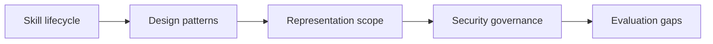

# SoK: Agentic Skills -- Beyond Tool Use in LLM Agents

## 论文信息
- 标签：survey / ontology；what=agentic skill taxonomy；when=lifecycle-based；how=lifecycle + design patterns + governance；where=agentic skill ecosystem
- 中文定位：技能定义与治理
- 作者：Yanna Jiang / Delong Li / Haiyu Deng / Baihe Ma / Xu Wang / Qin Wang / Guangsheng Yu
- 年份：2026
- arXiv：2602.20867
- PDF：https://arxiv.org/pdf/2602.20867
- 代码：未在当前元数据中明确；需要按论文题名继续查官方仓库。

## 一句话总结
SoK: Agentic Skills 的核心价值是：如果你要做 skill 平台，不能只做“写入文件”。必须记录 provenance、权限、适用范围、版本、评估结果和撤销策略。

## 这篇论文解决什么问题
很多论文把 skill 当作工具调用、prompt 文件或策略片段，但真实 Agent 里的 skill 更像一个可调用、可版本化、可治理的程序性能力模块。没有清晰定义，就无法讨论自进化后的安全、复用和责任边界。

如果放到 Agent skill 自进化的大图里，它解决的不是“模型有没有知识”，而是“Agent 如何把执行经验变成之后能稳定复用的外部能力”。这类外部能力可能是 `SKILL.md`、技能库、prompt、程序性记忆、world model、verifier 或 curator。区别只在于它把经验沉淀到哪一层。

## 方法图：先抓住机制闭环

这张图可以按从左到右读：左边是问题或数据来源，中间是论文提出的关键机制，右边是更新后的能力如何被复用或验证。读这篇论文时，最重要的是不要只看最后的分数，而要看中间那一层到底把什么东西变成了什么。

## 核心创新点
1. SoK: Agentic Skills 的核心价值是：如果你要做 skill 平台，不能只做“写入文件”。必须记录 provenance、权限、适用范围、版本、评估结果和撤销策略。
2. 它把方法链条明确拆成 Skill lifecycle → Design patterns → Representation scope → Security governance → Evaluation gaps 这样的闭环，中间每一步都在把原始轨迹压缩成更稳定的中间表示，而不是把所有经验原样塞给模型。
3. 它不是只证明“能写出 skill”，而是尽量证明“更新后的 skill / repo / curator / verifier / policy 能在后续任务里稳定被复用”。

这三点合在一起，说明这篇论文关注的不是孤立模块，而是一个能持续积累的外部能力系统。读的时候先盯住这三件事：输入是什么、哪一步发生了真正的压缩或筛选、最后能不能复用到别的任务或别的模型上。

## 方法详解

### 1. 给 agentic skill 一个更严格的定义
SoK 的第一件事是把 skill 和 tool、prompt、plan 区分开。Tool 是可调用动作接口，prompt 是上下文指令，plan 是当前任务的临时步骤；agentic skill 更像可复用的程序性能力模块，应该包含适用条件、执行策略、终止标准、依赖资源和可调用接口。

这个定义很重要，因为只有 skill 有清晰边界，后续才能讨论获取、组合、更新、安全和责任归属。

### 2. 梳理 skill lifecycle
论文把 skill 生命周期拆成 discovery、practice、distillation、storage、composition、evaluation、update 等阶段。Discovery 发现可复用能力，practice 在任务中练习和验证，distillation 把轨迹压缩成 skill，storage 决定如何保存，composition 处理多个 skill 的组合，evaluation 判断收益，update 负责版本演化。

这让 skill 不再是一次性文件，而是有完整生命周期的资产。自进化系统尤其需要 lifecycle 视角，因为每次自动更新都会影响未来任务。

### 3. 总结 skill 设计模式
SoK 讨论多类设计模式，例如 metadata-driven progressive disclosure、executable code skills、self-evolving libraries、marketplace distribution 等。不同模式解决不同问题：progressive disclosure 控制上下文成本，代码 skill 提供可执行能力，自演化库处理长期更新，marketplace 带来复用和供应链治理。

读这部分时要关注模式背后的权衡：表达能力越强，权限和安全要求越高；复用范围越广，provenance 和版本治理越重要。

### 4. 用 representation × scope 定位 skill
论文用表示形式和作用范围两个维度组织 agentic skills。表示形式可以是自然语言、代码、policy 或 hybrid；作用范围可以是 web、OS、软件工程、机器人、数据分析等环境。这个二维视角能解释为什么同样叫 skill，实际风险和评估方式差别很大。

自然语言 skill 主要风险是歧义和过度触发；代码 skill 主要风险是执行权限和供应链；policy skill 主要风险是不可解释和难回滚；hybrid skill 则需要同时治理多种风险。

### 5. 把安全治理放进 skill 定义
SoK 强调 skill 不是中性资源。它可能包含恶意指令、prompt injection、危险脚本、隐私泄漏或供应链攻击。ClawHavoc 这类案例说明，技能生态如果没有安全治理，会比普通 prompt 更危险。

因此，skill 平台必须记录 provenance、权限、适用范围、版本、评估结果和撤销策略。没有这些元数据，自进化 skill 很难安全共享和自动更新。

## 机制拆解表：输入、处理、输出

| 环节 | 输入 | 处理 | 输出 |
| --- | --- | --- | --- |
| Skill lifecycle | 任务经验、技能来源、执行反馈、版本历史 | 按 discovery 到 update 拆解 skill 的全生命周期 | 技能资产管理框架 |
| Design patterns | 现有 skill 系统和执行模式 | 归纳 progressive disclosure、代码技能、自演化库、marketplace 等模式 | skill 设计模式清单 |
| Representation scope | skill 表示形式、运行环境、依赖工具 | 区分自然语言、代码、policy、hybrid 及其作用域 | 风险和评估边界 |
| Security governance | provenance、权限、脚本、外部调用、共享渠道 | 分析 prompt injection、恶意技能、供应链风险 | 技能治理要求 |
| Evaluation gaps | benchmark、真实部署、长期更新和共享场景 | 指出收益评估、安全评估和生命周期评估不足 | 后续研究问题 |

这张表的重点是：SoK 提供的是 agentic skill 的定义、生命周期和治理框架，而不是某个新的 skill 生成算法。

## 实验与证据怎么理解
论文以 ClawHavoc 恶意技能案例和 SkillsBench 等基准证据说明：skill 不是中性资源，它既能提升任务成功率，也可能成为攻击载体。

更具体地说，读实验时建议抓三条线：第一，是否有和无 skill / 旧 skill / 新 skill 的公平对比；第二，是否证明收益来自 skill 本身，而不是模型或 prompt 其他部分变化；第三，是否展示跨任务、跨模型或 OOD 的迁移能力。只有同时满足这些条件，才能说明它真的是“自进化能力”，而不是一次性的 benchmark 调参。

## 一个具体例子

可以把它想成给技能立法：什么算 skill，生命周期是什么，谁能发布，谁来负责安全。

假设一个 Agent 连续处理十个相似任务。如果它每次都从零推理，那只是“会做题”；如果它能从前几次任务中提炼出规则、检查点、工具调用顺序或失败规避策略，并在后面任务中稳定复用，那才是这篇论文关心的自进化。

## 和相关方法的差异

| 对象 | 做法 | 关键差异 |
| --- | --- | --- |
| Atomic tool | 单次 API 或函数调用 | 缺少长期策略和适用条件 |
| One-off plan | 当前任务计划 | 通常不可复用 |
| Agentic skill | 可调用程序性能力 | 带生命周期、接口、适用条件和治理需求 |

这张表的重点是定位：同样都叫 self-evolving，不同论文改的层完全不同。有的改记忆，有的改 prompt，有的改 skill 文档，有的训练 curator 或 policy。把层级分清楚，论文就容易读很多。

## 适合怎么读
- 先看论文把经验沉淀到哪里：记忆、skill、prompt、policy、verifier、world model，还是 SkillRepo。
- 再看它如何防止坏经验进入系统：是否有 verifier、held-out gate、reward、score-based maintenance 或人工审核。
- 最后看它如何证明迁移：跨任务、跨模型、跨用户、跨环境，至少要有一种。

## 局限与风险
它偏 SoK，不提供单一算法；但正因为如此，它更适合作为判断所有后续 self-evolving skill 工作边界的基础。

从工程角度还要额外警惕两点。第一，skill 越自进化，越容易把错误规则长期固化；第二，skill 越共享，越需要权限、来源、版本和回滚机制。论文实验里有效，不代表上线系统里可以无审核运行。

## 工程启发
如果你要做 skill 平台，不能只做“写入文件”。必须记录 provenance、权限、适用范围、版本、评估结果和撤销策略。

如果把这篇论文转成可落地方案，我会把它拆成四个组件：经验采集器、技能更新器、验证器、发布/回滚器。没有验证器和回滚器的“自进化”，本质上只是自动改文件，风险很高。
