# A Survey of Self-Evolving Agents: What, When, How, and Where to Evolve on the Path to Artificial Super Intelligence

## 论文信息
- 标签：meta survey；what=taxonomy/framework；when=n/a；how=what/when/how/where；where=self-evolving agents field map
- 中文定位：自进化 Agent 路线图型综述 / 分类框架 / 评估与开放问题
- 作者：Huan-ang Gao / Jiayi Geng / Wenyue Hua / Mengkang Hu / Xinzhe Juan / Hongzhang Liu / Shilong Liu / Jiahao Qiu 等
- 年份：2025；arXiv v4 标注为 77 页、9 张图，Transactions on Machine Learning Research 01/2026
- arXiv：2507.21046
- PDF：https://arxiv.org/pdf/2507.21046
- HTML：https://arxiv.org/html/2507.21046v4

## 一句话总结
这篇综述的核心价值不是提出一个新的自进化算法，而是给整个 self-evolving agents 领域建立坐标系：一个 Agent 到底演化什么、什么时候演化、靠什么信号和机制演化、在哪些应用场景中演化，以及这些演化应该如何评估和治理。

## 这篇论文解决什么问题
LLM Agent 的能力正在从“静态模型 + 临场推理”走向“能从交互中持续改变自身”。但 self-evolving agent 这个词覆盖面太宽：Reflexion 改的是反思记忆，Voyager 改的是技能库，SkillOpt 改的是 skill 文档，Agents of Change 改的是策略代码，Harness Updating 改的是执行框架，某些 RL 路线则会直接改模型参数。如果没有统一框架，这些工作很容易被混成同一种“会自我改进”。

这篇综述的作用就是把领域拆开。它提出一个操作性定义：self-evolving agent 是能够基于自身轨迹或反馈信号，修改内部参数、上下文状态、工具集或架构拓扑，并以提升未来表现为目标的 Agent。这个定义有两个关键点：第一，变化必须来自经验或反馈，而不是人工离线改配置；第二，变化必须对未来行为产生持久影响，而不是一次性上下文里的临场调整。

因此，它更像一篇路线图论文。读它不是为了找某个 benchmark 的最高分，而是为了建立判断标准：一篇新论文声称 self-evolving 时，它到底改了哪个层，改动在什么时候发生，反馈信号是什么，改动是否可累积，是否真的提升了未来任务表现。

## 总体框架：what、when、how、where

```mermaid
flowchart TB
    A[Self-Evolving Agent] --> B[What to evolve]
    A --> C[When to evolve]
    A --> D[How to evolve]
    A --> E[Where to evolve]
    A --> F[How to evaluate]

    B --> B1[Model parameters]
    B --> B2[Memory and context]
    B --> B3[Tools and workflows]
    B --> B4[Skills and external artifacts]
    B --> B5[Architecture and topology]

    C --> C1[Intra-test-time]
    C --> C2[Inter-test-time]

    D --> D1[Textual feedback]
    D --> D2[Scalar rewards]
    D --> D3[Imitation and demonstration]
    D --> D4[Population and multi-agent evolution]

    E --> E1[Coding and software engineering]
    E --> E2[Web GUI and tool use]
    E --> E3[Education healthcare finance]
    E --> E4[Science and virtual assistance]

    F --> F1[Adaptivity]
    F --> F2[Generalization]
    F --> F3[Efficiency]
    F --> F4[Safety]
```

这张图就是读这篇综述的主线。它把 self-evolution 拆成四个问题：what 是演化对象，when 是演化时机，how 是演化机制，where 是应用场景。论文还单独讨论 evaluation，因为自进化 Agent 的评估不能只看静态任务分数，还要看长期适应、泛化、效率和安全。

## 1. What to Evolve：到底演化什么
What to evolve 是这篇综述最重要的轴。一个 Agent 系统通常包含模型、记忆、工具、工作流、外部环境接口和多 Agent 结构；self-evolving 的关键不是它有没有这些组件，而是哪些组件会基于经验被改写。

第一类是模型参数演化。这里最接近传统机器学习，包括 SFT、RL、continual learning、model editing 等。优点是能力可以内化到模型中，运行时不一定需要额外上下文；缺点是成本高、可解释性弱、上线风险大，还容易遇到遗忘、数据污染和安全对齐问题。

第二类是记忆和上下文演化。典型形式包括 episodic memory、semantic memory、reflection memory、用户偏好、历史任务摘要等。它们通常不改模型权重，而是把交互经验写入外部状态，未来通过检索或注入影响行为。Reflexion、Generative Agents 这类工作可以放在这里。它们的优势是轻量、可读、易回滚；短板是记忆质量、检索准确性和上下文污染。

第三类是工具、workflow 和 harness 演化。Agent 不只会调用已有工具，还可能学会创建工具、修改工具调用顺序、更新执行脚手架、调整 planner-executor-verifier 流程。Autonomous software engineering、web automation 和 harness updating 类工作经常落在这一层。它们的演化对象不是“知识”，而是 Agent 做事的外部执行结构。

第四类是 skill 和外部 artifact 演化。Skill-Pro、SkillOpt、Trace2Skill、Voyager、SkillOS 等工作都可以放到这一类，但内部仍有差别：有的保存程序性 option，有的保存自然语言 skill 文档，有的保存代码函数，有的保存 skill directory，有的训练 curator 或调用策略。这个方向对工程实践特别重要，因为它兼顾可读性、可版本化和跨模型复用。

第五类是架构和拓扑演化。这里包括多 Agent 结构、角色分工、通信方式、planner / critic / verifier 的组合方式变化。它比单个 memory 或 skill 更高一层：系统不只是学到一条规则，而是调整“谁来做、谁来审、谁来记、谁来改”的组织结构。

## 2. When to Evolve：什么时候演化
When to evolve 解决的是演化发生在任务执行的哪个时间尺度上。综述把它大体分为 intra-test-time 和 inter-test-time 两类。

Intra-test-time self-evolution 发生在一次任务或一次测试过程中。Agent 可以在当前任务内反思、修正计划、重试工具调用、更新临时上下文或调整当前策略。这类方法的优点是反馈快，适合即时纠错；缺点是改动通常不持久，容易只解决当前样例，不能形成长期能力。

Inter-test-time self-evolution 发生在任务之间。Agent 会把完成任务后的轨迹、奖励、反馈或失败经验沉淀下来，用于改进后续任务。它可以是 offline 的，例如先收集一批轨迹再训练或更新 skill；也可以是 online 的，例如部署后持续读取新交互并更新记忆、工具或策略。SkillOpt 的离线 skill 文档优化、Trace2Skill 的轨迹池蒸馏、Skill-Pro 的 batch 后 Skill Pool 维护，都属于这个尺度。

这个区分很关键。很多论文都说自己会 self-improve，但如果只是当前任务内多反思几轮，它更接近 test-time adaptation；如果改动能跨任务保留并影响未来行为，才更接近 self-evolving agent。读论文时必须问清楚：更新是否持久，是否跨任务复用，是否会被版本化或长期维护。

## 3. How to Evolve：靠什么机制演化
How to evolve 讨论的是反馈信号和优化机制。综述把方法族放在同一张地图里，核心不是某个算法名，而是“经验如何变成可接受的更新”。

第一类是 textual feedback。反馈可以来自模型自我反思、critic、用户评论、错误分析报告或多 Agent 讨论。它的优点是表达丰富，能描述失败原因和修正建议；缺点是主观、难校准，容易把看似合理的语言建议写成错误规则。Reflexion、Expel、很多 skill evolution prompt 都属于这一类。

第二类是 scalar reward 或 external reward。反馈可以是任务成功率、测试分数、环境 reward、win rate、人工评分、verifier 通过率等。它比纯文本反馈更容易比较新旧版本，但往往不直接告诉系统“为什么错”。Skill-Pro 的 online score、Agents of Change 的 simulation win rate、SkillOpt 的 scored rollouts 和 held-out gate，都体现了标量反馈的重要性。

第三类是 imitation and demonstration。系统从专家轨迹、成功样例、人类示范或高性能模型行为中学习。它适合冷启动和技能迁移，但风险是示范数据覆盖不足、质量不稳定，或者把专家策略里的隐含假设误当成通用规则。

第四类是 population-based 或 multi-agent evolution。多个 agent、多个候选策略、多个技能版本互相比较、竞争、合并或协作。它适合探索多样性和降低单一路径偏差，但会带来成本、评估一致性和冲突治理问题。Trace2Skill 的 parallel analysts 和 hierarchical merge 就可以被理解为一种 patch 级的多候选合并路线。

除此之外，还要看 online/offline、on-policy/off-policy、reward granularity 这些横向维度。在线更新更贴近真实部署，但风险更高；离线更新更可控，但可能滞后。轨迹级 reward 容易获取但归因粗，步骤级 reward 更有指导性但成本高。自进化系统是否稳定，很大程度取决于这些反馈和更新机制是否匹配。

## 4. Where to Evolve：在哪些场景中演化
Where to evolve 把自进化 Agent 放进应用域。综述提到的典型方向包括 coding、GUI/web automation、education、healthcare、finance、scientific discovery、virtual assistants 等。

Coding 是最自然的场景之一，因为代码任务有明确环境、可执行反馈、测试、lint、编译器和版本控制。Agent 可以从失败构建、测试错误、CR 反馈中演化工具调用方式、修复策略、代码模板和验证流程。

GUI 和 web automation 也很适合自进化，因为 Agent 会遇到反复出现的页面模式、按钮布局、表单错误、登录状态和工具失败。这里的演化对象往往是操作记忆、页面技能、任务 workflow 或恢复策略。

教育、医疗、金融等领域更强调个性化、风险控制和审计。Agent 需要从用户反馈中适应个人需求，但不能随意固化错误偏好或违反领域规则。因此这些场景更需要安全 gate、人工审核、权限隔离和回滚机制。

科学发现和研究辅助场景的特点是长周期、开放式、目标不完全明确。自进化 Agent 可能需要维护假设、实验日志、失败路径、工具链和知识图谱。这里的挑战不是单次任务成功，而是长期研究状态是否越来越有组织。

## Evaluation：自进化 Agent 应该怎么评估
这篇综述强调，self-evolving agents 的评估不能只套静态 benchmark。静态任务分数只能说明当前能力，不能说明 Agent 是否能从经验中持续改进。

第一类指标是 adaptivity：Agent 遇到新任务、新用户、新环境或新约束后，是否能根据反馈改变未来行为。这里要看学习曲线、适应速度、需要多少交互样本，以及是否能避免重复犯同类错误。

第二类指标是 generalization：更新后的能力是否只对训练轨迹有效，还是能迁移到新任务、新分布、新模型或新环境。SkillOpt 的 held-out gate、Trace2Skill 的 OOD transfer、Skill-Pro 的 cross-agent reuse，都是在回答这个问题。

第三类指标是 efficiency：演化带来的收益是否抵消了额外成本。成本包括训练成本、存储成本、token 成本、检索成本、验证成本和延迟。长期 Agent 最怕记忆或 skill 无限增长，最后上下文越来越重、决策越来越不稳。

第四类指标是 safety：更新是否会引入坏规则、权限绕过、隐私泄漏、奖励黑客、工具误用或不可控行为。自进化越强，越需要 provenance、审计、版本、回滚、隔离验证和人工门禁。

评估范式上，可以分为 static evaluation、short-horizon adaptation 和 long-horizon evaluation。真正能证明 self-evolution 的，通常是长周期曲线：同一个系统随着经验积累，是否在未来任务上持续变好，并且没有明显负迁移。

## 这篇综述和当前这些论文怎么对应
这篇综述最适合用来给其他论文定位。

| 论文 | What to evolve | When to evolve | How to evolve | 主要定位 |
| --- | --- | --- | --- | --- |
| Reflexion | 反思记忆 | trial 之间 | textual feedback | 把失败总结写进后续提示 |
| Voyager | 代码技能库 | 跨任务长期 | 环境反馈 + skill validation | 把探索经验沉淀成可执行技能 |
| Skill-Pro | 程序性 Skill Pool | batch 后持续维护 | semantic gradient + PPO Gate + online score | 让 skill pool 向紧凑高收益集合收敛 |
| SkillOpt | skill 文档版本 | 离线多轮更新 | scored rollout + textual learning-rate + held-out gate | 把 skill 文档当可训练文本状态 |
| Trace2Skill | skill directory | 轨迹池离线蒸馏 | parallel analysts + hierarchical merge + validation | 把局部轨迹教训合并成可迁移技能目录 |
| Agents of Change | policy code artifact | 模拟迭代之间 | simulation games + code refinement | 把长程策略固化成可测试策略代码 |
| Harness Updating | execution harness | 部署或任务之间 | 失败反馈 + harness refinement | 改 Agent 做事的外部脚手架 |

这样看，survey 本身不解决某个具体 skill 怎么写，而是让你知道每篇论文到底在自进化链条的哪一层做贡献。它把“自进化”从口号拆成了可比较维度。

## 对“收敛”的参考价值
作为综述，这篇论文不提供单一收敛算法，但它给了判断收敛的框架。一个自进化系统是否在收敛，不能只看任务分数上涨，还要看演化对象是否明确、更新时机是否稳定、反馈信号是否可靠、验证是否覆盖未来任务、成本和风险是否受控。

如果演化对象是 memory，收敛意味着记忆库不再无限堆积，而是形成高价值、低冲突、可检索的经验结构。如果演化对象是 skill，收敛意味着技能库向高复用、高收益、低冗余的集合靠拢。如果演化对象是 policy code，收敛意味着策略在保留模拟分布上的收益进入平台期，失败模式减少，代码更新从大改转为局部微调。如果演化对象是模型参数，收敛还要额外看遗忘、分布外泛化和安全对齐。

这也是它对后续论文最实用的启发：不要问“这个系统有没有自进化”，而要问“哪个对象在朝什么指标收敛”。没有这个问题，memory 增长、prompt 变长、skill 增多、工具变复杂，都可能被误读成进步；但真正的自进化应该表现为未来任务更好、成本更低、错误更少、行为更稳。

## 局限与风险
第一，综述的框架覆盖面广，但不可避免会牺牲细节。它能告诉你 SkillOpt 和 Skill-Pro 都属于 skill / artifact 层演化，但不能替代阅读它们的具体 gate、score、验证和维护机制。

第二，领域发展太快。arXiv v4 已经扩展到 77 页、9 张图，但 2026 年围绕 skill optimization、harness evolution、multi-agent co-evolution 的工作仍在快速出现。使用这篇综述时，要把它当作基础地图，而不是最终目录。

第三，安全和治理仍然是开放问题。自进化 Agent 的风险不是普通模型推理错误，而是错误会被写回系统，影响未来更多任务。任何可持久更新的组件都需要来源记录、权限边界、验证集、回滚机制、人工审核和监控。

第四，评估体系还不成熟。很多 benchmark 仍偏静态任务，难以衡量长期适应、跨会话记忆、负迁移、成本增长和多 Agent 共演化。未来 self-evolving agents 的评估很可能要和 Agent 本身共同演化，否则 benchmark 会很快被过拟合或失去区分度。

## 适合怎么读
读这篇综述时，建议不要按引用列表逐篇记，而是按四个问题读：

1. What：这篇方法到底改的是模型、记忆、工具、skill、workflow、harness，还是 agent topology？
2. When：更新发生在一次任务内、任务之间、离线训练期、还是部署后长期运行？
3. How：更新靠文本反思、标量 reward、示范数据、多 Agent 竞争、verifier，还是人工反馈？
4. Where：它在哪个场景里成立，反馈是否足够可靠，风险是否可控？

用这个框架读后续论文，会更容易判断一篇工作的真实贡献：它是把演化对象推进了一层，还是改进了反馈信号，还是增强了验证门，还是只是在已有框架里换了一个任务。

## 工程启发
如果要把这篇综述落到一个真实 Agent 平台，最重要的是先建立演化资产目录：哪些文件、记忆、工具、skill、prompt、policy、workflow 可以被自动更新，哪些必须人工审批，哪些完全禁止自动改。然后为每类资产定义反馈信号、验证方式、发布门禁和回滚机制。

一个可控的自进化平台至少要有五个组件：经验采集器、候选更新器、验证器、版本管理器、监控与回滚器。没有验证器和回滚器的自进化，本质上只是自动写入；没有评估指标的自进化，本质上只是资产膨胀；没有明确 what/when/how/where 的自进化，很难判断它到底是否真的在进步。

## 最后结论
这篇综述的价值在于把 self-evolving agents 从一个宽泛概念拆成了可分析的设计空间。它告诉我们：自进化不是“Agent 会反思”这么简单，而是系统中某些组件能够基于经验被持久改写，并在未来任务中带来可验证收益。

对当前 Agent skill 自进化方向来说，它最值得带走的一句话是：先定义演化对象，再定义反馈和门禁，最后再谈优化。否则，所谓自进化很容易退化成更长的 prompt、更大的 memory bank 或更混乱的工具库。