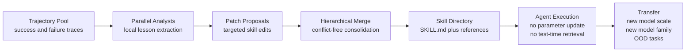
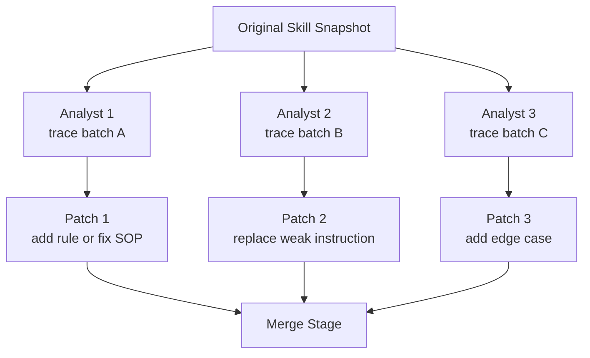
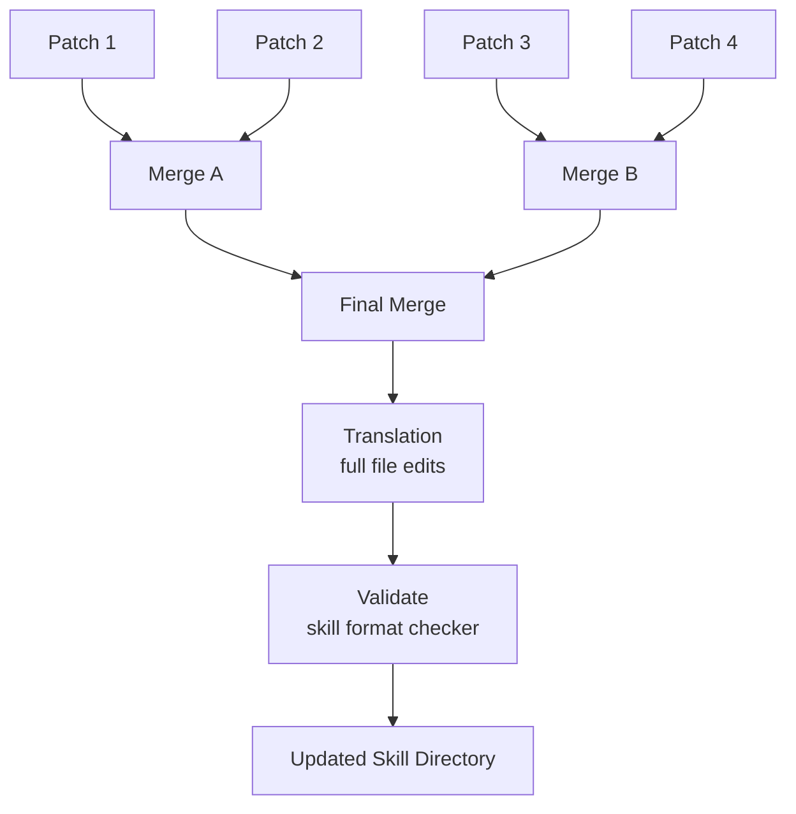
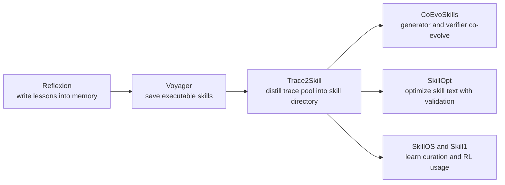

# Trace2Skill: Distill Trajectory-Local Lessons into Transferable Agent Skills

## 论文信息
- 标签：trace distillation；what=skill directory；when=offline merge；how=hierarchical merge + validation；where=trajectory-to-skill pipeline
- 标签：trace distillation；what=skill directory；when=offline merge；how=hierarchical merge + validation；where=trajectory-to-skill pipeline
- 作者：Jingwei Ni / Yihao Liu / Xinpeng Liu / Yutao Sun / Mengyu Zhou / Pengyu Cheng / Dexin Wang / Erchao Zhao / Xiaoxi Jiang / Guanjun Jiang
- 机构：Qwen Large Model Application Team, Alibaba
- 年份：2026
- arXiv：2603.25158
- PDF：https://arxiv.org/pdf/2603.25158
- 官方代码：https://github.com/Qwen-Applications/Trace2Skill
- 代码状态：官方仓库已公开；本地克隆 GitHub 时网络失败，下面的代码结构来自公开 README 和仓库页面。

## 一句话总结
Trace2Skill 解决的是：**如何把大量 Agent 执行轨迹里的局部经验，蒸馏成一个可迁移、可复用、不依赖测试时检索的 skill directory。** 它的核心不是“记住轨迹”，而是像人类专家写操作手册一样，先看大量成功/失败案例，再归纳成稳定的 SOP。

## 先看整体图



这张图就是 Trace2Skill 的主线：输入不是单条失败记录，而是一池子执行轨迹；中间不是顺序编辑 skill，而是并行地产生补丁；最后不是把所有经验塞进检索库，而是合并成一个可以直接放进 Agent harness 的 skill directory。

## 核心创新点
1. Trace2Skill 的核心价值是：它不是把轨迹直接存成检索记忆，而是把成功和失败轨迹一起压成可落盘、可迁移、可验证的 skill directory。
2. 它把方法链条明确拆成 Trajectory pool → Parallel analysts → Patch proposals → Hierarchical merge → Skill directory 这样的闭环，关键压缩点发生在并行 patch 生成和层次合并，而不是顺序改写。
3. 它不是只证明“能从轨迹里找出经验”，而是尽量证明“这些经验能以 skill asset 的形式跨模型、跨规模、跨 OOD 复用”。

## 机制拆解表：输入、处理、输出

| 环节 | 输入 | 处理 | 输出 |
| --- | --- | --- | --- |
| Trajectory pool | 成功/失败轨迹、任务、反馈、日志 | 过滤、分组、标注与证据整理 | 供 analyst 读取的轨迹集合 |
| Parallel analysts | 轨迹集合、原始 skill snapshot | 并行诊断、抽取局部教训、提出 patch | 多个候选技能补丁 |
| Patch proposals | 候选补丁、错误与成功模式 | 去重、重写、补边界条件 | 可合并的 patch 集合 |
| Hierarchical merge | patch 集合 | 冲突消解、层次合并、格式验证 | 最终 merged skill |
| Skill directory | merged skill、references | 落盘、发布、加载、跨模型复用 | 可执行的 `SKILL.md + references/` |

## 它到底解决了什么问题

LLM Agent 已经开始依赖 domain-specific skills，但这些 skill 有三个现实瓶颈。

第一，**人工写 skill 不可扩展**。一个专家可以写 Excel 操作规范、Office 工作流 SOP、数学推理注意事项，但真实 Agent 会遇到大量长尾错误。每个错误都靠人补文档，速度跟不上。

第二，**纯 LLM 生成 skill 容易漏掉操作坑位**。模型知道“应该排序”“应该检查列名”，但真实轨迹里的错误往往很细，比如表格区域判断错、公式引用错、输出文件格式错、评估单元格范围错。这些坑不是参数知识，而是执行经验。

第三，**把每条轨迹当记忆检索也不够好**。ReasoningBank 或 episodic memory 类方法会在测试时检索相似轨迹，但这会带来两个问题：一是推理时额外检索成本，二是轨迹太局部，容易把某个例子的 workaround 误用到新任务。

Trace2Skill 的目标是把轨迹里的“局部教训”提升成“可迁移技能”。它不是保存每次事故报告，而是把事故报告写成操作手册。

## 方法详解：从轨迹到技能目录

### 1. 输入：执行轨迹池，而不是单条经验

Trace2Skill 首先收集 Agent 在任务上的执行日志。论文和官方代码主要以 SpreadsheetBench 场景为重点，轨迹里包含任务输入、Agent 思考、工具调用、文件操作、输出结果、评估反馈，以及成功或失败原因。

官方代码里这一层对应：

| 代码位置 | 作用 | 对应论文环节 |
|---|---|---|
| `run_spreadsheetbench.py` | 运行 spreadsheet agent 产生任务轨迹 | trajectory generation |
| `spreadsheet_agent/` | 表格任务 Agent、工具、运行时技能 | agent execution harness |
| `analysis/run_error_analysis.py` | 对失败轨迹做 agentic error analysis | failed trace diagnosis |
| `analysis/run_success_analysis_llm.py` | 对成功轨迹做 success pattern analysis | successful trace mining |

这里有一个关键点：Trace2Skill 同时看失败和成功。失败告诉你哪里会踩坑，成功告诉你什么流程有效。只看失败容易写成“不要做什么”的黑名单；只看成功又容易漏掉边界条件。两者一起看，才更像专家复盘。

### 2. 轨迹分析：把原始日志变成 trajectory-local lessons

原始轨迹不能直接写进 skill。原因很简单：轨迹太长、太具体、噪声太多。Trace2Skill 先让 analyst 子 Agent 分析轨迹，提取局部经验。

失败轨迹分析大致回答这些问题：

- Agent 在哪一步开始偏离正确路径？
- 错误来自任务理解、工具调用、文件操作，还是输出格式？
- 这个错误是偶发，还是一类任务里的常见坑？
- 如果写进 skill，应该写成什么可执行规则？

成功轨迹分析则回答：

- 哪些操作顺序稳定有效？
- 哪些检查动作避免了后续错误？
- 哪些中间结果值得保留成 SOP？
- 这个成功经验能不能抽象到别的任务？

官方代码里的 `analysis/error_analysis_agent.py` 使用 ReAct agent，配有 bash tool 和 evaluation tool。它会检查 agent log、工作目录、输出文件和 ground truth，并生成错误分析报告。这不是普通摘要，而是带工具检查的诊断。

```text
analysis/error_analysis_agent.py
- 输入：agent execution log、工作目录、ground truth、answer position
- 工具：bash tool、evaluate_output tool
- 输出：错误诊断文本，供后续 skill evolution 使用
```

### 3. MAP 阶段：并行 analyst 提出 patch

Trace2Skill 最关键的设计是并行 MAP。它不会按时间顺序一条一条改 skill，而是让多个 analyst 在同一个 frozen skill snapshot 上独立提出 patch。



为什么要并行？因为顺序编辑有一个严重问题：第 1 条轨迹改过 skill 后，第 2 条轨迹看到的是已经被污染或偏移的 skill；越往后，skill 越容易被最近几条轨迹牵着走。这叫 order-dependent sequential editing。

并行 MAP 的好处是：每个 analyst 都面对同一个原始 skill，因此每个 patch 都是“这批轨迹认为原 skill 应该怎么改”。这些 patch 之间可以比较、合并、去冲突，而不是被顺序覆盖。

官方代码里这一层对应：

| 代码位置 | 作用 |
|---|---|
| `skill_evolver/run_parallel_skill_evolution.py` | 命令行入口，读取 records/patterns，启动并行演化 |
| `skill_evolver/parallel_evolving_agent.py` | 核心 MAP-REDUCE pipeline |
| `skill_evolver/run_parallel_combined_skill_evolution.py` | 组合错误/成功分析结果进行并行技能演化 |

从仓库公开代码说明看，`ParallelSkillEvolver` 的注释非常直接：

```text
1. MAP: Each batch of error records independently proposes a concise patch.
2. REDUCE: Patches are merged hierarchically until one final patch remains.
3. APPLY: The final merged patch is converted to full file content, applied and validated.
```

这和论文方法完全对应。

### 4. REDUCE 阶段：层次合并，消除冲突

MAP 会产生很多 patch，但这些 patch 可能互相冲突。例如，一个 patch 说“先读所有 sheet 再判断目标区域”，另一个 patch 说“优先从任务描述定位 sheet，避免遍历太慢”。这两条不一定谁对谁错，需要合并成更精确的条件化规则。

Trace2Skill 用层次化 merge 来做这件事：先小批量合并 patch，再把合并结果继续向上合并，直到得到一个 final merged patch。



这里的关键不是简单拼接，而是 conflict-free consolidation。最终输出要变成可落盘的 `SKILL.md` 和 references，不是碎片化建议列表。官方代码里也有 `changelog`、`patch-file`、`quick_validate`、`max_skill_lines` 等约束，说明它不是无边界地往文档里堆内容。

### 5. 输出：skill directory，而不是检索记忆库

Trace2Skill 的最终产物是 skill directory，典型形式是 `SKILL.md + references/`。这点很重要。

- 如果输出是 memory bank，推理时还要检索。
- 如果输出是模型微调权重，迁移和审计都困难。
- 如果输出是 skill directory，它可以直接被不同模型、不同 harness 加载。

这也是论文强调 portability 的原因。一个由 Qwen3.5-35B 轨迹演化出的 skill，可以迁移给 Qwen3.5-122B 使用；也可以跨模型家族、跨 OOD 任务继续有用。

## 和旧方法的核心差异

| 方法 | 怎么使用经验 | 主要问题 | Trace2Skill 的改法 |
|---|---|---|---|
| 人工写 skill | 专家手写 SOP | 成本高，覆盖慢 | 用轨迹池自动补强和创建 skill |
| One-shot LLM skill | 让模型凭知识生成 skill | 容易漏真实操作坑 | 从真实成功/失败轨迹归纳 |
| Sequential editing | 一条轨迹改一次 skill | 顺序敏感，容易过拟合最近样本 | 并行 patch，再层次合并 |
| ReasoningBank / retrieval memory | 测试时检索相似轨迹 | 推理成本高，迁移性弱 | 离线合并成单个 skill directory |
| 参数微调 | 把经验压进模型权重 | 成本高，不透明，不易迁移 | 不改参数，只改外部 skill |

这张表可以帮助理解论文的真正定位：Trace2Skill 不是一个新的 agent planner，而是一个 **experience-to-skill compiler**。

## 实验怎么证明它有效

论文的实验覆盖 office workflow、math reasoning、vision QA 等不同场景，但最核心的证据可以概括成三类。

### 1. 性能提升

论文摘要中给出的代表结果是：由 Qwen3.5-35B 轨迹演化出的 skills，可以让 Qwen3.5-122B agent 在 WikiTableQuestions 上提升最多 **57.65 个百分点**。

这说明两个事实：

- skill 不是只记住生成它的模型的行为；
- 小模型轨迹里也可能包含对大模型有用的操作经验。

### 2. 跨模型迁移

Trace2Skill 强调 skills transfer across model scales and families。也就是说，它不是为某一个执行模型过拟合出来的 prompt，而是更像任务域里的操作规程。

如果一个 skill 只能给原模型用，它更像调参；如果能迁移给不同大小、不同家族模型，它才更像知识资产。

### 3. OOD 泛化

论文还强调 evolved skills 能迁移到 out-of-distribution settings。这里的意义是：skill 没有把训练轨迹里的具体答案硬编码进去，而是归纳出了任务族共享的步骤、检查点和故障处理方式。

| 证据类型 | 说明 | 为什么重要 |
|---|---|---|
| 跨规模迁移 | 小模型轨迹生成的 skill 能帮助大模型 | 说明 skill 不是模型私有补丁 |
| 跨家族迁移 | skill 在不同模型家族间仍有效 | 说明 skill 更像任务知识 |
| OOD 迁移 | 新分布任务仍有收益 | 说明不是记忆训练样本 |
| 对比 sequential editing | 并行合并优于顺序改写 | 证明 MAP-REDUCE 设计有价值 |
| 对比 retrieval memory | 单个 consolidated skill 优于测试时检索 | 证明离线归纳优于堆记忆 |

## 为什么“合并”比“检索”更关键

很多人会直觉地问：既然有大量轨迹，为什么不直接 RAG？

Trace2Skill 的回答是：轨迹是经验材料，不是最终知识。RAG 只是把材料搬到模型面前，模型每次还要重新判断哪些有用；skill consolidation 则提前把材料加工成规则、步骤和例外条件。

类比一下：

- Retrieval memory 像把所有事故报告放进档案柜，遇到问题再翻。
- Trace2Skill 像读完事故报告后，更新公司的操作手册。

前者信息更全，但执行时负担重；后者信息更少，但更稳定、更便宜、更容易迁移。

## 对“收敛”的实质参考价值
Trace2Skill 和 Skill-Pro、SkillOpt 相比，对“优化收敛”的直接参考价值弱一些，因为它不是反复在线更新同一个 skill pool，也不是把 skill 文档当文本参数做多轮验证优化。它更像 experience-to-skill compiler：把一批轨迹局部教训编译成一个 skill directory。因此它是边缘相关，但对“多来源 patch 如何收敛成最终技能资产”非常有参考价值。

第一，它解决的是顺序编辑不收敛的问题。若按轨迹顺序一条条改 skill，后面的编辑会基于已经被前面轨迹污染的版本，最终结果高度依赖输入顺序。Trace2Skill 的 MAP 阶段让多个 analyst 面向同一个 frozen skill snapshot 独立提出 patch，相当于把不同轨迹对原 skill 的修改意见并行采样出来。这样后续合并面对的是一组可比较的候选变化，而不是一串互相覆盖的文档版本。

第二，hierarchical merge 是一种结构化压缩。大量 patch 不能直接拼接，否则 skill directory 会膨胀成事故清单；也不能简单投票，否则少数关键边界条件会丢失。层次合并通过小批量合并、冲突消解、继续上卷，逐步把局部教训压缩成条件化规则、操作顺序和边界检查。它的收敛目标不是保留最多信息，而是保留能迁移的最小充分规则集。

第三，validation 把“合并得像文档”推进到“合并后可加载、可执行、可评估”。Trace2Skill 的输出是 `SKILL.md + references/`，需要通过格式、长度、目录结构和执行 harness 的约束。这个 gate 看起来比 Skill-Pro 的 PPO Gate 弱，但工程意义很强：最终产物必须是一个可落盘、可发布、可被 Agent 加载的 skill directory，而不是 analyst 的建议集合。

第四，它提供了另一种收敛视角：从轨迹空间到资产空间的收敛。原始轨迹数量可能很大，且包含成功路径、失败路径、文件状态、工具调用和评估反馈；Trace2Skill 不在测试时检索这些轨迹，而是在离线阶段把它们合并成一个较小的技能目录。这样推理时不需要再为每个任务决定检索哪条轨迹，Agent 直接消费已经整理好的 SOP。这个过程把运行时不确定性前移到离线归纳阶段。

第五，它提醒自进化系统要区分“局部教训”和“全局规则”。轨迹里的经验往往只在某个文件格式、任务类型或工具限制下成立；合并阶段必须把适用条件写清楚，否则 patch 会变成过度泛化规则。对后续设计 skill evolution pipeline 来说，Trace2Skill 的价值就是给出一个并行分析、层次合并、格式验证、最终发布的治理模板。

因此，Trace2Skill 不应被当作 PPO 类优化算法来读，而应被当作“patch 集合向 skill directory 收敛”的工程方法来读。它最适合补足 SkillOpt / Skill-Pro 没有细讲的部分：当更新信号来自大量异构轨迹和多个 analyst 时，如何避免顺序污染、如何处理冲突、如何把碎片经验合并成可迁移技能目录。

## 代码对应关系

虽然本地克隆官方仓库失败，但公开仓库页面和 README 已经能看到核心结构：

| 论文概念 | 官方代码位置 | 说明 |
|---|---|---|
| 轨迹生成 | `run_spreadsheetbench.py`、`spreadsheet_agent/` | 跑 SpreadsheetBench agent，生成 logs、work、outputs |
| 错误分析 | `analysis/run_error_analysis.py`、`analysis/error_analysis_agent.py` | 用 ReAct agent + bash/evaluate 工具诊断失败轨迹 |
| 成功分析 | `analysis/run_success_analysis_llm.py` | 抽取成功轨迹里的有效模式 |
| 并行演化入口 | `skill_evolver/run_parallel_skill_evolution.py` | 读取 records/patterns，配置 batch、workers、merge levels |
| 核心并行合并 | `skill_evolver/parallel_evolving_agent.py` | MAP patch proposal、REDUCE hierarchical merge、APPLY validation |
| 发布技能 | `released_skills/` | 论文中 released spreadsheet skills 的落盘产物 |

从工程角度看，这个仓库把论文方法拆得比较清楚：`analysis/` 负责把轨迹变成可用证据，`skill_evolver/` 负责把证据变成 skill 更新，`spreadsheet_agent/` 负责评估和执行。

## 这篇论文的局限

第一，Trace2Skill 很依赖轨迹池质量。如果轨迹覆盖不到关键失败模式，或者轨迹本身噪声很大，分析子 Agent 提出的 patch 就会偏。

第二，合并器仍然可能丢失少数但重要的边界条件。层次合并会压缩信息，压缩带来可用性，也带来信息损失。

第三，目前官方代码重点释放的是 spreadsheet setting。论文声称方法可跨 domain，但不同 domain 的 skill 格式、验证器和轨迹结构都需要适配。

第四，skill directory 越来越大以后，仍然需要长期治理：过期规则怎么删，冲突规则怎么检测，多个 skill directory 怎么组合，这些不是 Trace2Skill 的核心重点。

## 读完后应该记住什么

Trace2Skill 的核心贡献可以压缩成一句话：**不要把轨迹当记忆直接塞给 Agent，而要把轨迹归纳成可执行、可迁移、可维护的技能目录。**

它在 agent skill 自进化路线里的位置非常清楚：



Reflexion 解决“失败后怎么反思”，Voyager 解决“技能怎么保存和复用”，Trace2Skill 则解决“很多轨迹如何合并成可迁移技能”。它是从 memory bank 走向 skill asset 的关键一步。
