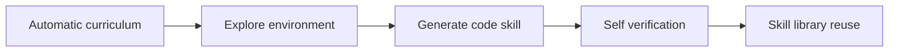

# Voyager: An Open-Ended Embodied Agent with Large Language Models

## 论文信息
- 标签：open-world skill acquisition；what=code skills；when=ongoing exploration；how=automatic curriculum + self-verification；where=Minecraft / open-world
- 中文定位：开放世界技能库基础
- 作者：Guanzhi Wang / Yuqi Xie / Yunfan Jiang / Ajay Mandlekar / Chaowei Xiao / Yuke Zhu / Linxi Fan / Anima Anandkumar
- 年份：2023
- arXiv：2305.16291
- PDF：https://arxiv.org/pdf/2305.16291
- 代码：https://voyager.minedojo.org/

## 一句话总结
Voyager 的核心价值是：它是后续 Trace2Skill、SkillX、SkillOpt 的起点：先有技能库，再谈技能自进化。

## 这篇论文解决什么问题
开放世界没有固定任务列表，Agent 需要自己设目标、学技能、复用技能。Voyager 给出了 LLM Agent 技能库自增长的早期闭环。

如果放到 Agent skill 自进化的大图里，它解决的不是“模型有没有知识”，而是“Agent 如何把执行经验变成之后能稳定复用的外部能力”。这类外部能力可能是 `SKILL.md`、技能库、prompt、程序性记忆、world model、verifier 或 curator。区别只在于它把经验沉淀到哪一层。

## 方法图：先抓住机制闭环

这张图可以按从左到右读：左边是问题或数据来源，中间是论文提出的关键机制，右边是更新后的能力如何被复用或验证。读这篇论文时，最重要的是不要只看最后的分数，而要看中间那一层到底把什么东西变成了什么。

## 核心创新点
1. Voyager 的核心价值是：它是后续 Trace2Skill、SkillX、SkillOpt 的起点：先有技能库，再谈技能自进化。
2. 它把方法链条明确拆成 Automatic curriculum → Explore environment → Generate code skill → Self verification → Skill library reuse 这样的闭环，中间每一步都在把原始轨迹压缩成更稳定的中间表示，而不是把所有经验原样塞给模型。
3. 它不是只证明“能写出 skill”，而是尽量证明“更新后的 skill / repo / curator / verifier / policy 能在后续任务里稳定被复用”。

这三点合在一起，说明这篇论文关注的不是孤立模块，而是一个能持续积累的外部能力系统。读的时候先盯住这三件事：输入是什么、哪一步发生了真正的压缩或筛选、最后能不能复用到别的任务或别的模型上。

## 方法详解

### 1. Automatic curriculum 负责提出目标
Voyager 面向 Minecraft 这样的开放世界，没有固定任务列表。Automatic curriculum 根据当前状态、已获得物品、技能库和探索进度提出下一个目标，例如获取新资源、解锁新工具或探索新区域。

这一步解决的是开放世界里的探索顺序问题：目标太简单无法增长能力，目标太难又会反复失败。课程机制让 Agent 持续进入有学习价值的新状态。

### 2. LLM 生成可执行代码技能
针对当前目标，Voyager 让 LLM 写代码来控制 Minecraft Agent 行动。这里的 skill 不是自然语言建议，而是可执行函数，能够调用环境 API 完成采集、合成、移动、战斗等操作。

代码化让技能可以被直接运行、调试和复用。成功行为不再只是轨迹记录，而是进入技能库的程序资产。

### 3. 环境反馈和自验证修复代码
生成代码后，Agent 在环境中执行。如果失败，系统读取错误信息、环境反馈和执行结果，让 LLM 迭代修复代码。这个过程类似写程序、运行、看报错、再改。

自验证是 Voyager 的关键：只有经过环境执行证明有效的代码，才有资格成为可复用技能。它避免把看似合理但不可运行的函数放进库里。

### 4. 成功技能进入 Skill Library
通过验证的代码技能会被保存到 Skill Library，并附带描述和调用信息。后续目标出现时，Agent 可以检索相关技能并组合使用，而不是每次重新写代码。

这使 Voyager 形成开放式能力积累：automatic curriculum 提出新目标，代码技能解决目标，验证后进入库，库又帮助后续更复杂目标。

## 机制拆解表：输入、处理、输出

| 环节 | 输入 | 处理 | 输出 |
| --- | --- | --- | --- |
| Automatic curriculum | 当前状态、已掌握技能、探索历史、环境进度 | 选择有学习价值且可达的新目标 | 当前探索目标 |
| Explore environment | 目标、环境 API、已有技能 | 尝试完成目标并收集反馈 | 执行轨迹和环境信号 |
| Generate code skill | 目标、反馈、已有技能、API 文档 | 生成或修复可执行代码函数 | 候选代码技能 |
| Self verification | 候选代码、环境执行结果、错误信息 | 运行并判断技能是否真的完成目标 | 通过验证的技能或修复反馈 |
| Skill library reuse | 已验证技能、描述、后续目标 | 检索、组合并复用代码技能 | 持续增长的开放世界技能库 |

这张表的重点是：Voyager 的技能库来自环境验证过的代码技能，它是后续 self-evolving skill 系统的重要起点。

## 实验与证据怎么理解
在 Minecraft 中，Voyager 获得更多 unique items、更远探索距离，并更快解锁 tech tree milestones。

更具体地说，读实验时建议抓三条线：第一，是否有和无 skill / 旧 skill / 新 skill 的公平对比；第二，是否证明收益来自 skill 本身，而不是模型或 prompt 其他部分变化；第三，是否展示跨任务、跨模型或 OOD 的迁移能力。只有同时满足这些条件，才能说明它真的是“自进化能力”，而不是一次性的 benchmark 调参。

## 一个具体例子

可以把它想成 Minecraft 里的技能背包：每学会一个操作，就保存成代码技能，下次直接复用。

假设一个 Agent 连续处理十个相似任务。如果它每次都从零推理，那只是“会做题”；如果它能从前几次任务中提炼出规则、检查点、工具调用顺序或失败规避策略，并在后面任务中稳定复用，那才是这篇论文关心的自进化。

## 和相关方法的差异

| 对象 | 做法 | 关键差异 |
| --- | --- | --- |
| Classic RL | 大量样本训练 | 开放世界成本高 |
| ReAct agent | 临时计划 | 不形成长期技能库 |
| Voyager | 自动课程 + 代码技能库 | 形成可复用能力资产 |

这张表的重点是定位：同样都叫 self-evolving，不同论文改的层完全不同。有的改记忆，有的改 prompt，有的改 skill 文档，有的训练 curator 或 policy。把层级分清楚，论文就容易读很多。

## 适合怎么读
- 先看论文把经验沉淀到哪里：记忆、skill、prompt、policy、verifier、world model，还是 SkillRepo。
- 再看它如何防止坏经验进入系统：是否有 verifier、held-out gate、reward、score-based maintenance 或人工审核。
- 最后看它如何证明迁移：跨任务、跨模型、跨用户、跨环境，至少要有一种。

## 局限与风险
强依赖 GPT-4 和明确环境反馈；没有系统处理 skill 冲突、过期和安全。

从工程角度还要额外警惕两点。第一，skill 越自进化，越容易把错误规则长期固化；第二，skill 越共享，越需要权限、来源、版本和回滚机制。论文实验里有效，不代表上线系统里可以无审核运行。

## 工程启发
它是后续 Trace2Skill、SkillX、SkillOpt 的起点：先有技能库，再谈技能自进化。

如果把这篇论文转成可落地方案，我会把它拆成四个组件：经验采集器、技能更新器、验证器、发布/回滚器。没有验证器和回滚器的“自进化”，本质上只是自动改文件，风险很高。
