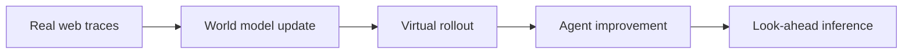

# WebEvolver: Enhancing Web Agent Self-Improvement with Coevolving World Model

## 论文信息
- 标签：web automation；what=world model + web agent；when=continuous co-evolution；how=real traces + virtual rollout + look-ahead；where=web interaction
- 中文定位：Web Agent 与世界模型共演化
- 作者：Tianqing Fang / Hongming Zhang / Zhisong Zhang / Kaixin Ma / Wenhao Yu / Haitao Mi / Dong Yu
- 年份：2025
- arXiv：2504.21024
- PDF：https://arxiv.org/pdf/2504.21024
- 代码：https://github.com/Tencent/SelfEvolvingAgent

## 一句话总结
WebEvolver 的核心价值是：可用于给 skill 演化生成验证场景：先真实轨迹归纳，再 world model 扩展，最后真实回归验证。

## 这篇论文解决什么问题
Web Agent 在真实网页上探索成本高、反馈慢、状态空间大，自我改进容易停滞。WebEvolver 用 world model 给 Agent 造出可控的想象空间。

如果放到 Agent skill 自进化的大图里，它解决的不是“模型有没有知识”，而是“Agent 如何把执行经验变成之后能稳定复用的外部能力”。这类外部能力可能是 `SKILL.md`、技能库、prompt、程序性记忆、world model、verifier 或 curator。区别只在于它把经验沉淀到哪一层。

## 方法图：先抓住机制闭环

这张图可以按从左到右读：左边是问题或数据来源，中间是论文提出的关键机制，右边是更新后的能力如何被复用或验证。读这篇论文时，最重要的是不要只看最后的分数，而要看中间那一层到底把什么东西变成了什么。

## 核心创新点
1. WebEvolver 的核心价值是：可用于给 skill 演化生成验证场景：先真实轨迹归纳，再 world model 扩展，最后真实回归验证。
2. 它把方法链条明确拆成 Real web traces → World model update → Virtual rollout → Agent improvement → Look-ahead inference 这样的闭环，中间每一步都在把原始轨迹压缩成更稳定的中间表示，而不是把所有经验原样塞给模型。
3. 它不是只证明“能写出 skill”，而是尽量证明“更新后的 skill / repo / curator / verifier / policy 能在后续任务里稳定被复用”。

这三点合在一起，说明这篇论文关注的不是孤立模块，而是一个能持续积累的外部能力系统。读的时候先盯住这三件事：输入是什么、哪一步发生了真正的压缩或筛选、最后能不能复用到别的任务或别的模型上。

## 方法详解

### 1. 从真实网页轨迹训练 World Model
WebEvolver 的输入是真实 Web Agent 轨迹，包括 observation、action、页面变化、工具反馈和任务结果。World Model 学习根据当前 observation 和 action 预测 next observation，相当于给 Web Agent 建一个可更新的网页动态模型。

真实网页探索成本高、状态空间大，World Model 的作用是把少量真实轨迹扩展成更多可控的训练和推演信号。

### 2. 用 World Model 生成 virtual rollout
训练阶段，World Model 可以扮演虚拟 web server，让 Agent 在想象环境中执行更多 self-instruction 或候选动作，生成 virtual rollouts。这些 rollout 成本低，可以覆盖真实环境中难以频繁探索的状态。

这一步不是替代真实网页，而是扩大经验分布。虚拟轨迹需要和真实轨迹持续校准，否则 world model 幻觉会污染 Agent。

### 3. 用虚拟反馈改进 Web Agent
Agent 可以从 virtual rollout 中学习更好的操作策略、错误恢复方式和页面状态理解。相比只靠真实网页反馈，虚拟环境提供了更多低风险试错机会，缓解在线探索停滞。

这对 skill 演化也有启发：world model 可以生成候选验证场景，让 skill 在上线前先经历模拟回归测试。

### 4. 推理阶段进行 look-ahead
在真实任务执行时，World Model 可以作为 imagination engine，帮助 Agent 预演某个动作之后可能出现的页面状态。Agent 不必盲目点击，而可以比较不同动作的预测结果，再选择更稳的路径。

Look-ahead 的价值取决于模型准确性。高风险操作必须回到真实环境验证，不能只相信想象状态。

### 5. World Model 与 Agent 共演化
随着 Agent 策略变化，它访问的页面状态分布也会变化；World Model 必须持续更新，否则会过时。WebEvolver 的共演化就在这里：Agent 产生新真实轨迹，World Model 更新；World Model 产生虚拟轨迹，Agent 改进。

## 机制拆解表：输入、处理、输出

| 环节 | 输入 | 处理 | 输出 |
| --- | --- | --- | --- |
| Real web traces | 真实网页 observation、action、next observation、任务反馈 | 收集并校准网页动态数据 | world model 训练样本 |
| World model update | 真实轨迹、当前 world model、页面状态分布 | 学习或更新状态转移预测 | co-evolving World Model |
| Virtual rollout | World Model、候选任务、Agent 策略 | 在虚拟网页环境中模拟操作结果 | 低成本想象轨迹 |
| Agent improvement | 虚拟轨迹、真实反馈、失败模式 | 改进网页操作策略、恢复策略和状态理解 | 更强 Web Agent |
| Look-ahead inference | 当前真实页面、候选动作、World Model | 预测动作后果并辅助选择 | 更稳的在线决策 |

这张表的重点是：WebEvolver 演化的不只是 Agent 策略，还包括一个随真实轨迹持续校准的网页世界模型。

## 实验与证据怎么理解
论文在 Mind2Web-Live、WebVoyager、GAIA-web 上报告约 10% 性能提升，说明虚拟反馈能缓解在线探索停滞。

更具体地说，读实验时建议抓三条线：第一，是否有和无 skill / 旧 skill / 新 skill 的公平对比；第二，是否证明收益来自 skill 本身，而不是模型或 prompt 其他部分变化；第三，是否展示跨任务、跨模型或 OOD 的迁移能力。只有同时满足这些条件，才能说明它真的是“自进化能力”，而不是一次性的 benchmark 调参。

## 一个具体例子

可以把它想成给 Web Agent 配一个沙盘环境：先在想象网页里试，再回真实网页验证。

假设一个 Agent 连续处理十个相似任务。如果它每次都从零推理，那只是“会做题”；如果它能从前几次任务中提炼出规则、检查点、工具调用顺序或失败规避策略，并在后面任务中稳定复用，那才是这篇论文关心的自进化。

## 和相关方法的差异

| 对象 | 做法 | 关键差异 |
| --- | --- | --- |
| Real-only exploration | 反馈真实 | 成本高、覆盖慢 |
| Static simulator | 便宜 | 容易过时 |
| WebEvolver | co-evolving world model | 兼顾扩展性和适应性 |

这张表的重点是定位：同样都叫 self-evolving，不同论文改的层完全不同。有的改记忆，有的改 prompt，有的改 skill 文档，有的训练 curator 或 policy。把层级分清楚，论文就容易读很多。

## 适合怎么读
- 先看论文把经验沉淀到哪里：记忆、skill、prompt、policy、verifier、world model，还是 SkillRepo。
- 再看它如何防止坏经验进入系统：是否有 verifier、held-out gate、reward、score-based maintenance 或人工审核。
- 最后看它如何证明迁移：跨任务、跨模型、跨用户、跨环境，至少要有一种。

## 局限与风险
World model 会幻觉网页状态，高风险操作必须回到真实环境验证。

从工程角度还要额外警惕两点。第一，skill 越自进化，越容易把错误规则长期固化；第二，skill 越共享，越需要权限、来源、版本和回滚机制。论文实验里有效，不代表上线系统里可以无审核运行。

## 工程启发
可用于给 skill 演化生成验证场景：先真实轨迹归纳，再 world model 扩展，最后真实回归验证。

如果把这篇论文转成可落地方案，我会把它拆成四个组件：经验采集器、技能更新器、验证器、发布/回滚器。没有验证器和回滚器的“自进化”，本质上只是自动改文件，风险很高。
