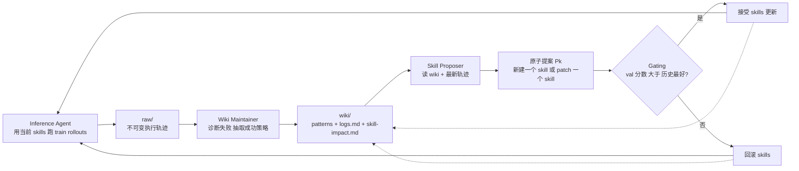
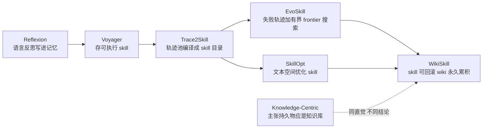

# WikiSkill: Compiling Agent Experience into Persistent Knowledge for Skill Evolution

## 论文信息
- 标签：experience→persistent knowledge；what=wiki + skill 双资产；when=迭代离线演化；how=Wiki Maintainer + Skill Proposer + validation gating；where=五 benchmark 五模型
- 作者：Liyan Tang / Cyrus Rashtchian / Chun-Sung Ferng / Andrew Tomkins / Da-Cheng Juan / Tu Vu
- 年份：2026（v1 提交于 2026-08-27）
- arXiv：2608.27454（cs.AI；cs.CL）
- PDF：https://arxiv.org/pdf/2608.27454
- 代码状态：论文 HTML 版中未见公开仓库链接，按“未开源/未声明”处理
- 资料来源说明：本地无外网，正文经 arXiv HTML 版（https://arxiv.org/html/2608.27454v1）分段抓取。Limitations 一节只抓到标题、抓不到正文，因此本报告的“局限”是我基于已抓到的方法与实验内容做的判断，不是转述作者原话。

## 一句话总结
WikiSkill 主张：**skill 演化真正缺的不是更好的提议器，而是一个跨迭代不回滚的持久知识库。** 它把 agent 工作区拆成 raw / wiki / skills 三层，skill 可以因验证不过被回滚，但沉淀到 wiki 的知识永远保留，于是下一轮提议是站在越来越厚的知识上改，而不是每轮重新面对原始轨迹。

## 先看整体图

图里最该注意的是那两条虚线：无论提案被接受还是被拒，wiki 都会留下记录。被拒的提案也是知识——它告诉下一轮“这条路已经试过、没用”。

## 核心创新点
1. **把“持久知识”和“可回滚资产”分开。** 以往方法把演化状态压在 skill 文件（或 skill 种群）里，skill 一回滚，那一轮学到的东西就一起消失。WikiSkill 让 skill 受验证门控约束、允许回滚，而 wiki 单向累积。
2. **wiki 不只是失败模式库，还包含演化史。** `logs.md` 记录每轮提了什么，`skill-impact.md` 由外层 harness 在门控后程序化写入，记录哪些改动被接受。于是提议器能看到完整接受/拒绝历史，避免重复提被拒过的干预。
3. **训练 rollout 阶段刻意不让执行 agent 看 wiki。** 这是反直觉的设计，且有消融支撑：给执行 agent 开 wiki 会让轨迹变得“对 skill 开发没信息量”。
4. **原子提案。** 每轮只动一个 skill：要么新建，要么对某个已有 skill 打增量补丁。这让门控的因果归因是干净的——分数变化对应单一改动。

## 三层架构：每层放什么

| 层 | 目录 | 内容 | 可变性 |
|---|---|---|---|
| Raw Layer | `raw/` | 本轮 rollout 的完整执行轨迹 | 不可变，只追加 |
| Wiki Layer | `wiki/` | `patterns/` 下每个 markdown 文件记录一个具体失败模式或成功策略，附可执行的绕行办法；`logs.md` 演化日志（Wiki Maintainer 写）；`skill-impact.md` skill 影响追踪（harness 在门控后程序化写） | 持久累积，不随 skill 回滚 |
| Skill Layer | `skills/` | 正在演化的程序性知识，即 agent 实际加载的 skill | 受门控，可回滚 |

## 四个组件：一轮迭代都发生什么

| 组件 | 输入 | 动作 | 输出 |
|---|---|---|---|
| Inference Agent | 任务 $x_i$ + 当前 skills $S$（**无 wiki 访问**） | 多步执行、调用工具，产出轨迹 $\tau_i \sim \pi(x_i; S)$，末步给答案，由领域评分函数 $f(\hat{y}_i, y_i) \in [0,1]$ 判分 | `raw/` 里的轨迹 |
| Wiki Maintainer | 本轮 raw 轨迹 + 现有 wiki | 诊断失败、抽取成功策略，更新 pattern 目录与演化日志 | 更新后的 $W'_k$ |
| Skill Proposer | $W'_k$、$S_{k-1}$、最新轨迹 $\mathcal{T}_{\text{train},k}$ | 生成原子提案 $P_k \leftarrow \mathcal{M}_P(W'_k, S_{k-1}, \mathcal{T}_{\text{train},k})$ | 候选 skill 改动 |
| Gating & Rollback | 候选 $S'_k = \text{Apply}(S_{k-1}, P_k)$ | 在 $\mathcal{D}_{\text{val}}$ 上评测得 $\mathcal{R}(\mathcal{T}_{\text{val},k})$ | 按下式取舍 |

$$S_k \leftarrow \begin{cases} S'_k & \text{if } \mathcal{R}(\mathcal{T}_{\text{val},k}) > \mathcal{R}_{\text{best}} \\ S_{k-1} & \text{otherwise} \end{cases}$$

门控是**严格大于历史最好**，不是“不比上一轮差”。数据按任务划成 $\mathcal{D}_{\text{train}} / \mathcal{D}_{\text{val}} / \mathcal{D}_{\text{test}}$ 三个不相交子集，完整算法见论文 Appendix A 的 Algorithm 1。

## 实验设置

- **五个 benchmark，跨五类任务形态**：LiveMathematicianBench（数学推理）、SealQA（网页搜索）、SpreadsheetBench（表格操作）、OfficeQA（长文档 QA，给 oracle 参考页 + glob/grep/read 工具查原始 Treasury bulletin）、ALFWorld（交互式具身，多步序列决策）。
- **五个执行模型**：Qwen-3.5-4B / 9B-Instruct、Qwen-3.6-27B、Gemma-4-31B-It（均用 vLLM 部署）、Gemini-3.5-Flash。
- **基线**：No skill、Trace2Skill、EvoSkill、SkillOpt。其中 EvoSkill 把 skill 演化当程序前沿搜索，按类别轮转采训练任务，只把失败轨迹连同一份扁平的历史反馈喂给提议器，候选落成 SKILL.md 后在验证集打分、进入一个有界 frontier。
- **统计严谨性**：每个方法完整跑三次独立演化，报告的是三套演化产物的测试均值；差异显著性用 paired bootstrap，$p<0.05$。
- **迭代规模**：论文按 Iter 0–1 / 2–4 / 5–7 分组统计接受时点，可推知一次演化跑 8 轮。每轮 rollout 数与各 benchmark 划分大小在 Appendix B，HTML 抓取未取到具体数字。

## 主结果（测试集准确率 %）

| 模型 | 方法 | LiveMath | SealQA | SpreadSheet | OfficeQA | ALFWorld | 均值 |
|---|---|---|---|---|---|---|---|
| Qwen-3.5-4B | No skill | 29.1 | 32.5 | 14.6 | 30.2 | 24.4 | 26.2 |
| | Trace2Skill | 31.5 | 37.6 | 17.5 | 31.0 | 42.8 | 32.1 |
| | EvoSkill | 41.7 | 37.3 | 18.6 | 29.5 | 41.5 | 33.7 |
| | SkillOpt | 48.7 | 33.3 | 14.0 | 34.5 | 45.3 | 35.2 |
| | **WikiSkill** | 49.7 | 39.4 | 21.1 | 28.5 | 53.7 | **38.5** |
| Qwen-3.5-9B | No skill | 28.2 | 26.3 | 24.3 | 35.9 | 34.7 | 29.9 |
| | Trace2Skill | 33.1 | 36.9 | 26.5 | 38.4 | 48.8 | 36.7 |
| | EvoSkill | 58.1 | 34.5 | 35.4 | 34.9 | 48.5 | 42.3 |
| | SkillOpt | 48.7 | 29.4 | 29.0 | 38.0 | 55.7 | 40.2 |
| | **WikiSkill** | 56.3 | 43.1 | 33.6 | 40.5 | 63.4 | **47.4** |
| Qwen-3.6-27B | No skill | 33.9 | 27.5 | 40.8 | 42.1 | 52.8 | 39.4 |
| | Trace2Skill | 36.3 | 37.3 | 53.3 | 54.3 | 55.5 | 47.3 |
| | EvoSkill | 57.3 | 32.9 | 59.5 | 52.5 | 64.2 | 53.3 |
| | SkillOpt | 51.9 | 34.5 | 53.2 | 54.8 | 59.2 | 50.7 |
| | **WikiSkill** | 61.9 | 41.6 | 81.7 | 53.7 | 77.6 | **63.3** |
| Gemma-4-31B | No skill | 33.9 | 30.6 | 48.3 | 43.3 | 50.4 | 41.3 |
| | Trace2Skill | 32.3 | 37.7 | 58.5 | 43.2 | 57.2 | 45.8 |
| | EvoSkill | 29.8 | 38.4 | 56.4 | 39.9 | 52.6 | 43.4 |
| | SkillOpt | 40.1 | 36.1 | 63.1 | 44.4 | 61.9 | 49.1 |
| | **WikiSkill** | 56.7 | 41.2 | 68.0 | 44.2 | 64.4 | **54.9** |
| Gemini-3.5-Flash | No skill | 33.0 | 29.4 | 50.5 | 48.6 | 85.9 | 49.5 |
| | Trace2Skill | 41.9 | 44.3 | 56.0 | 50.0 | 85.9 | 55.6 |
| | EvoSkill | 44.6 | 43.6 | 55.4 | 51.2 | 85.9 | 56.1 |
| | SkillOpt | 49.7 | 28.2 | 66.1 | 49.8 | 85.9 | 55.9 |
| | **WikiSkill** | 72.6 | 未取到 | 76.6 | 未取到 | 85.9 | 未取到 |

Gemini 那行 WikiSkill 的 SealQA / OfficeQA / 均值三格我没从 HTML 抓到，留“未取到”而不是猜数。已确认的两点是 LiveMath 33.0→72.6、SpreadSheet 50.5→76.6；另据正文，该模型的均值增益相对最强基线是 +12.0 点，可反推均值约 68 左右，但这是推算不是原文数字。

几个值得单独记住的读数：

- 相对**每个模型各自最强的竞争方法**，WikiSkill 的均值增益是 +3.3 / +5.1 / +10.0 / +5.8 / +12.0 点（4B / 9B / 27B / Gemma-31B / Gemini-Flash），五个模型上均值全部第一。
- 基线的不稳定是这张表的对照重点：EvoSkill 在 Qwen-9B 的 LiveMath 上 28.2→58.1，却在 Gemma-4-31B 同一 benchmark 上 33.9→29.8；SkillOpt 在 Gemini 的 SealQA 上 29.4→28.2。WikiSkill 的卖点是“又强又不倒退”。
- WikiSkill 也不是全胜：Qwen-3.5-4B 的 OfficeQA 从 30.2 掉到 28.5，低于三个基线中的两个。论文的措辞是“在多数 model-dataset 组合上优于 no-skill”，不是全部。
- ALFWorld + Gemini-3.5-Flash 一列所有方法都是 85.9%，原因是演化前该模型在验证集上已经 100%，门控无从触发。这一格在跨模型迁移表里也因此被标为 `−`。

## 消融：wiki 到底贡献在哪

论文用 Gemini-3.5-Flash 把“是否给 wiki”在两个组件上独立切换，构成四种配置（一旦 Skill Proposer 不给 wiki，Wiki Maintainer 也一并去掉，等于彻底关掉跨迭代知识累积）。默认配置是 Proposer 有 wiki、Inference Agent 没有。

| 配置 | 均值 | 关键单点 |
|---|---|---|
| Proposer 无 wiki（无跨迭代累积） | 48.7 | LiveMath 51.3；SpreadSheet 49.9 |
| **Proposer 有 wiki（默认）** | **63.7** | LiveMath 72.6；SpreadSheet 76.6 |
| 默认 + 给 Inference Agent 也开 wiki | 60.9 | LiveMath 64.8 |

两条结论：

1. 持久 wiki 值 **+15.0 点**均值。没有跨迭代累积的知识，提议器解不开那些需要多轮才能看清的复杂失败模式。
2. 给执行 agent 开 wiki 反而掉 2.8 点。作者的解释是：执行时同时能看 skills 和 wiki，部分解题知识会直接从 wiki 拿走，导致轨迹对 skill 开发的信息量下降——**skill 学不到那些本该由 skill 承担的东西**。这是很实用的工程教训：训练期要故意让 skill 成为唯一知识通路。

## 跨模型迁移：技能发现和技能执行是两种能力

把“skill 来源”和“执行模型”解耦后出现了几个反常识结果：

| 执行模型 | skill 来源 | LiveMath | SealQA | SpreadSheet | OfficeQA | ALFWorld |
|---|---|---|---|---|---|---|
| Qwen-3.5-9B | 无 | 28.2 | 26.3 | 24.3 | 35.9 | 34.7 |
| Qwen-3.5-9B | 自己 | 56.3 | 43.1 | 33.6 | 40.5 | 63.4 |
| Qwen-3.5-9B | Qwen-3.5-4B | 61.0 | 40.4 | 25.0 | 40.3 | 69.2 |
| Qwen-3.5-9B | Qwen-3.6-27B | 59.1 | 40.4 | 50.5 | 39.9 | 70.2 |
| Qwen-3.6-27B | 无 | 33.9 | 27.5 | 40.8 | 42.1 | 52.8 |
| Qwen-3.6-27B | Qwen-3.5-4B | 62.6 | 41.6 | 40.6 | 52.9 | 72.1 |
| Qwen-3.6-27B | 自己 | 61.9 | 41.6 | 81.7 | 53.7 | 77.6 |
| Qwen-3.6-27B | Gemini-3.5-Flash | 65.1 | 51.0 | 76.0 | 52.5 | — |

- **别人演化的 skill 可以打败自己演化的 skill**：Qwen-3.5-9B 用 27B 演化的 skill 在 ALFWorld 上 70.2%，自演化只有 63.4%。作者据此提出 skill discovery 与 skill execution 是两种不同能力。
- **skill 能补偿模型规模**：带 WikiSkill 的 Qwen-3.5-9B 均值 47.4%，高于裸的 Qwen-3.6-27B 的 39.4%。
- **规模越大收益越大**：Qwen 家族内 WikiSkill 的均值提升是 4B +12.3%、9B +17.5%、27B +23.9%——skill 演化与模型 scaling 互补而非替代。跨家族也成立（Gemini 演化的 skill 给 27B 用，SealQA 51.0 是该行最高）。
- 但迁移不是无条件的：4B 演化的 skill 给 9B 用，SpreadSheet 只有 25.0，反而低于 9B 自演化的 33.6。需要精细领域知识的任务上，弱模型产出的 skill 撑不起强模型。

## 接受时点分布：改进不是一轮打完

Appendix Table 5 把被接受的 skill 更新按早（Iter 0–1）/中（2–4）/晚（5–7）分组：

| 维度 | 早期 | 中期 | 晚期 |
|---|---|---|---|
| Qwen-3.5-4B | 39% | 39% | 21% |
| Qwen-3.5-9B | 52% | 30% | 19% |
| Qwen-3.6-27B | 43% | 40% | 17% |
| Gemma-4-31B | 52% | 37% | 11% |
| Gemini-3.5-Flash | 50% | 46% | 4% |
| LiveMath | 44% | 42% | 14% |
| SealQA | 39% | 33% | 28% |
| SpreadSheet | 41% | 48% | 11% |
| OfficeQA | 58% | 26% | 16% |
| ALFWorld | 55% | 34% | 10% |

早期占 39%–58%，但相当比例的接受发生在中晚期，SealQA 尤其明显（中期 33% + 晚期 28%）。这是对 wiki 设计的间接支持：如果知识不累积，晚期基本提不出还能过门控的改动。反过来 Gemini 晚期只有 4%，说明强模型加上偏易的验证集会更早饱和。

## 和这条线上其他工作的关系

- 对 **Trace2Skill**：Trace2Skill 是把一池轨迹一次性编译成 skill 目录，收敛发生在“多 patch → 单资产”；WikiSkill 是跨迭代的，收敛发生在“知识越厚 → 提案越准”。两者中间产物不同：前者是 patch，后者是 wiki 页面。
- 对 **EvoSkill / SkillOpt**：这两个方法的状态几乎全在 skill（或 skill 前沿）里，回滚即失忆；WikiSkill 的核心改动就是给它们加一层不回滚的记忆。消融基本就是在证“去掉这层就退回它们的水平”（48.7 vs 63.7）。另外 EvoSkill 只喂失败轨迹，WikiSkill 的 Wiki Maintainer 同时抽取成功策略。
- 对 **递归自进化合集里的 Knowledge-Centric**：那篇主张持久物应该是共享知识库而不是 agent，WikiSkill 与它直觉相同但结论不同——两者都要留，只是**回滚策略不同**：能力资产受门控、知识资产不受。这比“二选一”是更细的答案。

## 这篇论文的局限

Limitations 正文没抓到，以下是我基于已获取内容的判断，按可信度排序：

1. **门控成本没有交代清楚。** 每轮都要在验证集上完整跑一遍候选 skill，8 轮 × 3 次独立运行 × 5 benchmark × 5 模型，rollout 开销很大。论文有一张 skill 数量/长度统计表，但我没看到与基线的 token 或时间成本对比。“性价比是否更高”这一问没被回答。
2. **验证集饱和会让整套机制失效。** Gemini + ALFWorld 就是现成例子：验证集 100% 之后门控永远拒绝，方法退化为 no-skill。严格大于历史最好的门控在验证集偏小或偏易时会过早停止改进。
3. **wiki 单向累积必然带来长期治理问题。** `patterns/` 只增不减，过期规则怎么淘汰、矛盾条目怎么检测、wiki 大到超出上下文时怎么选择性加载，8 轮的尺度还碰不到这个天花板，真实长期部署会。
4. **“别人的 skill 比自己的好”这个结论还缺机制解释。** 现象很有价值，但 discovery ≠ execution 只是命名，不是解释。哪类知识可迁移、哪类是模型私有，没有拆开；SpreadSheet 上 4B→9B 迁移变差也提示存在未被刻画的边界。
5. **wiki 层的安全性没有被检验。** 参照《Practice Makes Unsafe: Skill Misevolution》的发现，演化管线普遍会写出不安全产物，而这里的 wiki 是一个只增不减、后续所有提案都要读的持久文档——一旦写入错误或危险的“绕行办法”，污染是持续且被放大的。论文的门控只看验证分数，不看安全性。
6. **未见代码释放声明**，且论文自陈用 LLM 与 coding agent 辅助生成了部分表格和图。复现只能靠方法描述与 Algorithm 1。

## 读完后应该记住什么

一句话：**把“哪些资产该回滚、哪些不该”当成一个独立的设计决策。**

skill 是能力，验证不过就该退回去；从失败里读出的知识是事实，它不该因为一次提案失败而被删除。以往方法把两者混在同一个可回滚状态里，等于每次回滚都在扔掉证据。WikiSkill 的 +15.0 点，本质上就是把这两件事分开的收益。

对自己搭演化管线的实操结论有三条：一是加一层只增不减的知识层，且必须记录被拒历史；二是训练 rollout 阶段别把知识旁路开给执行 agent，否则 skill 学不到东西；三是先检查验证集是否已经饱和，饱和的验证集会让门控变成一堵墙。
